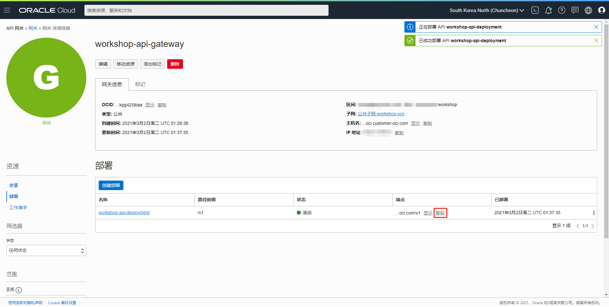

### 概览

Oracle API 网关是一项全托管式服务，您无需配置和管理服务器。轻松处理来自前端客户端的流量并将其路由至后端服务。使用单个 API 网关链接多个后端服务，如负载平衡器、计算实例、容器和无服务器函数。专用和公共 API 端点支持 API 验证、转换、CORS、身份验证和授权等功能。Oracle API 网关服务与 Oracle 云基础设施身份和访问管理 (IAM) 实现了完全集成，可轻松进行身份验证。

在本实验中，您可以创建Oracle API 网关，并使用API网关服务调用了您的第一个API。

### 前提条件

- Oracle云基础设施用户名和密码。
- 您必须在开始本实验之前创建了一个区间。
- 您必须在开始本实验之前创建了一个虚拟云网络。

### 目录

1. [添加入口规则](#step1)
2. [创建策略](#step2)
3. [创建API 网关](#step3)
4. [创建部署](#step4)
5. [调用API](#step5)


<a name="step1"></a>
### 1. 添加入口规则

在OCI管理控制台界面，单击"网络"=>"虚拟云网络"。


本实验使用"workshop"区间，选择"workshop"区间。然后单击API 网关将要使用的虚拟云网络。例如，本实验使用`workshop-vcn`。


单击"公共子网-workshop-vcn"。


单击"Default Security List for workshop-vcn"。


单击"添加入站规则"。


输入项目，单击"添加入站规则"。


添加完成。


<a name="step2"></a>
### 2. 创建策略

以租户管理员的身份登录OCI管理控制台，单击"身份"=>"策略"。


选择"workshop"区间，单击"创建策略"。


输入项目，单击"创建"。

"策略构建器"处单击"定制（高级）"，输入策略内容。

```
Allow group <group-name> to manage api-gateway-family in compartment <compartment-name>
```

例如，"group-name"为"workshop"。

```
Allow group workshop to manage api-gateway-family in compartment workshop
```


创建完成。


<a name="step3"></a>
### 3. 创建API 网关

在OCI管理控制台界面，单击"开发人员服务"=>"API Management"。


选择"workshop"区间，单击"创建网关"。


输入项目，单击"创建"。


API 网关"正在创建"。


API 网关创建完成。


<a name="step4"></a>
### 4. 创建部署

在"API 网关"详细信息界面，单击"资源"=>"部署"。


单击"创建部署"。


输入项目，单击"下一步"。


输入项目，单击"下一步"。
- URL：`https://api.weather.gov`


单击"创建"。


部署"正在创建"。


部署创建完成。


<a name="step5"></a>

### 5. 调用API

在"API 网关"详细信息界面，单击"复制"您想要访问API的端点信息。



输入curl命令访问API。`deployment-endpoint`是上面复制的您想要访问API的端点信息，加上创建部署时配置的路径信息，本实验的路径是`/hello`。

```
curl -k -X GET <deployment-endpoint>
```

例如，本实验的curl命令如下。（将`deployment-endpoint`缩写是为了可读性）

```
curl -k -X GET https://lmk...7sm.apigateway.ap-chuncheon-1.oci.customer-oci.com/v1/hello
```

运行结果如下。


祝贺！您可以创建Oracle API 网关，并使用API网关服务调用了您的第一个API。

