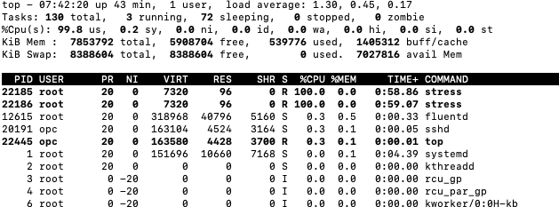

# 弹性伸缩 Auto Scaling

## 概览

弹性伸缩（auto scaling）能监控实例池的CPU或是内存的用量，自动化的改变实例池的大小，实现尽可能低的成本来保持稳定，可预测的性能。在出现需求峰值时候后，弹性伸缩可以自动增加实例，让您保持高质量的服务。

如下图： 

​	我们需要建立实例池以后设置弹性伸缩规则

## 前提条件

- Oracle Cloud Infrastructure帐户凭据（用户，密码和租户）
- 要登录控制台，您需要满足以下条件：
  - 租户，用户名和密码
  - 控制台的URL：[https : //cloud.oracle.com/](https://cloud.oracle.com/)
  - Oracle Cloud Infrastructure支持最新版本的Google Chrome，Firefox和Internet Explorer 11

* 政策:  确保Admin已经为你的指定的组提供了管理实例和映像的常规访问权限，以及将现有块卷附加到实例所需的访问级别  [参考策略](https://docs.oracle.com/en-us/iaas/Content/Identity/Concepts/commonpolicies.htm#launch-instances)

## 目录

1. [建立实例](#creating-oci-instance-images-001)
2. [实例配置创建实例池](#config-oci-instance-images-001)
4. [配置自动缩放](#autoscaling-config-images-001)
5. [模拟压力测试验证自动缩放的实现](#testing-if-autoscaling-001)

**注意：** *由于版本原因，某些UI可能与说明中包含的屏幕截图有些许不同，但是您仍然可以使用说明来完成动手实验。*

## 1：建立实例

1.1 根据 [OCI 计算实例](https://gitlab.oracle.k8scloud.site/oracle/oci-learning-library/blob/master/oci-compute-tutorial/README.md) 建立好实例，VCN等信息

1.2 这里建立一个实例“autoscaling”

## 2：实例配置

2.1 接下来我们配置实例，点击更多操作，点击创建实例配置

2.2 选择区间，输入名称，点击创建实例配置

2.3 接下来可以看到实例配置界面

2.4 返回实例列表界面，点击实例池，点击创建实例池

2.5 实例池配置

- 选择区间
- 输入实例池名字
- 选择配置
- 实例数设置为1

点击下一步

2.6 可用性域

- 可用性域选AD1

- 容错域选FD1

- VCN部分选择刚建立的虚拟网络

- 子网选刚建立的subnet

  点击下一步，点击创建

2.7 可以看到实例池正在预配

## 3：配置自动缩放

3.1 返回计算实例界面，点击自动缩放配置，点击创建自动缩放配置

3.2 创建自动缩放配置

- 输入名称
- 选择区间
- 选择实例池

点击下一步

3.3 配置策略policy

- 选择冷却所需秒数-例300ms（5分钟的缩放冷却）
- 性能度量- CPU占用率或内存占用率
- 横向扩展规则 - 大于- 50% - 添加1实例
- 横向收缩规则 - 小于- 40% - 删除1实例
- 缩放限制 最小实例 -1 / 最大例程数 - 3 / 初始实例数 - 1

点击下一步

3.4 复查界面，确认后创建

3.5 自动缩放建立完成可以看到实例界面多了一个实例

## 4：模拟压力测试

4.1 点击进入这个实例，在下面可以看到CPU占用率，目前CPU占用率没有达到50%，我们模拟一下压力测试让实例达到CPU占用率>50%的情况

4.2 我们用CMD或者terminal连入实例，需要用到公共IP地址

>  ssh opc@XXX

4.3 安装stress压力测试软件，运行stress（这里参考下面代码）

> $ sudo yum install stress
>
> Loaded plugins: extras_suggestions, langpacks, priorities, update-motd
>
> No package stress available.
>
> Error: Nothing to do
>
> To see the existing repositories:
>
> $ sudo yum repolist all
>
> To add EPEL:
>
> $ sudo yum install https://dl.fedoraproject.org/pub/epel/epel-release-latest-7.noarch.rpm
>
> Then install stress:
>
> $ sudo yum install stress -y
>
> $ sudo stress --cpu 2 --timeout 420 &

4.4 检查CPU占用率已经达到了90%以上

> top
>
> iostat -c

4.5 返回云界面看到刚刚的度量情况看到CPU占用率正在升高

4.6 点击左上角菜单，点击监视，点击度量浏览器。 这里可以随时监控任意度量情况

4.7 通过查询可以查询到我们刚建立的实例

4.8 查询1

- 度量名称
- 间隔
- 度量信息
- 度量维- 维名称选择instancepodId 维值选择刚刚的ociid

4.9 查询到结果

4.10 通过刚刚的stress 压力测试已经满足了我们配置的自动伸缩的横向延伸条件。5分钟后的可以看到实例界面有新的实例被自动配置出来

4.11新实例正在预配

4.12 可以验证我们配置的信息  >50% 添加1个实例

4.13 度量图中在7:54新加入了一个实例，由于我们设置stress已经失效CPU占用率降低，在7:58由于满足横向收缩规则删除了一个实例

4.14 可以看到之前的实例已经被删除

