# 计费，用量和成本分析

## 概览

Oracle Cloud Infrastructure提供了各种计费和支付查看工具，可轻松管理OCI上运行服务的成本。

成本分析提供了易于使用的可视化工具，可帮助您跟踪和优化Oracle Cloud Infrastructure支出。有关更多信息，请参见检查余额和使用情况。

预算可用于设置Oracle Cloud Infrastructure支出的阈值。您可以在预算上设置警报，以通知您何时可能超出预算，并且可以在Oracle Cloud Infrastructure控制台的一个位置查看所有预算和支出。

使用情况报告是一个逗号分隔值（CSV）文件，可用于获取Oracle Cloud Infrastructure中资源的详细明细，以进行审计或发票对帐。

资源限制是一个在整个租户的限制之下的柔性限制规则，您可以根据自己的情况，对资源的用量进行更细粒度的精确设置。

您可以查看和下载有关Oracle Cloud Infrastructure使用情况的发票。有关更多信息，请参见查看您的订阅发票。

Oracle Cloud Infrastructure控制台的“付款方式”部分使您可以轻松管理如何支付Oracle Cloud Infrastructure使用费。

## 前提条件

- Oracle Cloud Infrastructure帐户凭据（用户，密码和租户）
- 要登录控制台，您需要满足以下条件：
  - 租户，用户名和密码
  - 控制台的URL：[https : //cloud.oracle.com/](https://cloud.oracle.com/)
  - Oracle Cloud Infrastructure支持最新版本的Google Chrome，Firefox和Internet Explorer 11

## 目录

[1：**成本分析**](#practice-1-cost-analysis)

[2：**预算管理**](#practice-2-budet-management)

[3：**使用情况报告**](#practice-3-usage-report)

[4：**两种资源限制**](#practice-4-soft-quota)

**注意：** *某些UI可能与说明中包含的屏幕截图有些许不同，但是您仍然可以使用说明来完成动手实验。*

## 1：成本分析

成本分析是一种易于使用的可视化工具，可帮助您跟踪和优化Oracle Cloud Infrastructure支出，允许您生成图表以及下载关于Oracle Cloud Infrastructure消耗的汇总成本数据的准确，可靠的表格报告。使用该工具可以对支出趋势进行抽查并生成报告。

1. 导航至菜单**帐户管理**，然后单击**成本分析**。

   

2. 等待一段时间以加载您当前的费用数据（如果有云环境其他region请转到主区域查看，想看具体的region请在筛选里选择）

   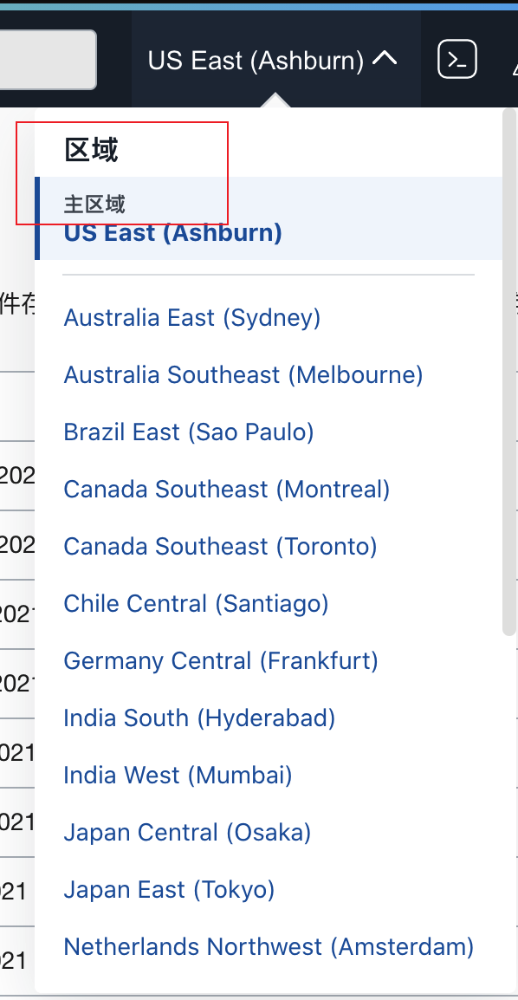

   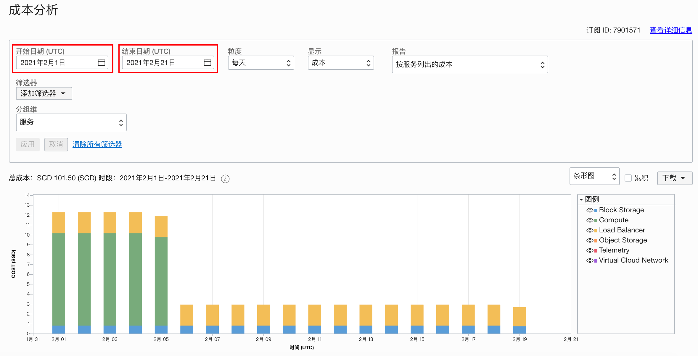

3. 您可以更改类型或将费用下载为image / csv文件。

   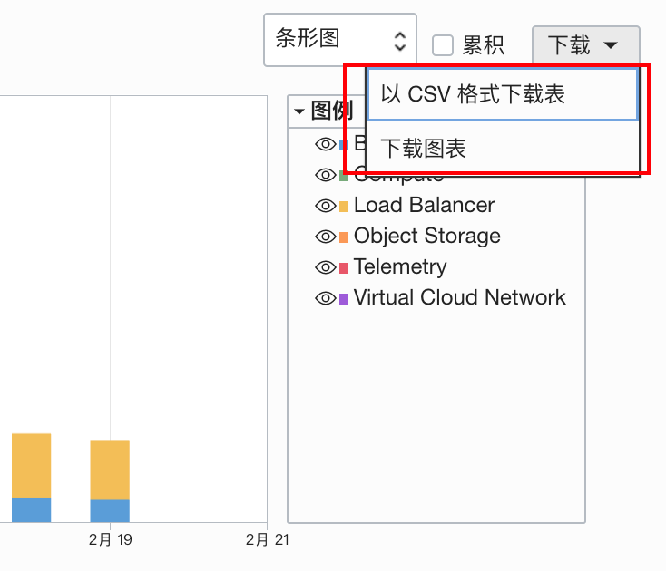

4. 在底部可以找到费用的最新详细信息

   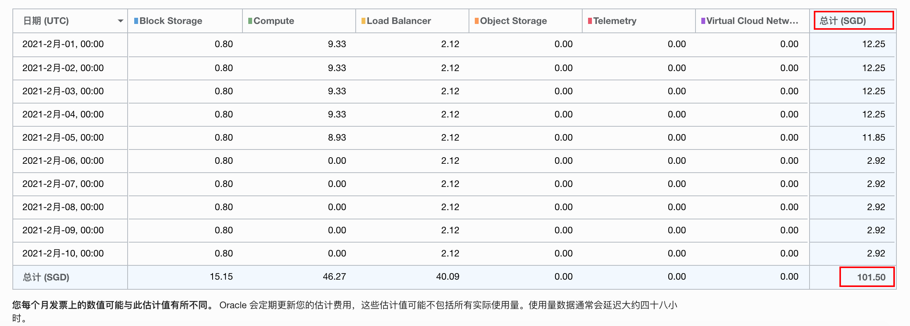

   

## 2：**预算管理**

预算可用于对Oracle Cloud Infrastructure支出设置监控。您可以在预算上设置警报，以通知您何时可能超出预算，并且可以在Oracle Cloud Infrastructure控制台的一个位置查看所有预算和支出。

1. 导航至菜单**帐户管理**，然后点击**预算**。

   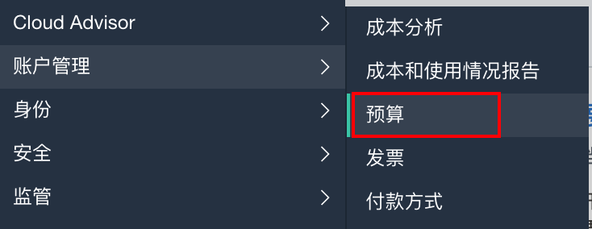

2. 我们可以通过单击按钮来创建新预算，或者检查当前现有预算

   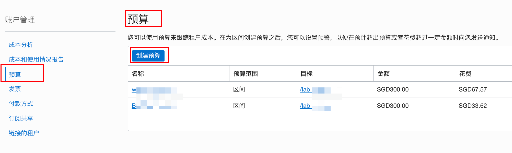

3. 点击**创建预算**按钮。

   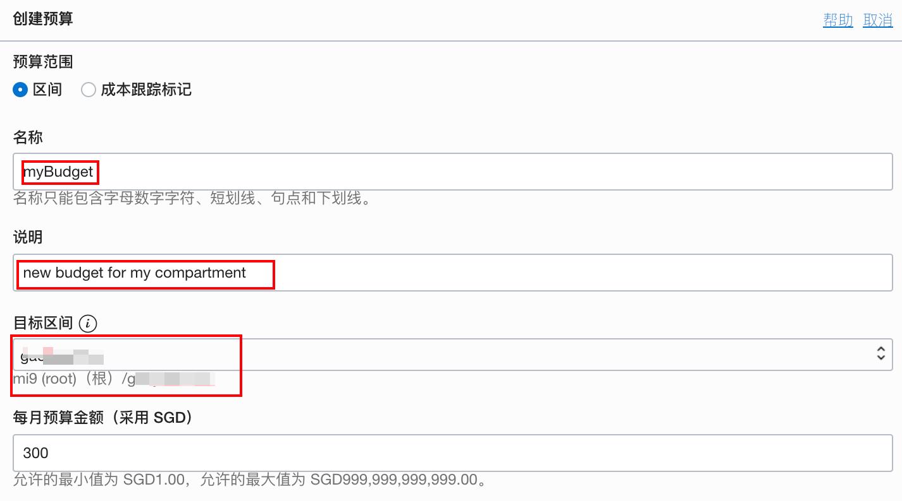

   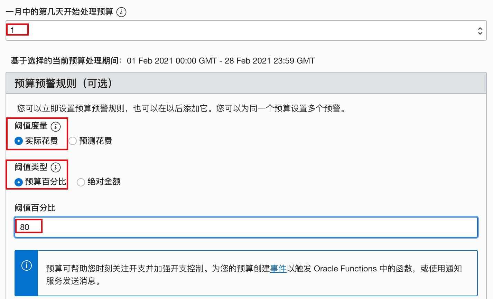

   

   

4. 你通常会如何得到警告的电子邮件？

   通常，基于预算的告警会被每15分钟进行评估。您可以预算的详细信息里查看上一次评估的时间，同时还可以看到和评估相关的一些预算的树枝。如果在评估时，达到了预设的阙值，您就会收到警告邮件。

   PS: 请注意您邮箱相关的过滤策略。

## 3：使用情况报告

费用报告是类似于使用情况报告的逗号分隔值（CSV）文件，但还包括费用列。该报告可用于获取资源级别的发票行项目明细。因此，您可以优化Oracle Cloud Infrastructure支出，并做出更明智的云支出决策。

使用情况报告是一个逗号分隔值（CSV）文件，可用于获取Oracle Cloud Infrastructure中资源的详细明细，以进行审计或发票对帐。

1. 导航到“菜单**帐户管理”** ，然后单击“**成本和使用情况报告”** 。

   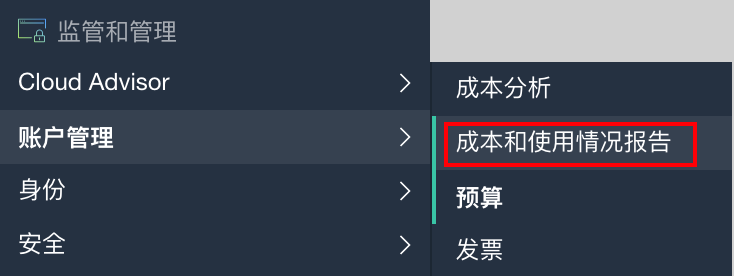

2. 然后您可以以csv格式查看报告

   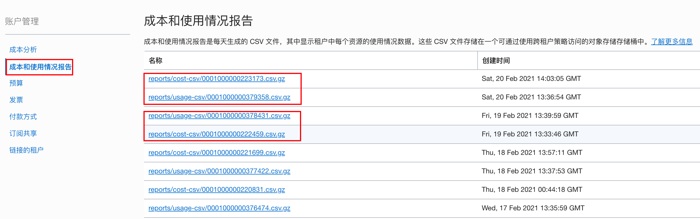

   

   通常有两种类型的报告供您选择：

   **成本报告**，每小时每个Oracle Cloud Infrastructure资源（例如实例，对象存储桶，VNIC）包含一行，以及消耗信息（使用，价格，成本），元数据和标签。成本报告通常包含24小时使用情况数据，尽管有时成本报告可能包含早于24小时的迟到数据。

    

   **使用情况**，它每个小时每个Oracle Cloud Infrastructure资源（例如实例，对象存储桶，VNIC）包含一行，以及消费信息，元数据和标签。使用情况报告通常包含24小时的使用情况数据，尽管有时使用情况报告可能包含早于24小时的迟到数据。

   

3. 单击其中的任何一个进行下载。

   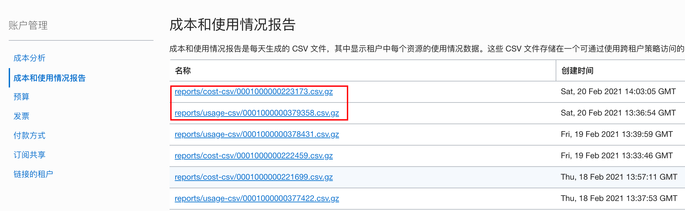

   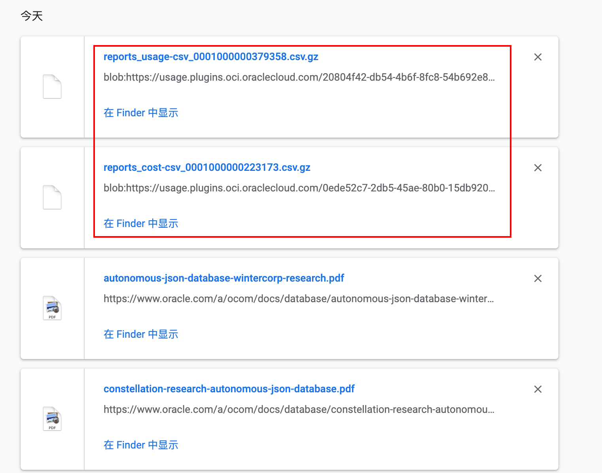

   

4. 使用DV等数据可视化工具来处理您的成本和使用情况数据

   您可以对您下载的报告解压后，进行相关的数据可视化的处理。通常您可以得到更为详细的关于您的资源使用情况的洞察。

   也可以参考相关的[官方文档](https://docs.cloud.oracle.com/en-us/iaas/Content/Billing/Concepts/usagereportsoverview.htm)。

## 4：两种资源限制

Oracle Cloud Infrastructure中，有两种资源限制：**租户资源限制**和**用户定义限额**。

首先看一下**租户资源限制**，它是注册Oracle Cloud Infrastructure时，为您的租户配置一组限制。服务限制是对资源设置的配额或配额。例如，您的租户允许每个可用性域中的最大计算实例数。购买Oracle Cloud Infrastructure时，通常会与Oracle销售代表一起确定这些限制。如果您没有与Oracle销售代表建立限制，或者如果您通过Oracle Store注册，则将为您的租户设置默认或试用限制。这些限制可能会根据您的Oracle Cloud Infrastructure资源使用情况和帐户信誉自动增加。

1. 导航至菜单**管理**，然后单击**限制，配额和用法**。

   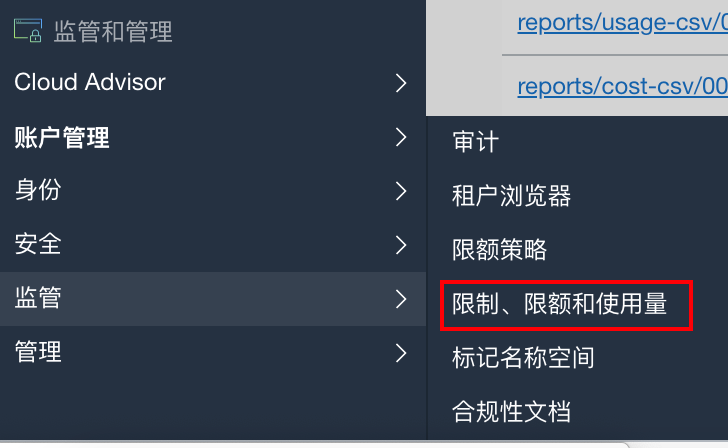

2. 在下一页中，您可以检查服务的所有默认限制和配额。

   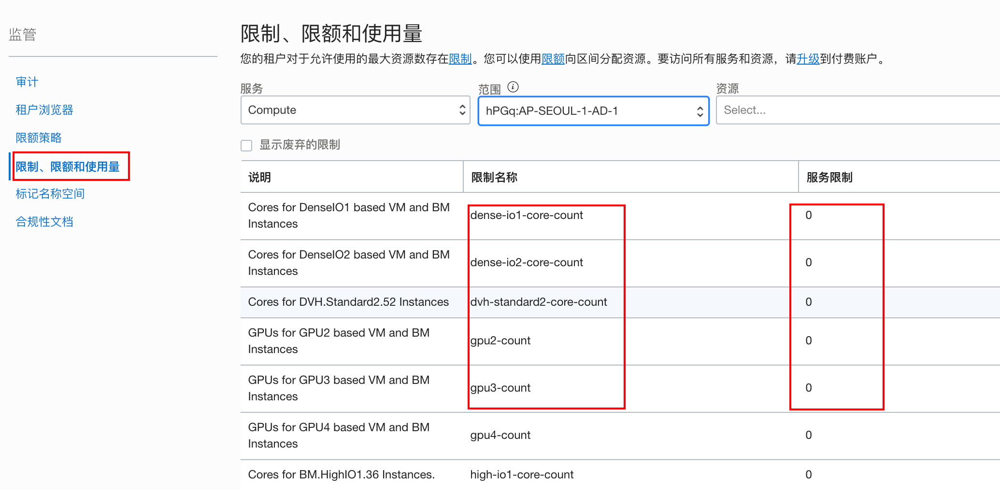

   

接下来看一下**用户定义限额**，它类似于软性的服务限额；二者最大的区别是**租户资源限制**是由Oracle设置的，而**用户定义限额**是由管理员设置的，它们的组合使用，让您可以高度灵活地分配和使用OCI资源。在定义用户定义限额时，我们使用以类似于IAM策略的简单声明性语言，来编写策略声明进行相应配额的设置。

1. 导航至菜单**管理**，然后单击**配额策略**。

   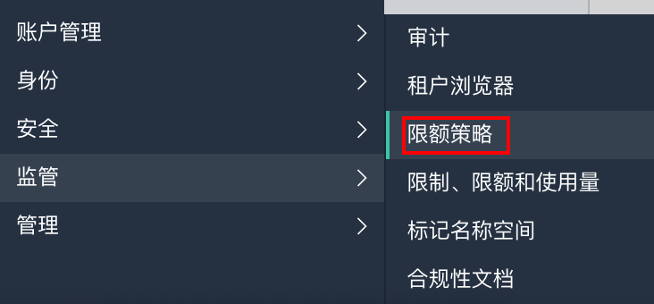

2. 我们可以根据要求为我们自己的Compartment创建限额策略或查看已经存在的策略。

   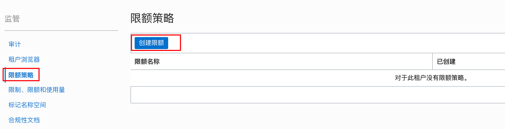

   

   

3. 我们为 自己的Compartment创建限额策略。

   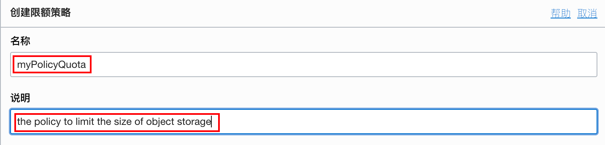

   

   配额策略声明分为三种：

   set - 设置资源限制

   unset - 取消资源限制

   zero - 把资源限制设置为0，也就是不允许使用该资源

   

   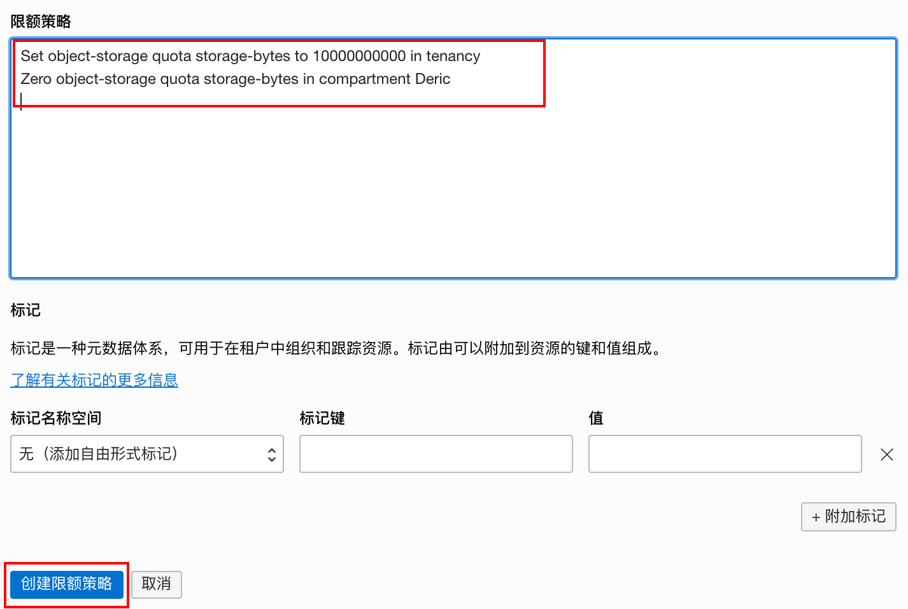

   

   

4. 验证。

   当我们到对应的Comparment下，为某个bucket上传数据时，会得到如下的提示，因为我们限制了空间的使用。

   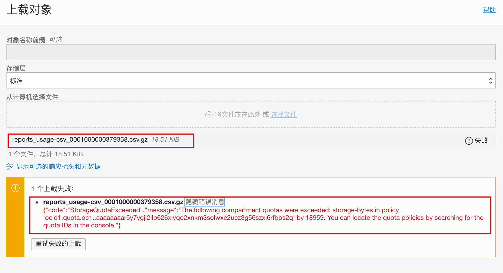

   

   限额策略在我们实际操作中有更多的扩展。

   例如限制compute-core数量，实例数等等在某区域下/某区间下。
   
   同时你可以更改或者删除已建的策略
   
   
   
   

