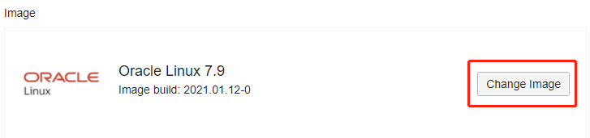

### 概览

Oracle Cloud Infrastructure Compute服务提供裸机（Bare-metal），虚拟机（Virtual Machine）以及专用虚拟主机（Dedicated Virtual Host ），本文将演示虚拟机（VM）的创建和配置过程。

### 前提条件 

- 已经通过 IAM 授权，加入到了具 有Compute 操作权限的用户组中。
- 由于计算实例的创建需要选择其所在的虚拟网络相关信息，故要求已在指定的区域（Region）创建好 VCN 以及 Subnet。
- 创建好登录 VM 的 SSH Key Pair。

### 目录

[1 选择 VM Instance 放置的位置及硬件配置 ](#step1)

[2 选择 VM Instance 的网络配置](#step2)

[3 配置 VM Instance 的 SSH 密钥 ](#step3)

[4 配置 VM Instance 的 启动盘](#step4)

[5 配置其他高级选项 ](#step5)

[6 确认创建成功 ](#step6)

 

------

 

## 1 选择 VM Instance 放置的位置及硬件配置 

登录 Oracle Cloud Infrastructure 控制台主页, 在选择好 Region之后，点击左上角的三条横线图标，选择 **Compute** > **Instances** 。

在 Instances 主页面下选择指定的区间（Compartment），然后点击 **Create Instances**。

 **NAME** 处我们填入想要添加的 VM 的名称（本 LAB 中使用Test instance为例） ；

 **Configure placement and hardware** 处：

 **Availibility Domain** 选择想要放置 VM 的 AD（本 LAB 中使用 AD1 为例）；

 勾选**Choose a fault domain for this instance** 选择想要放置 VM 的 FD（本 LAB 中使用 FD2 为例）；

  **Image** 处默认提供了Oracle Linux7.9 的镜像，此处可点击 **Change Image** 选择/更改想要使用的虚拟机镜像。

  在弹出页面中提供了多种镜像可供选择（本LAB中选择 **Platform Images** 中的 **CentOS 7** 镜像）；

  点击 **Select Image** 确认选择该镜像。

  **Shape** 处默认提供了VM.Standard2.1 的实例硬件配置，此处可点击 **Change Shape** 选择/更改想要使用的虚拟机硬件配置。

  在弹出页面中提供了多种配置可供选择（本 LAB 中选择 **Virtual Machine - Intel Skylake** 中的 **VM.Standard2.2** 镜像）；

  点击 **Select Shape** 确认选择该镜像。

 

## 2 选择 VM Instance 的网络配置 

**Network** 处选择 **Select existing virtual cloud network** 选项， 然后在下拉列表中选择之前创建的 VCN （本 LAB 使用 VCN_01 作为例子）；

**Subnet** 处选择 **Select existing subnet** 选项， 然后在下拉列表中选择之前创建的 Subnet （本 LAB 使用 Public_Subnet 作为例子）；

**Use network Security Group** 处勾选则可以将VM Instance的VNIC放入已经创建好的 NSG（本 LAB 中不勾选此选项）；

勾选 **Assign a public IPv4 address** 为该 VM Instance 创建一个 IPv4 公共 IP ；

  

## 3 配置 VM Instance 的 SSH 密钥 

此处可以选择 **Generate SSH key pair** 来让 OCI 为您生生一对 SSH Key Pair， 或者选择 **Choose public key files** 或 **Paste public keys** 来上传自己的 SSH 公钥（本 LAB 选择 **Choose public key files** 作为例子）；

在虚线框中拖入自己的 SSH 公钥（必须是OpenSSH 格式）。

  

## 4 配置 VM Instance 的 启动盘 

默认提供的启动盘大小是50GB， 此处可以选择 **Specify a custom boot volume size** 来修改 Boot Volume 的大小（本 LAB 选择 60 GB 作为例子）；

由于Boot Volume 是远程启动盘，勾选 **Use in-transit encryption** 可以加密 Instance 和 BoottVolume 之间的通讯（本 LAB 不勾选此选项）；

**Encrypt this volume with a key that you manage** 选项可以使用客户自己的加密密钥来加密 Boot Volume（本 LAB 不勾选此选项）；

  

## 5 配置其他高级选项 

点击 Show Advanced Options 展开高级选项配置
在管理（**Management**）选项处：
**Instance metadata service** 选项可以配置创建好的 实例元数据信息（本 LAB 不勾选此选项）；

**Initialization Script** 选项可以配置 VM Instance 启动时的自定义初始化脚本（OCI官方提供的镜像中已包含了标准的 cloud-init脚本，本 LAB 选择默认的选项）；

**Oracle Cloud Agent** 选项中共用户配置 OCI 监控服务所需的 Cloud Agent，（本 LAB 使用默认配置勾选此处的三个选项）。

 在网络（**Netowork**）选项处：

 可以在 **Private IP address** 处为 VM  Instance 指定一个私有 IP（本 LAB 不填入此处，让 OCI 来为用户选择合适的私有 IP）；

 可以在 **Hostname** 处为 VM  Instance 指定一个私有的域名（本 LAB 中填入 test-01为例）；

 OCI 为计算实例提供 PV 和 SR-IOV 的两种网络（I/O）模式，选择 OCI 官方提供的镜像会默认选择SR-IOV 高性能模式（本 LAB 选择默认选项，即让OCI为用户选择合适的模式）。

 在镜像（**Image**）选项处：

 可以在 **Choose an image build** 处为已经选择的镜像指定一个版本（本 LAB 选择默认版本选项）。

 在放置（Placement）选项处：

 可以选择 **No placement specified** 选项让 OCI在指定的 AD/FD 中随意放置即将创建的 VM Instance（本 LAB 选择此默认选项）；

 也可以选择已经创建好的 **Dedicated host** 来放置即将创建的 VM Instance。

  

## 6 确认创建成功 

点击 **Create** 确认创建该VM Instance 。

页面将转到该 VM Instance 的主页面，可以看到该 Instance正在 Provision 中，主要的信息将显示在 **Instance Information**  Tab 中。

可以点击 **Resource** 下面的 **Work Request** 选项来查看任务进度。

 也可以选择**Resource** 下面的其他选项来为创建好的 VM Instance 添加VNIC/Volume 等操作。

 VM Instance 创建成功后，可以使用自己的SSH私钥通过VM的共有 IP及账号连接到该实例。

在Instance主页面中也提供了众多操作选项可以共用户来启动/关闭/重启/删除实例，还可以以此实例为基础创建自定义镜像/实例配置等操作。

