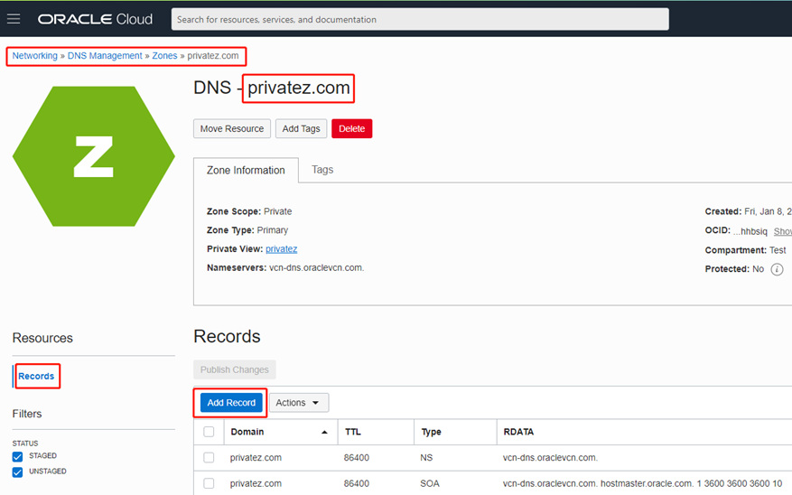

### 概览

Oracle Cloud Infrastructure提供Public DNS以及Private DNS 服务，本文将演示Public DNS及Private DNS的 Zone，Record的创建和配置过程。
由于DNS记录类型众多，本文将主要演示在OCI上创建DNS Zone以及创建A（Address Record）以及CNAME（Canonical Name Record）。

### 前提条件 

- 已经通过 IAM 授权，加入到了具有 DNS 操作权限的用户组中。

### 目录

[1 创建Public  DNS Zone及Record](#step1)

[1.1 创建Zone](#step2)

[1.2 创建Zone Record](#step3)

[2 创建Private  DNS Zone及Record](#step4)

[2.1 创建Zone](#step5)

[2.2 创建Zone Record](#step6)

 

------

 

# 1 创建Public DNS Zone及Record

本节将演示如何手动 Oracle Cloud Infrastructure 控制台上创建Public DNS Zone 以及Zone Record。

 

## 1.1 创建Zone 

登录 Oracle Cloud Infrastructure 控制台主页, 在选择好 Region之后，点击左上角的三条横线图标，选择 **Networking** > **DNS Management** 。

                               

在DNS Management 主页面选择**Zones**，在**Public Zones** Tab下点击**Create Zone** 。

 

**METHOD**选项我们选择**MANUAL**手动添加Zone。

**ZONE NAME** 处我们填入想要添加的Zone名称（本LAB中使用myzone.com为例, 此处注意使用正式注册过的Zone）。

选择**Primary** （代表我们希望在OCI内直接控制Zone的内容，可以选择Secondary来创建Secondary Zone）。

点击**Create**

 

回到DNS Management 主页面，点击刚创建的**myzone.ai**进入其主页面。

 

 

## 1.2 创建Zone Record 

选择**Records**选项，点击**Add Record** 来为此Zone 创建 Record。

 

**RECORD TYPE** 处选择**A**  **- IPv4 Address** ；

 **NAME **处填入 A Record 的名字（本LAB使用arecord作为例子） ；

 **TTL** 填入想要的TTL值 ；

 **RDATA MODE **处选择 **Basic** ；

 **ADDRESS** 处填入该 A Record 对应的 **Public IP** 地址 ；

 点击**Submit** ；

 

同样的，在 Zone 主页面选择 **Records** 选项，点击 **Add Record** 来为此 Zone 创建 CNAME Record ；

 **RECORD TYPE** 处选择 **CNAME - CNAME** ；

 **NAME** 处填入CNAME 的名字（本LAB使用cname作为例子） ；

 **TTL** 填入想要的TTL值 ；

 **RDATA MODE** 处选择 **Basic** ；

 **TARGET** 处填入该 CNAME Record 对应的 **A RECORD**  ；

 点击 **Submit** ；

 

回到Zone的 Record页面查看刚刚创建的A Record 及 CNAME Record，然后点击 **Publish Changes** 。

 

在弹出的页面 Review 刚才添加的 Record，然后点击 **Publish Changes** 将刚创建的记录推送到所有 Name Servers。

 

 

  

# 2 创建Private DNS Zone及Record

本节将演示如何手动 Oracle Cloud Infrastructure 控制台上创建Private DNS Zone 以及Zone Record。

 

## 2.1 创建Zone 

登录 Oracle Cloud Infrastructure 控制台主页, 在选择好 Region之后，点击左上角的三条横线图标，选择 **Networking** > **DNS Management** 。

 

在DNS Management 主页面选择**Zones**，在**Private Zones** Tab下点击**Create Zone** 。

 

**ZONE NAME** 处填入 Zone 的名字（本 LAB 使用 private.com 作为例子） ；

 **DNS Private View** 处选择 **CREATE NEW DNS PRIVATE VIEW** 来创建一个新的Private View ；

 点击 **Create** ；

 

  

## 2.2 创建Zone Record 

进入刚创建的Zone（privatez.com）的主页面，选择**Records**选项，点击**Add Record** 来为此Zone 创建 Record 。

 

**RECORD TYPE** 处选择**A - IPv4 Address** ；

 **NAME**处填入A Record的名字（本LAB使用web01作为例子） ；

 **TTL** 填入想要的TTL值 ；

 **RDATA MODE**处选择**Basic** ；

 **ADDRESS** 处填入该 A Record 对应的 VCN 内 **Private IP** 地址 ；

 点击**Submit** ；

 

同样的，在 Zone 主页面选择 **Records** 选项，点击**Add Record** 来为此 Zone 创建 CNAME Record  ；

 **RECORD TYPE** 处选择**CNAME - CNAME** ；

 **NAME** 处填入 CNAME 的名字（本LAB使用nginx01作为例子） ；

 **TTL** 填入想要的 TTL 值 ；

 **RDATA MODE** 处选择 **Basic** ；

 **TARGET** 处填入该 CNAME Record 对应的 **A RECORD** ；

 点击 **Submit** ；

 

回到 Zone 的 Record页面查看刚刚创建的A Record 及 CNAME Record，然后点击 **Publish Changes** 。

 

在弹出的页面 Review 刚才添加的 Record，然后点击 **Publish Changes** 将刚创建的记录推送到所有Private DNS Server 。

 

 