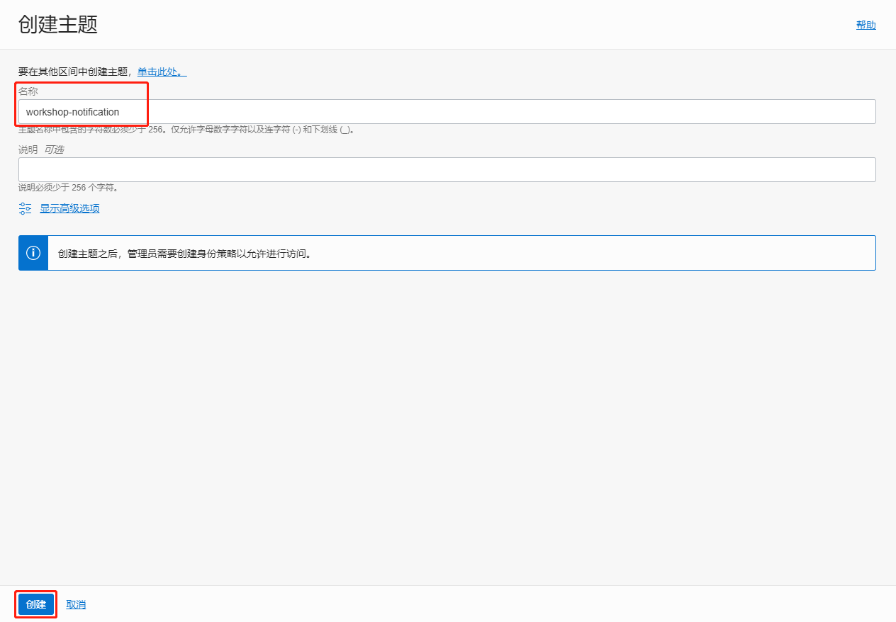

### 概览

Oracle 云基础设施事件服务使用符合云原生计算基金会 (CNCF) CloudEvents 标准的事件来跟踪资源变更。开发人员可以通过多种方式实时响应变更 — 使用 Oracle Functions 触发代码；写入流处理；或使用通知服务发送警报。

通过本实验，您创建一个事件，并通过上载文件到对象存储，触发该事件并且收到相关通知。

### 前提条件

- Oracle云基础设施用户名和密码。

- 您必须在开始本实验之前创建了一个区间。

### 目录

1. [创建对象存储](#step1)
2. [创建通知](#step2)
3. [创建事件](#step3)
4. [测试事件](#step4)

### 1. 创建对象存储

在OCI管理控制台界面，单击"对象存储"=>"对象存储"。

本实验使用"workshop"区间，选择"workshop"区间。单击"创建存储桶"。

输入项目。您必须勾选对象事件的"发出对象事件"。单击"创建"。

创建完成。

### 2. 创建通知

在OCI管理控制台界面，单击"应用程序集成"=>"通知"。

选择"workshop"区间，单击"创建主题"。

输入项目，单击"创建"。

创建完成。单击"订阅"。

单击"创建订阅"。

输入项目，电子邮件请输入您想接收邮件的邮箱。单击"创建"。

创建完成。订阅是"Pending"状态，您需要确认订阅。

您需要打开收件箱里的确认邮件，单击"Confirm subscription"。

确认完成。

确认完成后，订阅变为"Active"状态。

### 3. 创建事件

在OCI管理控制台界面，单击"应用程序集成"=>"事件服务"。

选择"workshop"区间，单击"创建规则"。

输入项目，单击"创建规则"。

- 属性值：您创建的存储桶的名称
- 主题：您创建的通知的名称

创建完成。

### 4. 测试事件

在OCI "bucket-workshop"的存储桶详细信息界面，单击"上载"。

您可以选择任意一个文件，上载这个文件。

单击"关闭"。

上载完成。

在事件服务的度量界面，可以查看有一个事件。

打开您订阅了通知服务的邮件收件箱，可以查看收到了通知邮件。

祝贺！您创建了一个事件，并通过上载文件到对象存储，触发了该事件并且收到了通知。