# 文件存储服务


## 概览

Oracle Cloud Infrastructure文件存储服务提供了持久的，可扩展的，分布式的企业级网络文件系统。您可以从虚拟云网络（VCN）中的任何裸机，虚拟机或容器实例连接到文件存储服务文件系统。您还可以使用Oracle Cloud Infrastructure FastConnect和Internet协议安全性（IPSec）虚拟专用网络（VPN）从VCN外部访问文件系统。文件存储服务支持网络文件系统版本3.0（NFSv3）协议。该服务支持用于文件锁定功能的网络锁定管理器（NLM）协议。

在本实验中，您将学到如何使用OCI Console来创建文件存储服务，在VCN中配置相关的安全规则，把文件存储服务挂载到具体的实例上，以及在实例中进行验证的基本技能。


## 前提条件

- Oracle Cloud Infrastructure帐户凭据（用户，密码和租户）
- 要登录控制台，您需要满足以下条件：
  - 租户，用户名和密码
  - 控制台的URL：[https : //cloud.oracle.com/](https://cloud.oracle.com/)
  - Oracle Cloud Infrastructure支持最新版本的Google Chrome，Firefox和Internet Explorer 11


## 目录

[1：为文件存储配置VCN安全列表规则](#practice-1-configuring-vcn-security-list-rules-for-file-storage)

[2：创建文件系统](#practice-2-creating-a-file-system)

[3：挂载文件系统](#practice-3-mounting-a-file-system)

**注意：** *某些UI可能与说明中包含的屏幕截图有些许不同，但是您仍然可以使用说明来完成动手实验。*


<a name="practice-1-configuring-vcn-security-list-rules-for-file-storage"></a>

## 1：为文件存储配置VCN安全列表规则

创建VCN时，还将创建默认的安全列表。安全列表中的规则用于允许或拒绝到子网的通信。在挂载文件系统之前，必须配置安全列表规则，以允许流量流向挂载目标子网。文件存储需要对TCP端口111、2048、2049和2050进行有状态入站，以及对UDP端口111和2048的有状态入站。

1. 打开导航菜单。在“**核心基础结构**”下，转到“**网络**”，然后单击“**虚拟云网络**”

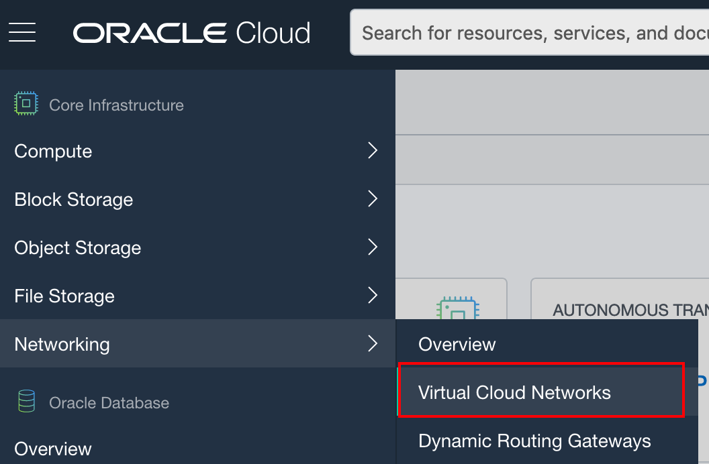


2. 在**列表作用域**部分中，选择包含要与文件系统关联的子网的Compartment

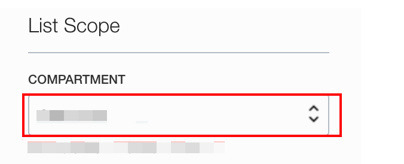


3. 在VCN的详细信息页面上，单击“**安全列表**”

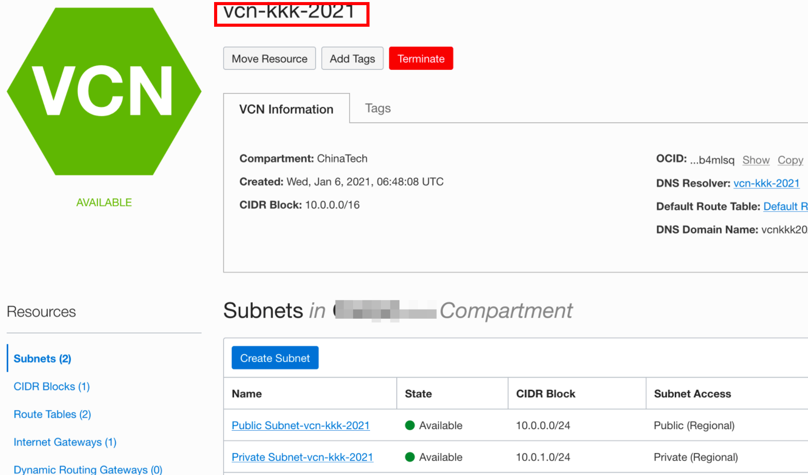


然后单击子网用于与文件系统关联的安全列表。

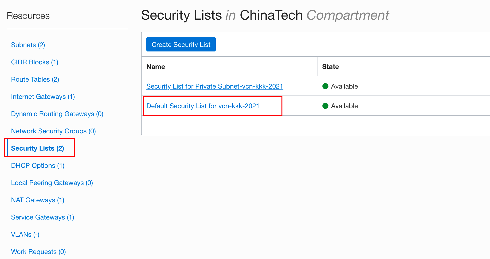

   

4. 在安全列表的详细信息页面上，选择**资源**部分下的**入站规则**链接。单击**添加入站规则**按钮。

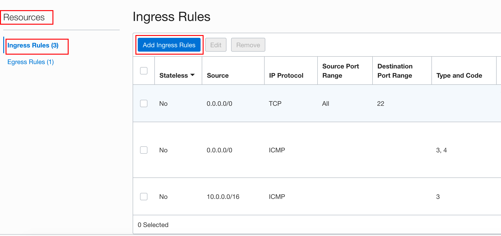

   

5. 添加以下允许TCP通信的入站规则

   - **来源CIDR**： *10.0.0.0/16*
   - **IP协议** ：*TCP*
   - **源端口范围**：*全部*
   - **目标端口范围** ：*2048-2050*

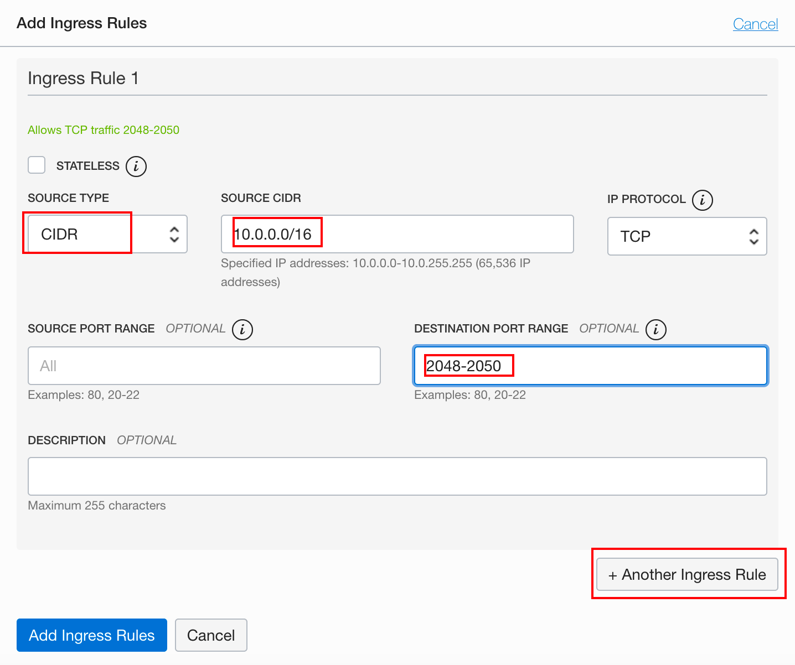

   点击**添加另一个入站规则**添加更多规则

   

6. 添加以下允许UDP流量的入站规则：

   - **来源CIDR**： *10.0.0.0/16*

   - **IP协议**：*UDP*

   - **源端口范围**：*全部*

   - **目标端口范围**：*2048*

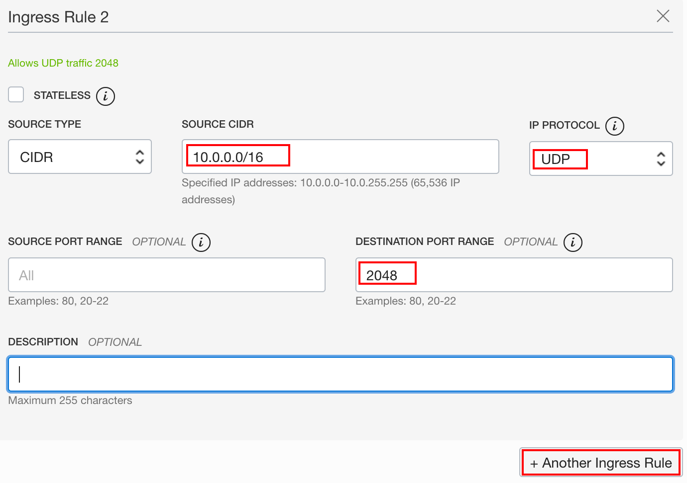

点击**添加另一个入站规则**添加更多规则

7. 创建第三个入站规则，允许流量到**目的端口111**（NFS rpcbind程序）
- **来源CIDR**：*10.0.0.0/16*
  
- **IP协议**：*TCP*
  
- **源端口范围**：*全部*
  
- **目的端口范围**：*111*

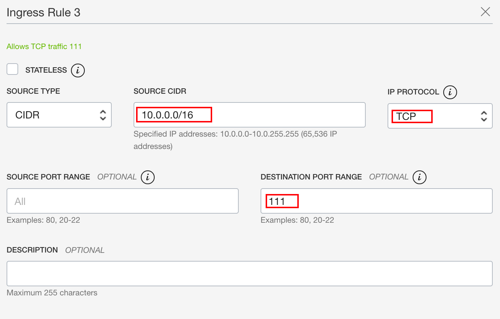

点击**添加另一个入站规则**添加更多规则


8. 创建第四个入站规则，允许流量到**目的端口111**（NFS rpcbind程序）
   - **来源CIDR**：*10.0.0.0/16*

   - **IP协议**：*UDP*

   - **源端口范围**：*全部*

   - **目的端口范围**：*111*

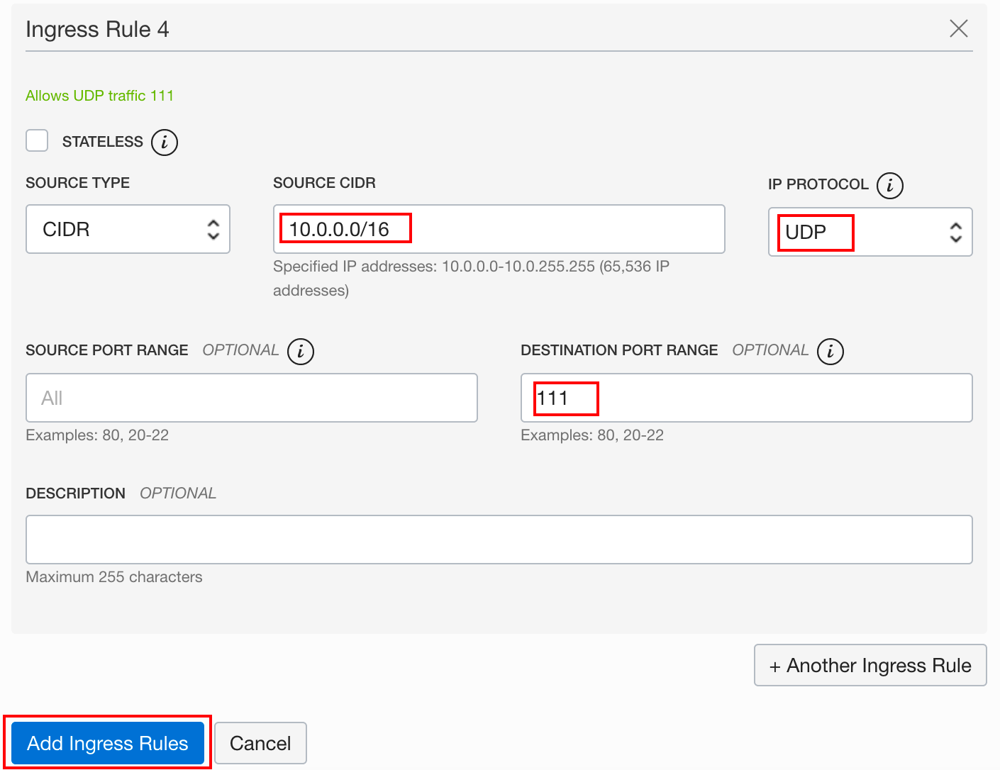

点击**添加入站规则**按钮创建上述规则。完成后结果如下：


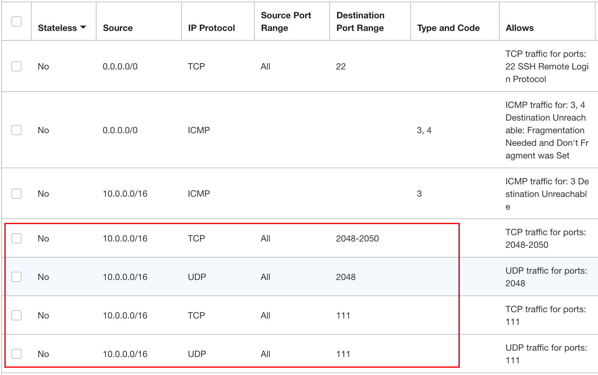

​     

<a name="practice-2-creating-a-file-system"></a>

## 2：创建文件系统

您可以使用文件存储服务在云中创建共享文件系统。使用控制台时，创建文件系统还会创建一个挂载点，您的Compute实例将使用该目标来访问和写入文件系统。创建挂载目标后，可以将多个文件系统与之关联。使用API或命令行界面（CLI），您可以创建文件系统并彼此独立地挂载目标。

1. 打开导航菜单。在“**核心基础结构**“下，单击“**文件存储**“->“**文件系统**“

   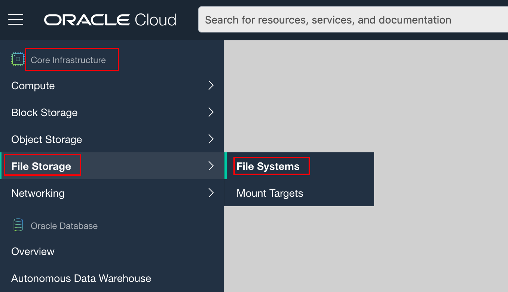

   

2. 单击**创建文件系统**按钮。

   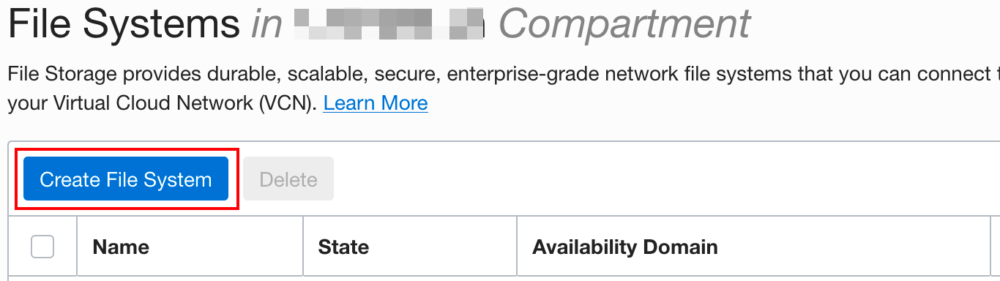

   

3. 在**创建文件系统**对话框的**文件系统信息**下，单击**编辑详细信息** 

   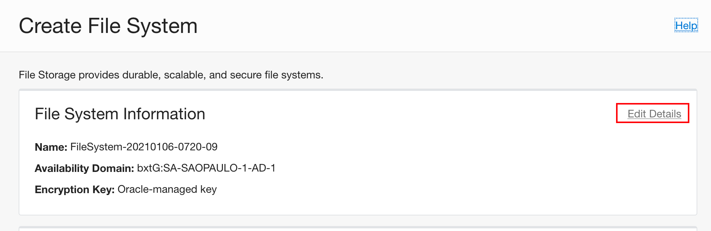

4. 输入以下内容：

   - **名称**： *FSS-Storage01*
   - **可用性域**：*选择在其中创建计算实例的相同可用性域*

   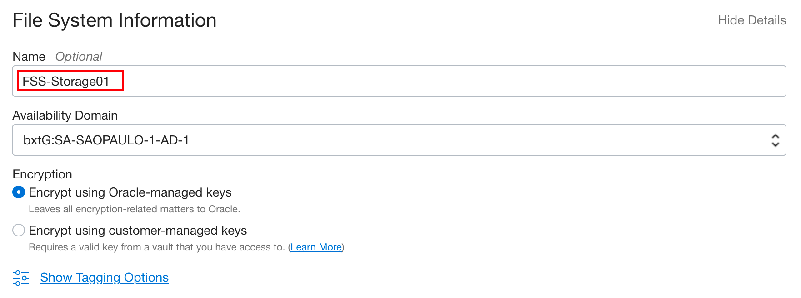

5. 在**挂载点信息下**，单击**编辑详细信息**

   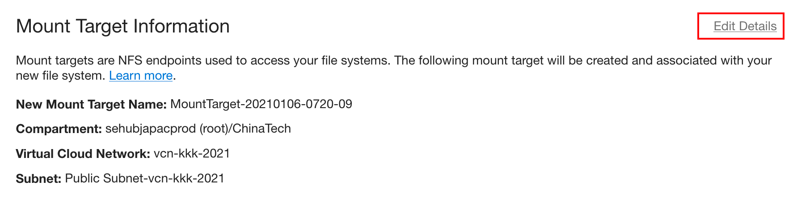

6. 输入以下内容，点击**创建**按钮

   - **名称**： *FSS-MT-01*
   - **虚拟云网络**：*选择您的VCN*
   - **子网**：*为挂载点选择一个子网*

   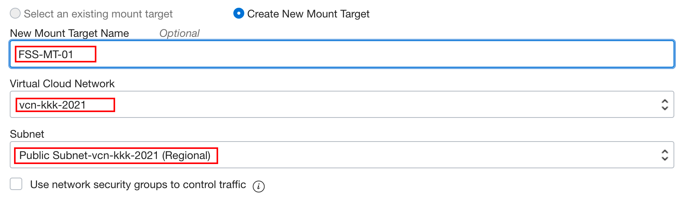

   

7. 稍后您将看到新文件存储的**详细信息**屏幕。

   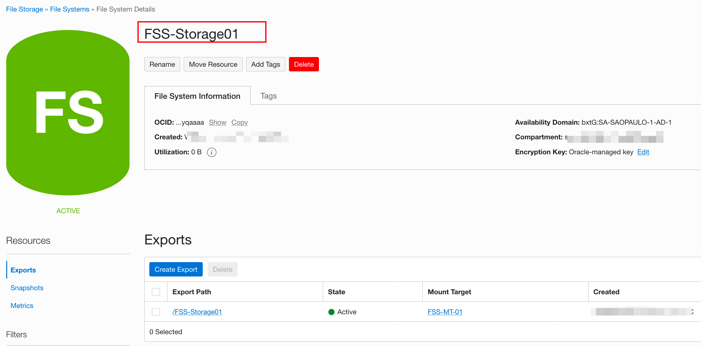

   

<a name="practice-3-mounting-a-file-system"></a>

## 3：挂载文件系统


Ubuntu和Linux操作系统的用户可以使用命令行连接到文件系统并写入文件。挂载目标用作文件系统网络访问点。为挂载目标分配IP地址后，您可以使用它来挂载文件系统。在要从其挂载文件系统的实例上，需要安装NFS客户端并创建挂载点。挂载文件系统时，挂载点有效地表示文件存储文件系统的根目录，从而使您可以从实例将文件写入文件系统。


1. 连接到实例，如果使用MAC，则可以使用“ Terminal”，如果使用Windows，则可以使用Gitbash。使用以下SSH命令：

   **注意：**对于Oracle Linux VM，默认用户名是**opc**

   ```
   # ssh opc@PublicIP_Address
   ```

   

   

2. 单击刚刚创建的文件系统，在**资源**下点击**导出**链接

   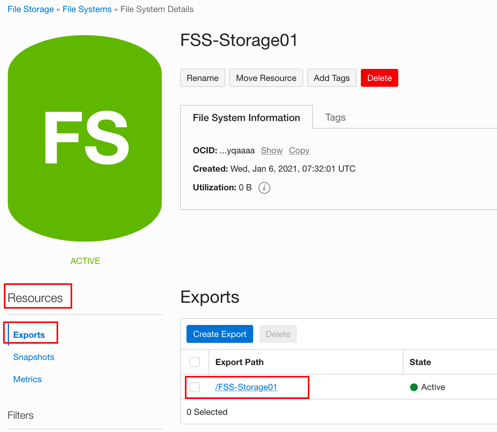

   

3. 然后在单击**导出**的菜单，选择**挂载命令**

   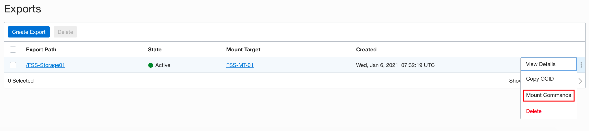

4. 现在，您可以查看到在不同的计算实例的类型中对应的挂载命令： 

   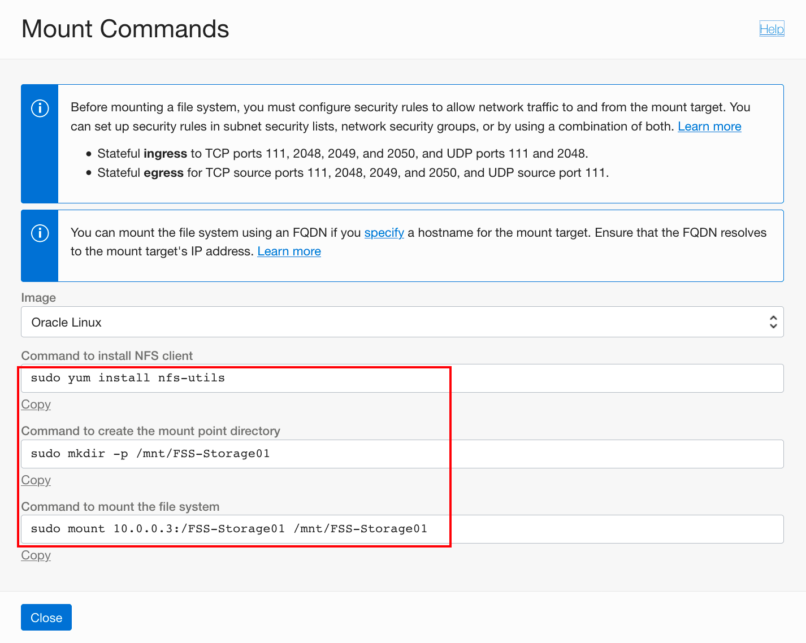

5. 打开一个终端窗口以查看您的计算实例，然后依次复制和粘贴每个命令。

   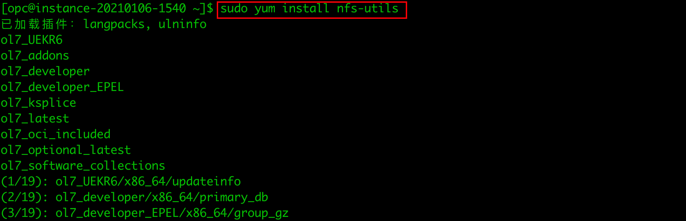

   

   

   

   

   

   最后，我们可以看到，文件系统已经挂载。

   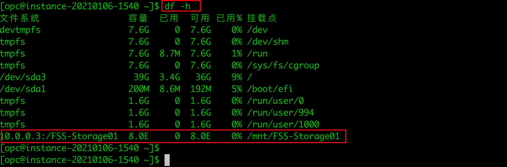

   

   **注意**：您可以同时在不同AD中的多个节点中挂载FSS文件系统。