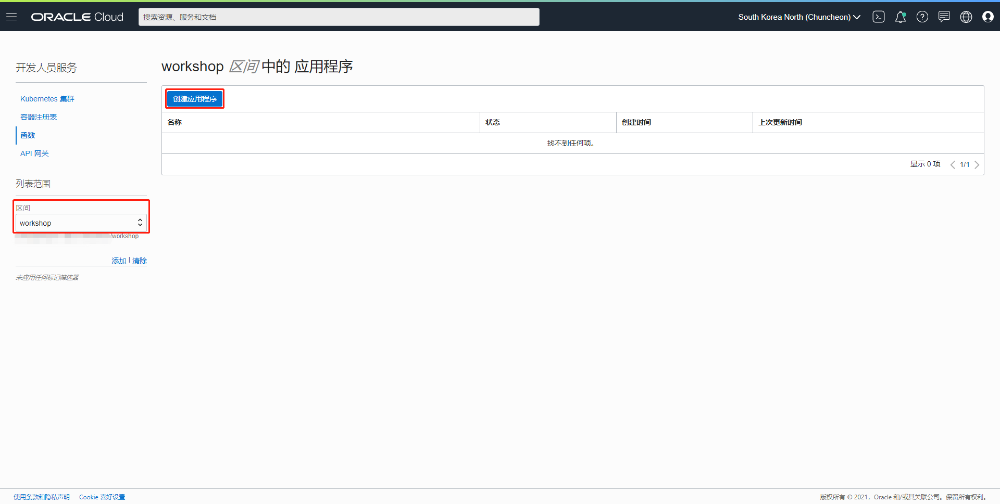

### 概览

Oracle Cloud Functions 是一个无服务器平台，让开发人员无需管理任何基础设施即可创建、运行和扩展应用。Oracle Functions 与 Oracle 云基础设施、平台服务和 SaaS 应用相集成。由于 Oracle Functions 基于开源 Fn Project 平台，因此开发人员可以创建能够轻松移植到其他云和本地部署环境的应用。基于 Oracle Functions 的代码通常运行时间很短，而且客户只需为所使用的资源付费。

在本实验中，您可以创建Oracle Functions应用，并在该应用中部署您的第一个Function。

### 前提条件

- Oracle云基础设施用户名和密码。

- 在您的租户中，必须有一个区间来包含必要的网络资源（VCN、子网、Internet 网关、NAT 网关、路由表、安全列表）。如果此类区间不存在，您必须在开始本实验之前创建它。

- 在本实验稍后部分设置Fn配置文件之前，您必须已执行以下操作：
  - 生成API签名密钥对
  - 将API签名密钥对的公钥值添加到用户的"API 密钥"
  - 安装并配置了Oracle云基础设施CLI

### 目录

1. 创建虚拟云网络
2. 创建策略
3. 生成身份验证令牌
4. 安装Docker
5. 安装Fn CLI
6. 创建应用程序
7. 配置Fn CLI并部署Oracle Functions

### 1. 创建虚拟云网络

在OCI管理控制台界面，单击"网络"=>"虚拟云网络"。


本实验使用"workshop"区间，选择"workshop"区间。


单击"启动 VCN 向导"。


选择默认的"具有Internet 连接的 VCN"，单击"启动 VCN 向导"。


输入项目，单击"下一步"。


复查后单击"创建"。


单击"查看虚拟云网络"。


创建完成。


### 2. 创建策略

以租户管理员的身份登录OCI管理控制台，单击"身份"=>"策略"。


选择"根"区间，单击"创建策略"。


输入项目，单击"创建"。

"策略构建器"处单击"定制（高级）"，输入策略内容。（示例中赋予的权限范围较大，在生产环境上请仅设置所需的策略。）

```
Allow group <group-name> to manage all-resources in tenancy
```

例如，"group-name"为"workshop"。

```
Allow group workshop to manage all-resources in tenancy
```


创建完成。


### 3. 生成身份验证令牌

在OCI控制台管理界面，单击用户图标，然后单击用户名。


单击"验证令牌"。


单击"生成令牌"。


输入项目，单击"生成令牌"。


单击"复制"，记录令牌。令牌只会出现一次，一定要记录保存。然后，单击"关闭"。


令牌生成完成。


### 4. 安装Docker

卸载旧版本。

```Linux
sudo yum remove -y docker \
                  docker-client \
                  docker-client-latest \
                  docker-common \
                  docker-latest \
                  docker-latest-logrotate \
                  docker-logrotate \
                  docker-engine
```

安装yum-utils包（它提供了yum-config-manager工具）。

```
sudo yum install -y yum-utils
```

创建仓库。

```
sudo yum-config-manager \
    --add-repo \
    https://download.docker.com/linux/centos/docker-ce.repo
```

安装特定版本的 Docker Engine。列出你的 repo 中可用的版本并进行排序，这个命令按照版本号从高到低对结果进行排序。

```
sudo yum list docker-ce --showduplicates | sort -r
```

安装一个特定的版本，用包名(docker-ce)加上版本字符串(第2列)，从冒号(:)开始的第一个连字符，用连字符(-)连接。

```
sudo yum install -y docker-ce-<VERSION_STRING> docker-ce-cli-<VERSION_STRING> containerd.io
```

例如，`19.03.15`。

```
sudo yum install -y docker-ce-19.03.15 docker-ce-cli-19.03.15 containerd.io
```

如果你想以非root用户的身份使用Docker，应该将你的用户添加到 "docker "组中。例如将`workshop`用户添加到 "docker"组中。

```
sudo usermod -a -G docker workshop
```

启动Docker。

```
sudo systemctl start docker
```

设置开机启动启动Docker。

```
sudo systemctl enable docker
```

通过运行hello-world镜像来验证Docker Engine是否正确安装。

```
docker run hello-world
```


### 5. 安装Fn CLI

环境是Linux and Unix (Including Oracle Linux 8)时，运行下面命令。其他环境请参考官方安装文档，[Install the Fn Project CLI](https://docs.oracle.com/en-us/iaas/Content/Functions/Tasks/functionsinstallfncli.htm)。

```
curl -LSs https://raw.githubusercontent.com/fnproject/cli/master/install | sh
```

确认CLI已经安装。

```
fn version
```

### 6. 创建应用程序

在OCI控制台管理界面，单击"开发人员服务"=>"函数"。


选择"workshop"区间，单击"创建应用程序"。



输入项目，单击"创建"。


创建完成。


### 7. 配置Fn CLI并部署Oracle Functions

在Oracle Functions的应用程序一览界面，单击"workshop-app"。


在"workshop-app"详细界面，单击"入门"。


单击"本地设置"。


顺次"复制"并运行下面步骤1到步骤8的命令。


1. 初始化您的函数。例如，"runtime"设置为"java"。

   ```
   fn init --runtime java my-func
   ```

2. 切换到生成的目录。

   ```
   cd my-func
   ```

3. 为此区间创建上下文并选择它以供使用。

   ```
   fn create context workshop --provider oracle
   fn use context workshop
   ```

4. 使用区间 ID 和 Oracle Functions API URL 更新上下文。

   ```
   fn update context <your-compartment-ocid>
   fn update context api-url https://functions.<your-region>.oraclecloud.com
   ```

5. 使用您要使用的注册表的位置更新上下文。例如，"OCIR-REPO"设置为"workshop"。

   ```
   fn update context registry yny.ocir.io/<tenancy-namespace>/workshop
   ```

6. 使用验证令牌作为密码来登录注册表。

   ```
   docker login -u '<tenancy-namespace>/<username> or <tenancy-namespace>/oracleidentitycloudservice/<username>' yny.ocir.io
   ```

7. 部署您的函数。

   ```
   fn deploy --app workshop-app
   ```

8. 调用函数。

    ```
   fn invoke workshop-app my-func
   ```

   输出结果。

   ```
   Hello, world!
   ```


祝贺！您刚刚使用Oracle Functions创建、部署并调用了您的第一个Function！