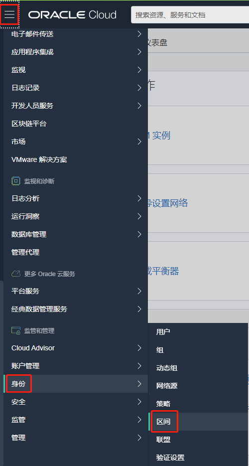
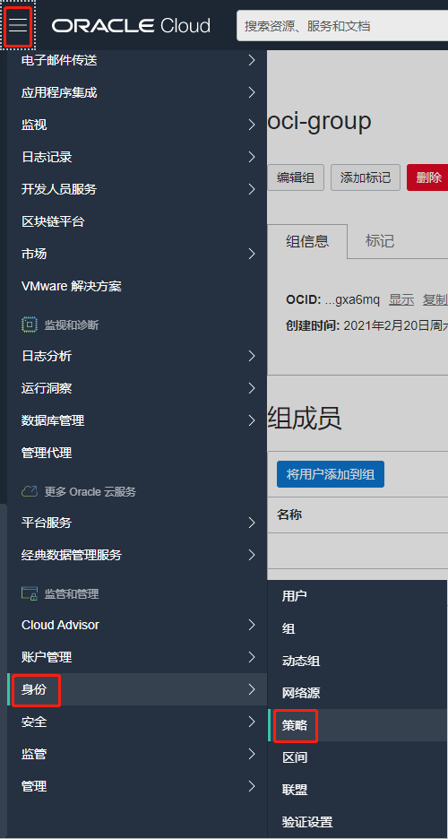
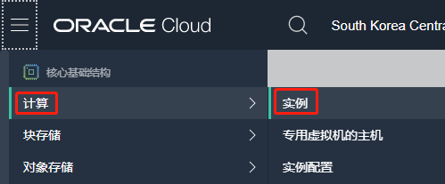

### 概览

Oracle Cloud Infrastructure 身份和访问管理（IAM）服务使您可以控制谁有权访问您的云资源。您可以控制一组用户拥有的访问类型以及对哪些特定资源的访问。本实验的目的是为您提供 IAM 服务组件的概述以及示例场景，以帮助您了解它们如何协同工作。


### 前提条件 

- Oracle Cloud Infrastructure帐户凭据（用户，密码和租户）
- 要登录控制台，您需要满足以下条件：
  - 租户，用户名和密码
  - 控制台的URL：https://oracle.com/
  - Oracle Cloud Infrastructure支持最新版本的Google Chrome，Firefox和Internet Explorer 11


### 目录

[1 登录控制台](#step1)

[2 创建区间 ](#step2)

[3 管理用户，组和策略以控制访问 ](#step3)

 

------

 <a name="step1"></a>

## 1 登录控制台 

您将使用凭据登录到 Oracle Cloud Infrastructure 控制台:

1. 打开受支持的浏览器，然后转到控制台URL：https://oracle.com/

2. 单击浏览器窗口右上角的肖像图标，然后单击“**登录到云”**链接。

   

3. 输入您的租户名称（即您的帐户名，而不是用户名），然后单击“**下一步”**按钮。

   

4. Oracle Cloud Infrastructure 与 Identity Cloud Services 集成在一起，您将看到一个屏幕，用于验证 Identity Provider。输入您的用户名和密码。单击**登录**。

   

   

5. 登录控制台后，将显示仪表板。

   


  <a name="step2"></a>

## 2 创建区间 

区间是云资产的集合，如计算实例，负载平衡器，数据库等。默认情况下，在您创建租约时（即当您注册试用帐户时）为您创建了根区间。可以在根区间中创建所有内容，但是 Oracle 建议您创建子区间以帮助更有效地管理资源。

1. 从菜单中，选择“**身份**--**区间**”。然后在下一页面中单击蓝色的**创建区间**按钮以创建子区间。

   

   

2. 将区间命名为**Demo**并提供简短说明。确保根区间显示为父区间。准备好后，按蓝色的**“创建区间”**按钮。

   

3. 您刚刚创建了一个区间。


  <a name="step3"></a>

## 3 管理用户，组和策略以控制访问 

用户访问服务的权限来自它们所属的**组**。**组**的权限由**策略**定义。策略定义组成员可以执行的操作以及针对哪些区间中的服务资源。用户可以根据为其所属组设置的策略访问服务资源并执行操作。

我们将创建一个用户，一个组和一个安全策略来理解该概念。

1. 登录到控制台，在“**菜单”上**单击“**身份”**，然后选择“**组”**。

   

2. 单击**创建组**。

   

3. 在**创建组**对话框中，为您的组输入唯一的名称，例如“ oci-group”。请注意，组名不能包含空格。点击**创建**。

   
   
   

4. 显示您的新组。

   

5. 现在，让我们创建一个策略，该策略在分配的区间中为您的组授予权限。例如，创建一个策略，向成员或组 oci-group 授予其对**Demo区间**内资源的访问权限：

   a）在**菜单上，**选择**身份**，然后单击**策略**。

   

   b）在左侧，选择刚创建的 **Demo 区间**，然后单击**创建策略**。 

   

   > 注意：您可能需要单击主区间名称旁边的+号才能看到子区间。如果这样做，但仍然看不到子隔间，请***刷新浏览器***。有时您的浏览器会缓存区间信息，并且不会更新其内部缓存。

   c）为您的策略输入唯一的**名称**（例如，“ Policy-for-oci-group”）。**请注意，该名称不能包含空格。**

   d）输入**描述**（例如，“ OCI组策略”）。

   e）输入以下**语句**：

   ```
   Allow group oci-group to manage all-resources in compartment Demo
   ```

   g）点击**创建**。

   

   

6. 创建一个新用户

   a）在**菜单上**选择**身份**，然后单击**用户**。

   

   b）在新页面中点击**创建用户**。

   

   c）在弹出页面中，选择 **IAM 用户**并为新用户输入唯一的名称及电子邮件地址。点击**创建**。

   

7. 为新创建的用户设置临时密码

   a）从用户列表中，单击**User01**以显示其详细信息。

   

   b）点击**创建/重置密码**。

   

   c）在弹出对话框中，单击**创建/重置密码**。

   

   d）OCI会为该用户船舰一个临时的一次性密码，单击**复制**该密码然后单击**关闭**。确保将此密码复制到您的记事本中。

   

   e）从用户菜单中单击“**注销”**，然后完全注销/退出admin用户帐户。

   

8. 使用其他网络浏览器或隐身窗口以新用户身份登录。

   a）转到[https://oracle.com](https://oracle.com/)。

   b）如果出现提示，请输入租户名称。

   c）这次，您将使用创建的用户使用 “**Oracle Cloud Infrastructure Direct Sign-In**” 框登录。请注意，您创建的用户不属于 Identity Cloud Services。

   d）输入您复制的密码并点击**登录**。

   

   **注意：** *由于这是首次登录，因此将提示用户更改临时密码，如屏幕截图所示。*

   e）新密码并点击**保存新密码**。

   

9. 验证用户权限

   a）转到**菜单，**单击**计算---实例**。

   

   b）尝试从左侧菜单中选择任何区间。

   c）出现消息“**您无权查看这些资源**”。这是正常现象，因为您没有将用户添加到与策略关联的组中。 

   d）注销控制台。

10. 将用户添加到组

    a）使用管理员帐户重新登录。

    b）从**用户**列表中，单击您刚创建的用户帐户（User01），以转到用户详细信息页面。

    c）在左侧的**资源**菜单下，单击**组**，点击**添加用户到组**。

    

    d）从**组**下拉列表中，选择您创建的**oci-group**，点击**添加**。

    

11. 当用户属于特定组时验证用户权限

    a）注销管理员登录，使用您创建的本地 User01 帐户登录。请记住使用您分配给该用户的最新密码。

    b）进入**菜单，**单击**计算**和**实例**。

    c）从左侧隔间列表中选择 **Demo** 区间。

    

    d）没有与权限相关的消息提示，您可以创建新实例

    e）转到**菜单，**单击**身份，**然后选择**组。**

    f）出现消息**您无权访问这些资源**。这是预期的，因为您的用户无权修改组。

    


