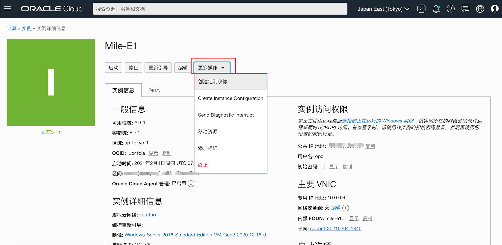
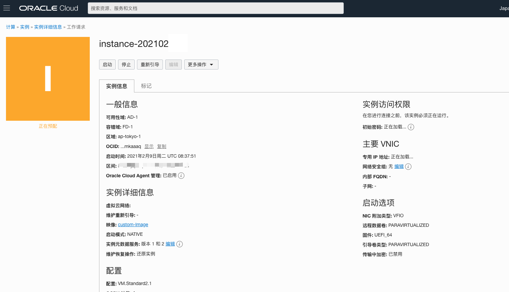
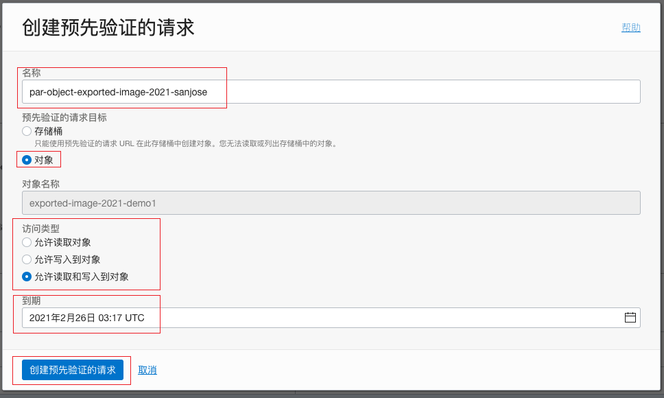
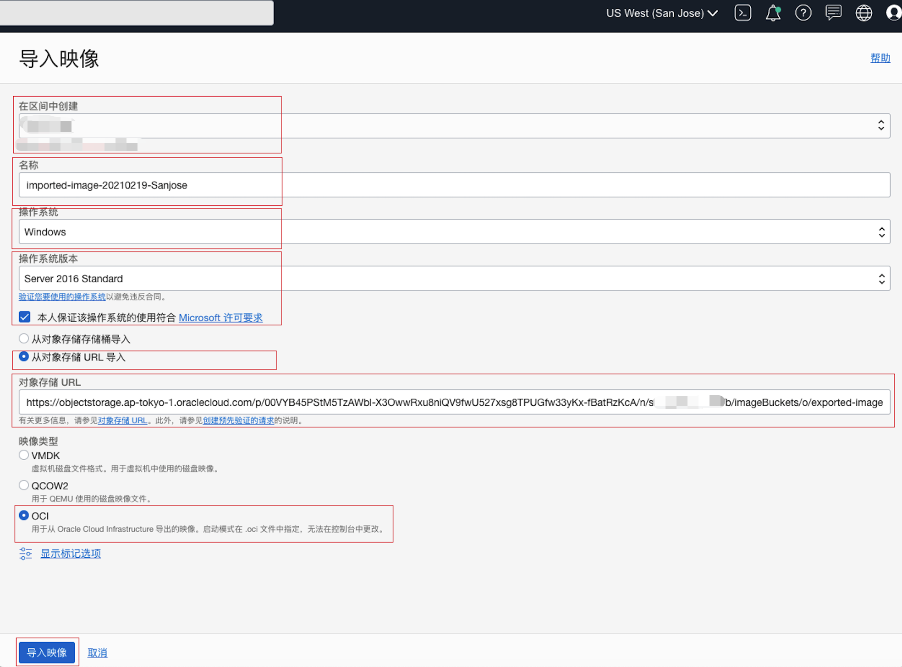
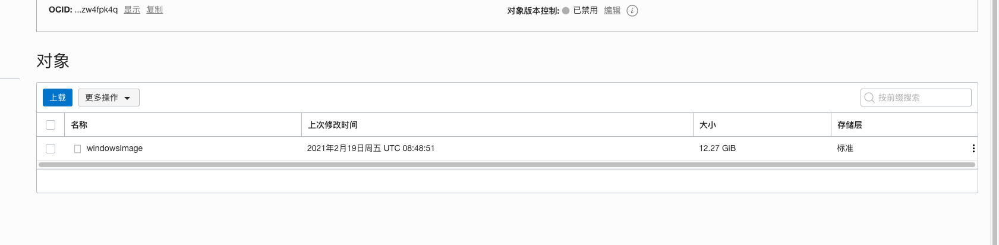
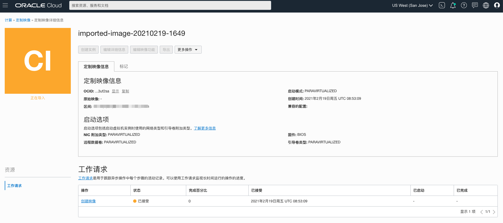

# 镜像管理

## 概览

镜像是是什么？  它是虚拟硬盘驱动器的模板，用于确定实例的操作系统和其他软件, 镜像有三种：oracle镜像，定制镜像，Bring your own Image自带镜像（后称BYOI）。Oracle Cloud Infrastructure 需要使用镜像来启动实例，你可以选择一个想用的镜像（oracle镜像）。您还可以创建裸机实例的启动盘的定制镜像，并使用它来启动实例。从镜像启动的实例包含了创建镜像时安装的定制选项、配置和软件。

内部的镜像可以通过导入导出在不通的区域之间建立镜像实例，从而使迁移更简单便捷。

在内部不满足的情况还可以通过BYOI方法来导入你自己的镜像到OCI里面建立实例。

本次镜像管理主要讲解定制镜像，以及BYOI的镜像管理操作。

定制图像不包括来自任何附加块卷的数据。有关备份卷的信息, 参考 [备份卷](https://docs.oracle.com/en-us/iaas/Content/Block/Tasks/backingupavolume.htm#Backing_Up_a_Volume) 。

## 前提条件

- Oracle Cloud Infrastructure帐户凭据（用户，密码和租户）
- 要登录控制台，您需要满足以下条件：
  - 租户，用户名和密码
  - 控制台的URL：[https : //cloud.oracle.com/](https://cloud.oracle.com/)
  - Oracle Cloud Infrastructure支持最新版本的Google Chrome，Firefox和Internet Explorer 11

* 政策:  确保Admin已经为你的指定的组提供了管理实例和映像的常规访问权限，以及将现有块卷附加到实例所需的访问级别  [参考策略](https://docs.oracle.com/en-us/iaas/Content/Identity/Concepts/commonpolicies.htm#launch-instances)

## 目录

[1: 建立windows定制镜像](#creating-windows-custom-images-001)

[2: 镜像的导入与导出](#custom-images-import-export-001)

[3: BYOI 自带镜像](#custom-images-BYOI-001)

**注意：** *由于版本原因，某些UI可能与说明中包含的屏幕截图有些许不同，但是您仍然可以使用说明来完成动手实验。*

## 1：建立Windows定制镜像

#### 1.1 建立新的镜像

1.打开OCI实例列表

2.在指定区间选择你想要创建定制镜像的实例，点击这个镜像名。

3.点击更多操作，点击创建定制映像。

4.在弹出窗里：

- 确认区间

- 输入一个镜像名称

- 点击“创建定制映像”

返回列表可以查看“custom-Image”正在预配。

#### 1.2 利用镜像建立新的实例

1.完成1.1以后在“custom-Image”✅可用时，点击它。

2.输入：

- 实例的名称

- 区间

- 镜像为刚刚创建的镜像
- 点击创建

​	

3.过一会实例将会被建立成功。从镜像启动的实例包含了创建镜像时安装的定制选项、配置和软件。

#### 1.3 连接到实例

1.下载 [Remote Desktop client](https://docs.microsoft.com/en-us/windows-server/remote/remote-desktop-services/clients/remote-desktop-clients)

2.点击进入刚刚建立好的实例中，复制IP地址

3. 在Remote Desktop Client中添加一个链接。此次以Mac上截图为例：

   

   4.在弹出窗口里粘贴IP地址，用户名输入opc

   

   5.双击建立好的虚机即可登录上去。（密码为制作镜像时的机器登录密码）

### 1.4 编辑与更改定制镜像的名字或配置

- 计算>定制映像>点击刚刚创建的“custom-Image”的镜像

- 更改镜像名称

- 更改配置
- 保存更改

### 1.5 删除定制镜像

## 2: 镜像的导入与导出

为什么导入镜像，一个主要的原因是我们可以把op的镜像OCI导入上云并创建实例使用；另一方面我们可以在OCI上创建镜像，然后安装一些软件和配置，并把这个镜像作为母镜像使用从而保留了数据的同事，还可以随时把它迁移到其他的地区上使用。

注意可导出操作系统：

#### Linux 操作系统

- Oracle Linux 5.11 
- Oracle Linux 6.x
- Oracle Linux 7.x
- Oracle Linux 8.x
- CentOS 6
- CentOS 7
- CentOS 8
- Ubuntu 16.04 and later

#### Windows 操作系统

- Windows Server 2012 Standard, Datacenter
- Windows Server 2012 R2 Standard, Datacenter
- Windows Server 2016 Standard, Datacenter
- Windows Server 2019 Standard, Datacenter

接下来的实验，我们来把我们建立好的在东京的实例，迁移到美国San Jose去使用。

### 2.1 建立对象存储

1. 创建存储桶

- 点击目录
- 对象存储
- 对象存储（子集）

2. 选好区间，点击创建存储桶

- 输入桶名称

- 加密（可选）
- 点击创建按钮

3. 创建好后点击进入，可以看到对象存储里还没有对象，如下图

### 2.2 导出镜像

1. 返回到定制镜像界面还是在同一区下找到我们刚建立的custom-image点击右边菜单，点击导出。

2. 导出镜像配置：

- 选择导出到对象存储存储桶
- 选择区间
- 写入镜像名称
- 点击导出镜像

3. 正在导出，可能需要几分钟

4. 成功后界面

### 2.3 导入镜像

​	1. 选择刚导出的对象，点右边菜单，点击创建预先验证的请求。

2. 创建预先验证的请求配置

- 输入名称
- 选择对象
- 访问类型选择你想设置的访问类型
- 选择到期的日期
- 点击创建预先验证的请求

3. 新弹出界面里点击URL右边的复制链接按钮，点击关闭

4. 以上我们建立好了预先验证请求的链接，接下来我们转到San Jose去导入镜像。

   在右上角区域选择San Jose（或选择你想导入的区域），如果没有可以在区域管理中添加区域。

5. 进入定制镜像界面，可以看到当前区域的区间中目前没有镜像。

6. 点击导入镜像按钮。

7. 导入镜像配置

- 选择区间
- 输入名称
- 选择操作系统
- windows选择版本
- 选择从对象存储URL导入
- 在对象存储URL中粘贴2.3.3中的链接
- 镜像类型选择OCI （注意导入类型选择OCI是因为导入的镜像是使用之前的OCI原生镜像）
- 点击“导入映像”按钮 

8. 完成后，正在导入界面。

9. 导入成功，在San Jose我们就有了这个镜像，接下来就可以利用这个镜像来在当前区域创建实例了。

## 3: BYOI 自带镜像

BYOI的操作其实我们已经覆盖了，和导出操作不同的是，我们需要上传自己的镜像到对象存储里面，然后创建预先验证的请求-导入镜像。

[准备需要导入的VM]: https://docs.oracle.com/en-us/iaas/Content/Compute/Tasks/importingcustomimagewindows.htm

1. 登录进入OCI后，点击左上角核心基础结构，对象存储，对象存储，点击创建对象存储桶。

   

2. 命名，可选加密方式，点击创建。

   

3. 创建桶后点击上载，上传你自己的镜像

   

4. 上传可以加前缀，选择文件，点击上载。或者通过OCI 命令行： oci os object put -bn <destination_bucket_name> --file <path_to_the_VMDK_or_QCOW2_file> 上传文件。

   

5. 上传后下方可以看到对象了

   

6. 返回OCI，点击左上角菜单点击计算，定制映像。

   

7. 点击导入镜像

   

8. 填写信息

   - 选择区间
   - 填写名称
   - 选择操作系统
   - 选择从对象存储桶导入
   - 选择刚建立的存储桶
   - 选择镜像类型选择QCOW2（注意类型选择为QCOW2是自带的镜像格式）
   - 点击导入映像按钮
   - 启动模式选择半虚拟化模式

   

9. 正在导入

   

10. 导入成功即可用此镜像生成实例了

    

