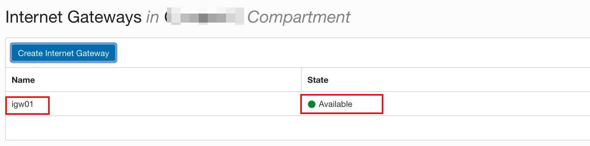

# 负载均衡器


## 概览

Oracle Cloud Infrastructure负载均衡服务提供了一个到虚拟云网络（VCN）可访问的多台服务器的自动流量分配。该服务地址为负载均衡器提供您所选择的公共IP地址或者私有IP地址，及您所配置的流量带宽。

负载均衡器可提高资源利用率，易于扩展并有助于确保高可用性。您可以配置多个负载均衡策略和基于应用程序的运行状况检查，以确保负载均衡器仅将流量定向到运行状况良好的实例。负载均衡器可以通过从运行状况不佳的应用程序服务器上删除流量，然后再将其从服务中删除进行维护，从而减少维护时间。

通过负载均衡服务，您可以在VCN中创建公共或私有负载均衡器。公共负载均衡器具有可从Internet访问的公共IP地址，私有负载均衡器具有来自托管子网的IP地址，该地址仅在您的VCN中可见。您可以为IP地址配置多个侦听器，以平衡地传输第4层和第7层（TCP和HTTP）的流量。公共负载均衡器和私有负载均衡器都可以将数据流量路由到VCN可以访问的任何后端服务器。

以下向您展示了一个简单的公共负载均衡器的使用过程。

在本实验中，您将学到如何使用OCI Console来创建负载均衡器，根据设定的规则把流量路由到后端的Web服务，以及在浏览器中进行验证的基本技能。

## 前提条件

- Oracle Cloud Infrastructure帐户凭据（用户，密码和租户）

- 要登录控制台，您需要满足以下条件：

  - 租户，用户名和密码

  - 控制台的URL：[https : //cloud.oracle.com/](https://cloud.oracle.com/)

  - Oracle Cloud Infrastructure支持最新版本的Google Chrome，Firefox和Internet Explorer 11

    

## 目录

[1：创建虚拟云网络](#practice-1-creating-virtual-cloud-network)

[2：创建两个Web服务器](#practice-2-creating-two-web-servers)

[3：创建和测试负载均衡器](#practice-3-creating-and-testing-the-load-balancer)

**注意：** *某些UI可能与说明中包含的屏幕截图有些许不同，但是您仍然可以使用本说明来完成动手实验。*


<a name="practice-1-creating-virtual-cloud-network"></a>

## 1：创建虚拟云网络

1. 单击**菜单**->**网络**->**虚拟云网络**

   

   

   

2. 单击**创建虚拟云网络**

   - **名称：** *VCN-WEB*

   - **CIDR块：** *10.0.0.0/16*

   - 单击*创建虚拟云网络*按钮。

     

     

3. 在VCN的资源选项中，点击**安全列表**

   

   

4. 创建以下安全列表：

   - **安全列表名称：** *LB-SecurityList01*
   - 删除*LB安全列表的*所有入站和出站规则（不应有任何规则，此处为默认）。
   - 单击*创建安全列表*

   

   

5. 创建另一个安全列表：

   - **安全列表名称：** *Web_SecurityList01*

     

   - 单击**添加入站规则**，然后输入：

     - **来源类型：** *CIDR*

     - **源CIDR：** *0.0.0.0/0*

     - **IP协议：** *TCP*

     - **目的端口范围：** *22*

       

   - 单击**其他出站规则**，然后输入：

     - **目的地类型：** *CIDR*

     - **目标CIDR：** *0.0.0.0/0*

     - **IP协议：** *所有协议*

       

   - 单击*创建安全列表*

     

     

6. 创建以下Internet网关：

   - **名称：** *igw01*
   - 单击**创建Internet网关**

   

   

   

   

7. 在默认的路由表下创建以下路由规则：

   - **路由表名称：** *Default Route Table for VCN-WEB*

     

   - 点击**添加路由规则**按钮

     

     - **目标类型：** *Internet网关*
     - **目标CIDR块：** *0.0.0.0/0*
     - **目标Internet网关：** *igw01*

   

   

8. 创建一个LB子网，然后单击**创建子网**进行编辑。

   

   输入以下参数：

   - **名称：** *lbsubnet01*
   - **子网类型：** *区域（推荐）*
   - **CIDR块：** *10.0.1.0/24*
   - **路由表：** *Default Route Table for VCN-WEB*
   - **子网访问：** *公共子网*
   - **DHCP选项：** *VCN-WEB的默认DHCP选项*
   - **安全列表：** *LB-SecurityList01*

   

   

   

9. 通过单击**创建子网**创建一个Web子网来承载您的Web服务器。输入以下参数：

   - **名称：** *websubnet01*
   - **子网类型：** *区域（推荐）*
   - **CIDR块：** *10.0.2.0/24*
   - **路由表：** *Default Route Table for VCN-WEB*
   - **子网访问：** *公共子网*
   - **DHCP选项：** *VCN-WEB的默认DHCP选项*
   - **安全列表：** *Web-SecurityList01*

   

   

   - 按**创建子网**按钮。


<a name="practice-2-creating-two-web-servers"></a>

## 2：创建两个Web服务器

您将创建两个Web服务器，这些服务器将用作Public Load Balancer的后端服务器。

1. 单击**菜单**->**计算**->**实例**

   

   

   然后单击**创建实例**按钮

   

   

2. 使用以下配置创建两个计算实例：

   - **名称：** *Web-Server-1*
   - **可用性域：** 默认
   - **Shape：** *VM.Standard.E3.FLex*
   - **子网：** *网络子网（区域）*
   - 点击**分配公共IP地址**按钮
   - 输入您的SSH公钥
   - 单击**创建**按钮。

   

   

   

   

   点击**创建实例**按钮。

   然后重复前面的步骤，但是这次输入名称**Web-Server-2**

   

   

3. 使用SSH连接到Web服务器，并在两个实例上运行以下命令：

   **注意**：对于Oracle Linux VM，默认用户名是**opc**。

   

   

   - 安装HTTP服务器：

   ```
   # sudo yum install httpd -y
   ```

   

   

   - 启动apache服务器，并将其配置为在系统重启后启动：

   ```
   # sudo apachectl start
   # sudo systemctl enable httpd
   ```

   

   

   - 对apache配置进行快速检查：

   ```
   # sudo apachectl configtest
   ```

   

   

   - 创建防火墙规则以允许访问HTTP服务器侦听的端口。

   ```
   # sudo firewall-cmd --permanent --zone=public --add-service=http 
   # sudo firewall-cmd --reload
   ```

   

   

   请对**Web-Server-2**执行以上所有步骤！

   

   

   - 为您的**Web-Server-1**创建一个默认主页：

   ```
   # sudo bash -c 'echo This is my Web-Server-1 running on Oracle Cloud Infrastructure >> /var/www/html/index.html'
   ```

   

   

   - 为您的**Web-Server-2**创建一个默认主页：

   ```
   # sudo bash -c 'echo This is my Web-Server-2 running on Oracle Cloud Infrastructure >> /var/www/html/index.html'
   ```

   

   

   

<a name="practice-3-creating-and-testing-the-load-balancer"></a>

## 3：创建和测试负载均衡器

1. 在控制台中，单击**菜单**->**网络**->**负载均衡器**。

   

   

2. 单击**创建负载均衡器**，然后输入以下参数：

   - **名称：** *LB-for-Web-01*

   - **可见性类型：** *公共负载均衡器*

     

   - **带宽：** *10Mbps*

   - **虚拟云网络：** *VCN-WEB*

   - **子网：** *lb-subnet（区域）*

     

   - 按**下一步**按钮

   - **负载均衡策略：** *加权循环*

     

     

   - 按**添加后端**按钮

     

   - 选择两个Web服务器

     

     健康检查默认

     

   - 按**下一步**按钮

     

   - 单击**HTTP**选项，并确保端口设置为**80**。

     

     

   - 按**创建负载均衡器**按钮。

   **注意**：创建负载均衡器后，会为您分配一个公共IP地址，所有入站流量都将路由到该IP地址。

   

3. 更新**LB-SecurityList01**，允许Internet访问侦听端口。转到**VCN详细信息**页面，然后执行以下任务：

   - 单击**安全列表**

   - 点击**LB-SecurityList01**。这将显示LB安全列表的详细信息

   - 点击

     添加

     进入**规则**，然后输入：

     - **源CIDR：** *0.0.0.0/0*

     - **IP协议：** *TCP*

     - **目的端口范围：** *80*

     - 点击*添加进入规则* 

       

       

4. 在左侧单击 **出站规则**，单击**添加出站规则**，然后输入以下出站规则：

   - **源CIDR：** *0.0.0.0/0*

   - **IP协议：** *所有协议*

   - 点击*添加出站规则*

     

   

5. 通过在Web浏览器上导航到负载均衡器的公共IP地址来测试其功能。

   **注意**：这可能需要几分钟的时间，因为LB将在启用安全规则后执行运行状况检查。

   

   

   

   在浏览器地址栏输入如下地址，将会看到Web-Server-1/2对请求的响应

   `http://<Public-IP-Address>`


