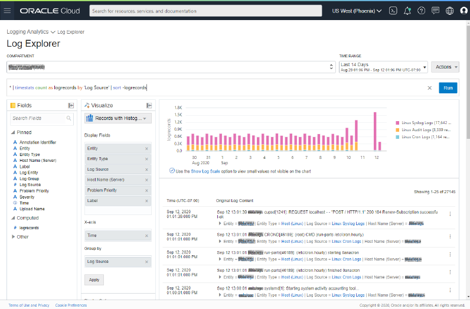
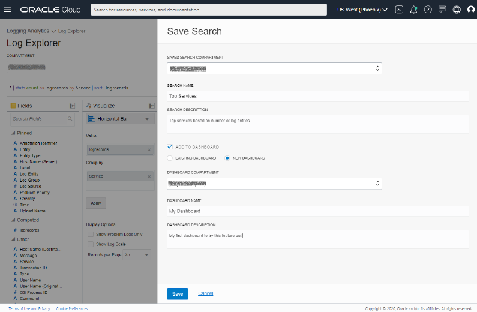

### 概览

Oracle 云基础架构 （OCI） 日志分析服务是一种高度可扩展、可靠和实时的日志分析解决方案。日志分析可自动从任何本地或云资源收集历史和实时日志。

本指南将提供非常简单的演练，以开始使用新的 OCI 日志分析服务。大约 30 分钟后，您将设置日志分析、安装代理、包含一些重要的 Linux 主机日志，并浏览日志资源管理器中的日志。

OCI**管理代理**用于执行日志收集工作。日志也可以直接上传到日志分析，如此所述：[使用 CLI 按需上传](https://docs.cloud.oracle.com/en-us/iaas/logging-analytics/doc/demand-upload-using-cli.html)。

**日志源**是日志文件的位置的定义，以及如何收集、屏蔽、分析、提取和丰富收集的日志数据。

**实体**是指安装管理代理的本地主机上的实际资产。每个实体都有一个**实体类型**，有超过 100 个预定义或任何自定义创建的类型。

每个日志都分配给**日志组**，此属性用于定义谁有权访问查询日志。

日志分析的用户将日志源关联到实体，以通过 OCI 管理代理启动连续日志收集过程。**源实体关联的概念**仅适用于通过代理进行连续日志收集。

### 前提条件 

- 是 IAM 用户的用户帐户。此用户将添加到"Logging-Analytics-SuperAdmins"组。
- 可用于在管理代理上安装和收集日志的 Linux 主机。如果使用按需上传上传日志，可以跳过代理安装。

### 目录

1. [设置 OCI 区间、用户和策略](#step1)
2. [启用日志分析](#step2)
3. [安装管理代理](#step3)
4. [准备输入日志数据](#step4)
5. [浏览日志](#step5)


------

<a name="step1"></a>

## 1. 设置 OCI 区间、用户和策略

（预计时间：8 分钟）

在 OCI 基础设施中需要设置以下几项操作才能使用日志分析和管理代理来收集日志。

注：有权访问创建组、区间、动态组、用户和策略的用户将需要执行这些初始设置步骤。

1. 首先，选择您的区域。

   日志分析和管理代理是区域服务。在开始之前，请选取要用于此快速入门的区域。您可以按照本指南了解要设置的每个区域，但每个区域将是不同的实例。使用 OCI 控制台右上角的区域选择器选择区域。

   

2. 为日志分析超级管理员创建用户组。

   在本教程中，我们将"Logging-Analytics-SuperAdmins"组的成员称为能够管理所有日志分析（包括on-boarding/off-boarding）的成员。在了解有关日志分析的更多信息后，您可以创建任何数量的标识组，具体取决于您希望如何控制对服务的访问。此组名只是一个示例 - 您可以在这里使用任何您想要的名称：

   1. 从 OCI 控制台菜单中导航到身份=>组。
   2. 单击"创建组"按钮。
   3. 提供组名称"Logging-Analytics-SuperAdmins"。
   4. 提供说明。
   5. 单击"创建"以保存组。

   创建此组后，将继续学习本教程其余部分的用户添加到该用户组：

   1. 从 OCI 控制台菜单中导航到身份=>用户。
   2. 单击将学习本指南的用户的名称
   3. 在屏幕的下半部分，单击"将用户添加到组"按钮。
   4. 在对话框中，选择"Logging-Analytics-SuperAdmins"组，然后单击"添加"按钮以保存所做的更改。

   

3. 为日志分析资源创建区间。

   在本教程的稍后部分，我们将创建日志分析日志组和实体。此区间是创建这些资源的地方。

   1. 从 OCI 控制台菜单中导航到身份=>区间。
   2. 单击"创建区间"按钮。
   3. 给区间起名字"LoggingAnalytics"。
   4. 提供说明。
   5. 选择父区间。您可以将此区间放在根区间下方或您想要的任何位置。将来，您可以创建更多区间来支持适用于您的组织的任何类型的访问控制模型。
   6. 单击"创建区间"按钮以保存更改。

4. 为管理代理资源创建区间。

   代理和代理密钥也需要位于区间中。在此示例中，我们将在租户根区间下创建代理区间。

   1. 从 OCI 控制台菜单中导航到身份=>区间。
   2. 单击"创建区间"按钮。
   3. 给区间起名称为"Agents"。
   4. 提供说明。
   5. 选择父区间。您可以将此区间放在根区间下方或您想要的任何位置。将来，您可以创建更多区间来支持适用于您的组织的任何类型的访问控制模型。
   6. 单击"创建区间"按钮以保存更改。
   7. 将此区间的OCID复制到剪贴板，您将需要在下一组步骤中使用它。

   

5. 为管理代理创建动态组。

   管理代理需要动态组和相关策略才能与 Oracle 云通信。

   1. 从 OCI 控制台菜单中导航到身份=>动态组。
   2. 单击"创建动态组"按钮。
   3. 提供名称"ManagementAgentAdmins"。
   4. 提供说明。
   5. 在"匹配规则"下，粘贴以下规则，将 XXX 替换为上一步中的区间"Agents"的 OCID。
     ```
   All {resource.type = 'managementagent', resource.compartment.id = 'XXX'}
     ```

   

6. 创建策略。

   此步骤提供本教程所需的所有策略。您可以将所有策略语句添加到单个策略，也可以创建单独的策略。我们通过将此处所需的所有语句都包括在一个策略中来简化此过程。这些只是示例策略，可以根据需要根据您的需求和访问控制要求进行调整。

   1. 从 OCI 控制台菜单中导航到身份>策略。
   2. 将区间更改为租户根区间。
   3. 单击"创建策略"按钮。
   4. 提供策略名称"Logging-Analytics-Policy"。
   5. 提供说明。
   6. 在"策略构建器"部分中，单击控件右侧的"定制（高级）"链接，将以下策略语句粘贴为一个文本块：
   
```
   allow service loganalytics to READ loganalytics-features-family in tenancy
   allow group Logging-Analytics-SuperAdmins to READ compartments in tenancy
   allow group Logging-Analytics-SuperAdmins to MANAGE loganalytics-features-family in tenancy
   allow group Logging-Analytics-SuperAdmins to MANAGE loganalytics-resources-family in tenancy
   allow group Logging-Analytics-SuperAdmins to MANAGE management-dashboard-family in tenancy
   allow group Logging-Analytics-SuperAdmins to READ metrics IN tenancy
   allow group Logging-Analytics-SuperAdmins TO MANAGE management-agents IN tenancy
   allow group Logging-Analytics-SuperAdmins to MANAGE management-agent-install-keys IN tenancy
   allow group Logging-Analytics-SuperAdmins to READ users IN tenancy
   allow dynamic-group ManagementAgentAdmins to MANAGE management-agents IN tenancy
   allow dynamic-group ManagementAgentAdmins to USE METRICS IN tenancy
   allow dynamic-group ManagementAgentAdmins to {LOG_ANALYTICS_LOG_GROUP_UPLOAD_LOGS} in tenancy
   allow dynamic-group ManagementAgentAdmins to USE loganalytics-collection-warning in tenancy
```

   7. 单击"创建"以保存策略。

 本教程中所有剩余步骤都假定您将作为"Logging-Analytics-SuperAdmins"组成员的用户登录到OCI 控制台。


------

<a name="step2"></a>

## 2. 启用日志分析

（预计时间：3分钟）

1. 日志分析服务可从顶级 OCI 控制台菜单获得。单击"日志分析"。

   

2. 如果这是第一次在此区域使用该服务，请查看登入页面，该页面将为您提供服务的一些高级详细信息，并可以选择"开始使用日志分析服务"。

   

   单击"开始使用日志分析"按钮，然后打开将指导您完成上面创建所需的策略的面板，以及您可以创建一些示例策略来管理服务的用户。

   

3. 准备就绪后，单击"继续"按钮以启动on-boarding。

   此过程只需几秒钟。在此期间，您将看到on-boarding屏幕更改，以显示我们正在启用日志分析。如果页面未在几秒钟内重新加载，请刷新浏览器。

4. on-boarding完成后，刷新浏览器，您将被带到日志分析界面。如果这是您单击的预期链接，您最终可能会访问日志资源管理器 UI。你会看到类似的界面：

   


------

<a name="step3"></a>

## 3. 安装管理代理

（预计时间：5分钟）

在此示例中，管理代理将安装在 Linux 主机上，我们希望在该主机上持续收集日志。代理通常安装在本地数据中心中，但也可以在运行 Linux 的云计算实例上安装代理。

注：如果此时不想安装管理代理，而是直接加载日志，可以跳过此步骤并执行本节中描述的步骤：[使用 CLI 按需上传](https://docs.cloud.oracle.com/en-us/iaas/logging-analytics/doc/demand-upload-using-cli.html)。

1. 创建管理代理安装密钥：

   选择此密钥可以使用的代理安装多少个代理，以及您希望该密钥有效的时间。本示例中的默认值是合适的。

   1. 从 OCI 控制台菜单，导航到"管理代理"。

   2. 从左侧菜单，选择"Downloads and Keys"：

      

   3. 在"Agent Software Download"下，单击"Agent for LINUX"链接，该链接将代理下载到您的主机。然后，您将需要将此安装程序传输到 Linux 主机。

   4. 在"Agent Install Keys"下，单击"Create Key"按钮。

   5. 在对话框中，提供密钥的"KEY NAME"为"demokey"。

   6. 将上面创建的"Agents"区间选取为密钥的区间。

   7. 选择此密钥可以使用的代理安装多少个代理，以及您希望该密钥有效的时间。默认值适用于此示例。

   8. 单击"Create"。

   9. 在列表页面中，单击行右侧的三点菜单，然后单击"Download Key to File"。您将在本地计算机上获取要传输到 Linux 主机的文件。

      

      

2. 传输从控制台下载的两个文件，即安装 Linux 主机上的代理所需的两个文件：`oracle.mgmt_agent.rpm`和 密钥文件`demokey.txt`。

3. 编辑文件`demokey.txt`并进行以下更改：

   1. 如果要为此代理命名，请为"AgentDisplayName"提供一个值。

   2. 如果您的 Linux 主机需要使用"proxy host"与Oracle云通信，请在以"Proxy"开始的字段中填写这些详细信息。

   3. 设置"CredentialWalletPassword"。这可能是您需要记住以后使用代理凭据存储所需的任何安全密码。

   4. 删除`Service.plugin.logan.download=true`行前面的注释线`#`。

   5. 将文件移动到`/tmp`文件夹，并使用以下命令设置权限。此文件需要由用户`mgmt_agent`（将在此示例中安装代理的用户）读取。

      ```
      sudo chmod 755 /tmp/demokey.txt
      ```

4. 安装管理代理。

   1. 作为根用户或使用 sudo，运行以下命令：

      ```
      sudo rpm -ivh oracle.mgmt_agent.rpm
      ```

   2. 如果收到消息`Agent install successful` ，请继续。

   3. 下一步是使用上面编辑的密钥文件配置代理。以 root 样运行以下命令或使用 sudo：

      ```
      sudo /opt/oracle/mgmt_agent/agent_inst/bin/setup.sh opts=/tmp/demokey.txt
      ```

   4. 请确保在输出中看到以下文本。如果看不到此消息，则上述步骤中失败。返回并再次检查这些步骤。
      ```
      Deploying service plugin(s)...Done.
          logan : Successfully deployed service plugin
      Agent setup completed and the agent is running
      ```
5. 确保日志文件可由代理读取。
   对于本教程，我们将配置代理以在`/var/log`下收集日志。代理将收集的任何日志需要由在管理代理设置期间创建的用户`mgmt_agent`可读。
   1. 您可以通过尝试以下操作系统命令，首先验证此用户`mgmt_agent`是否可读取文件：

      ```
      sudo -u mgmt_agent ls /var
      sudo -u mgmt_agent ls /var/log
      sudo -u mgmt_agent head -5 /var/log/messages.log
      ```
   
   2. 在此示例中，为了确保代理有权访问日志，请将权限设置为以下权限，作为根用户或使用 sudo：
   
      ```
      sudo chmod -R 755 /var/log
      ```
   
      在部署代理以监视日志的您自己的生产环境中，可以使用 OS 文件访问控制以正确的方式设置此设置。对于 Linux，这是通过使用命令`setfacl`或通过将代理安装用户添加到适当的操作系统组，使该用户能够读取必要的日志文件。
6. 验证代理是否正在与Oracle云通信。

   1. 从 OCI 控制台菜单中，选择"管理代理"。

   2. 使用屏幕左侧的选择器，确保您位于"Agents"区间中。

   3. 单击**"**Agents"菜单，您应该会看到最近安装的代理、安装的主机和已安装的日志记录分析插件。

      


------

<a name="step4"></a>

## 4. 准备输入日志数据

（预计时间：5分钟）

1. 创建日志组。

   要将任何日志发送到日志记录分析，您需要创建一个日志组来保存该数据：

   1. 从 OCI 控制台菜单中导航到日志分析=>管理。
   2. 在左侧，选择区间"LoggingAnalytics"。
   3. 在左侧菜单中，单击资源菜单"日志组"链接。您还可以单击右侧管理概览的"日志组"面板中的计数。
   4. 在"日志组"列表页上，单击"创建日志组"按钮。
   5. 提供日志组名称"HostLog"。
   6. 单击"创建"按钮进行保存。

2. 创建一个"实体"来表示 Linux 主机。

   若要通过代理启用连续收集，需要创建表示要从中收集日志的本地资产的实体。

   创建实体时，请选择"Agents"作为管理代理区间和之前安装的代理。此处的名称将是设置代理时在文件中`demokey.txt`设置的代理显示名称。

   1. 从 OCI 控制台菜单中导航到日志分析=>管理。
   2. 在左侧，选择区间"LoggingAnalytics"。
   3. 在左侧菜单中，单击资源菜单"实体"链接。您还可以单击右侧的"实体"面板中的计数。
   4. 在"实体"列表页上，单击"创建实体"按钮。
   5. 选择"Host (Linux)"作为实体类型。您可以开始键入名称以筛选下拉列表。
   6. 为实体提供名称，在此示例中我们将使用`host123` ，但通常使用实际的主机名。
   7. 选择"Agents"作为管理代理区间。
   8. 选择之前安装的代理。此处的名称将是设置代理时在文件`demokey.txt`中设置的代理显示名称。
   9. 单击"创建"按钮进行保存。

   

3. 使用管理代理启用日志收集。

   连续日志收集通过将日志源关联到一个或多个实体来执行。发生此关联时，将指示代理开始收集日志并将数据发送回日志记录分析。

   1. 从 OCI 控制台菜单中导航到日志分析=>管理以转到"管理概述"页面。
   2. 在左侧，选择较早创建的区间"LoggingAnalytics"。
   3. 在左侧菜单中，单击资源菜单"源"链接。您还可以单击右侧的"源"面板中的计数。
   4. 在源列表屏幕中，使用右上角的搜索输入框搜索"Linux Syslog Logs"。
   5. 单击"Linux Syslog Logs"源名称以打开源详细信息页面：
   6. 单击"关联的资源"部分下的"添加"按钮以添加新实体关联。
   7. 在弹出窗口中，通过选择前面的复选框来选择之前创建的新实体。
   8. 在面板底部，确保仍选择区间"LoggingAnalytics"。
   9. 选择之前创建的日志组"HostLogs"。
   10. 单击**"**保存"以保存此配置**，**然后单击在随后出现对话框中的"部署"。

   您可以单击页面顶部的"源"链接以返回源列表页，并重复上面的步骤追加一些其他 Linux 主机源如，`Linux Audit Logs, Linux Cron Logs, Linux Mail Delivery Logs, Linux Secure Logs, Linux YUM Logs, or Ksplice Logs`。代理收集将开始工作，日志数据将在几分钟后出现在日志资源管理器中。我们首先开始收集旧日志，因此根据主机的日志数，您可能需要等待几分钟才能看到新日志。


------

<a name="step5"></a>

## 5. 浏览日志

（预计时间：5分钟）

关联源和实体后，现在可以浏览日志中的数据并可视化这些数据。

1. 单击左侧的链接导航到"日志浏览器"。

   

2. 查看"日志浏览器"。

   一分钟后，您应该开始看到源的日志。"默认搜索"是一个饼图，显示所有日志源的日志条目数。

   页面顶部的"日志组区间"允许您根据这些日志组位于哪个区间来选择搜索中包括哪些日志组。当您在这里选择一个区间时，此区间加上所有子区间都自动包括在内。通过使用根区间，您将根据用户的区间访问策略和这些区间中的日志组搜索用户有权访问的所有日志。

   

3. 浏览"记录视图"。

   单击"可视化"下拉列表，可以更改为"带有直方图的记录"视图。

   

   此视图将显示按时间交错的所有日志源的日志条目：

   

4. 查看"群集分析"。

   您可以在上面的搜索屏幕中看到，过去 14 天内收集了 27，145 个日志条目。这是要手动检查的大量日志。在较大的生产环境中，您可能在 14 天期间内有数十亿个日志条目。

   将可视化选项更改为**群集**。

   

   

   屏幕将更改以显示日志条目群集。在这里，您可以看到 27k 的日志条目已减少到只有 654 个群集，我们已确定其中 46 个表示潜在问题的群集和 351 个显示为异常值的群集。随着数据集在较长的一段时间内越大，群集功能越好，因为需要比较的数据重复模式更多。

   
   
   在第二个条目中，您可以看到有一种类型的日志条目计数为 281。这意味着遵循此相同模式的日志条目已发生 281 次，过去 14 天。群集示例的某些部分显示为蓝色链接。这是因为在具有这种类似形状的 281 条记录中，蓝色部分对于不同的日志条目是不同的。单击蓝色链接将允许您查看特定实例的所有变体。

5. 使用"分面筛选"。

   回到"带直方图的记录"视图上，在左侧的字段面板中，可以单击您感兴趣的字段以查看从日志中解析的值。显示这些值的计数和发生趋势。您可以从这里选择值以缩小搜索范围。

   

6. 保存"搜索"。

   保存搜索很重要，原因有几个。首先，您可能希望定期使用搜索，而不必重写它。您还可以创建组织中许多人使用的搜索，以便对重要方面有一致的视图。此外，保存的搜索可以用作仪表盘的小部件，您将在此演练的稍后部分看到。

   将可视化效果更改为"水平条形图"。

   默认情况下，您将得到一个图形，该图形选择"分组依据"字段为"源"（或者，如果您进行了上述其他查询更改，该图形可能为空）。您可以将字段"其他"=>"服务"拖动到"分组依据"字段，然后单击"应用**"**按钮。

   您会看到一个条形图，根据日志条目的数量显示主机上使用的顶级服务，如：

   

   如果没有看到计数中的值降序，请确保查询具有日志记录，以便创建具有该值的计算字段并添加`|sort -logrecords`到搜索中。这将按记录计数排序。有关使用的查询，请参阅上面的屏幕截图。

   1. 选择区间"LoggingAnalytics"以保存搜索。
   2. 为搜索提供名称和说明。
   3. 单击"添加到仪表盘"复选框。
   4. 选择"新建仪表盘"。
   5. 选择区间"LoggingAnalytics"以保存仪表盘。
   6. 提供新仪表盘的名称和说明。
   7. 单击"保存**"**按钮。

   现在，您将看到"日志浏览器"标题已更改，以包括您正在使用的已保存搜索的名称。如果您在这里进行更改，并转到"操作"=>"保存"，您可以更新保存的搜索。

   

8. 查看"仪表盘"。

   从顶部导航控件中，单击"日志分析"并选择"仪表盘"

   

   

   在保存搜索的同时，您会看到包含您之前创建的仪表盘的仪表盘列表页。如果此处看不到新仪表盘，请确保左侧选择的区间是保存仪表盘的位置。

   


   单击仪表盘名称以查看仪表盘。在这里，您可以添加更多保存的搜索小部件，更改页面的布局和小部件的大小。如果更改时间范围或区间筛选器，它将更改所有保存的搜索小部件的数据。

   

   请继续不断探索，这只是您可以使用日志分析执行的许多任务的示例！