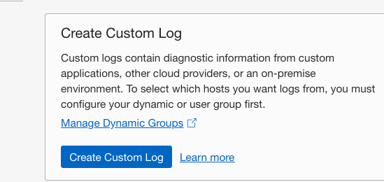
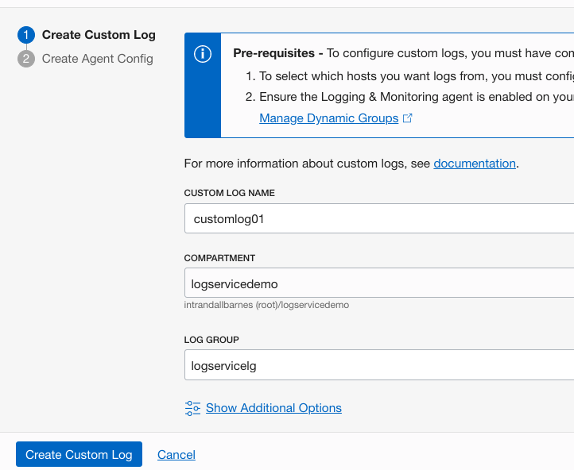
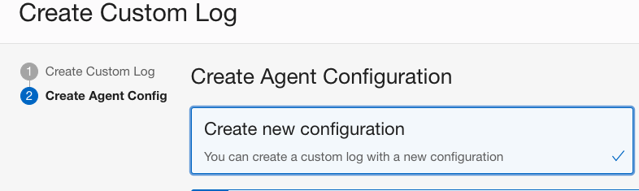
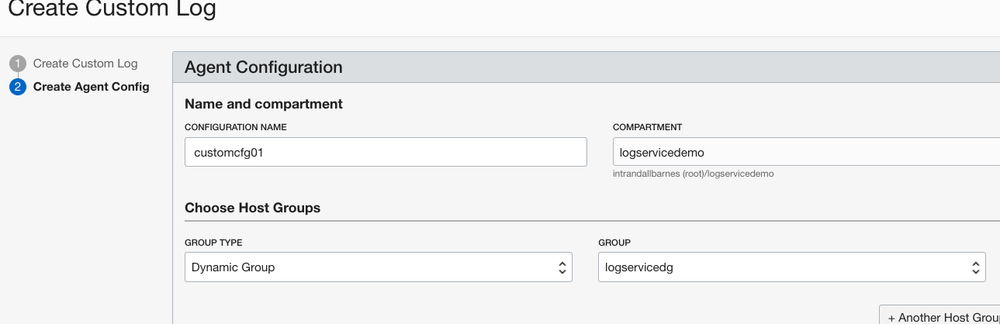
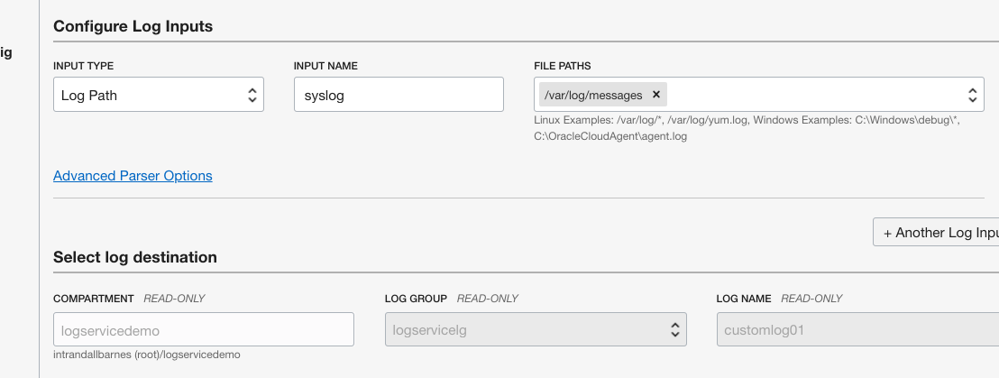
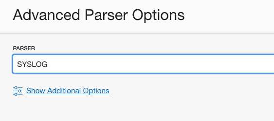
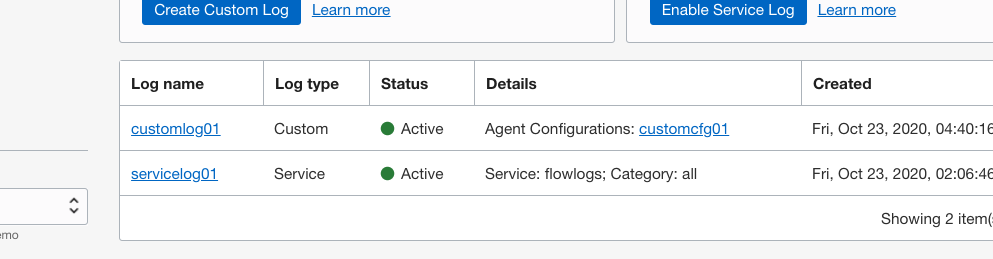
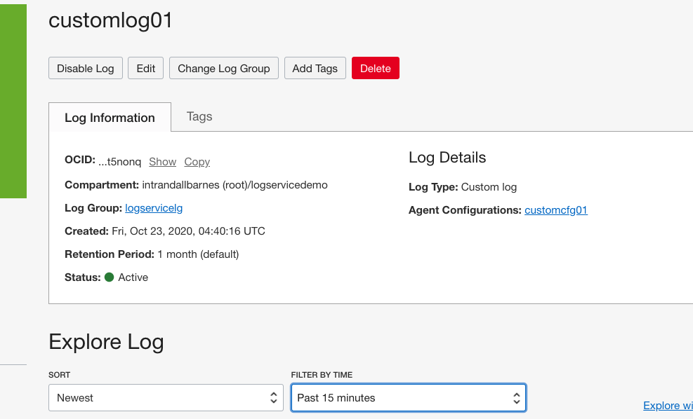
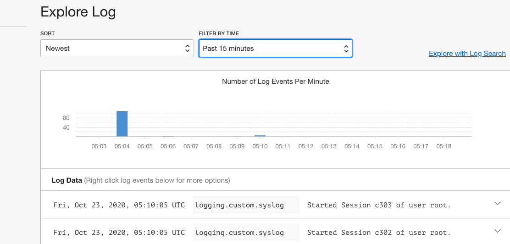

# 创建定制应用程序日志

## 概览

在此实验中，您将创建一个自定义日志代理，并用它来从在实验1中创建的虚拟机实时导入日志内容。
预计实验时间：10 分钟

### 关于产品/技术
自定义日志包含来自自定义应用程序、其他云提供程序或本地环境的诊断信息。OCI 日志记录服务通过提供代理将日志提取、解析和上载到 OCI，从而便于获取自定义日志。代理可以安装在许多计算机上，并且它可以从本地目录提取日志，您的应用或系统在本地目录中发出日志。代理可以安装在 OCI 以外的计算机上并配置。但是，为了节省时间，在此实验室中，我们将使用在实验1中创建的虚拟机，因为它已预配置已安装的代理。

### 目标

在此实验中，您将：
* 创建自定义日志代理配置
* 查看由日志记录服务摄入的自定义日志数据

### 前提条件

* Oracle 免费套餐、始终免费、付费或LiveLabs云帐户
* 访问云环境和完成实验1中资源的配置
* 在实验2中创建日志组

### 目录

1. [创建自定义日志代理配置](#step1)
2. [查看虚拟机中的日志数据](#step2)

## 1. 创建自定义日志代理配置

代理配置为日志记录服务和一组特定部署的代理提供协同工作的说明。这是自定义日志所需的。按照以下步骤创建代理配置，其中包括从我们在实验1中创建的虚拟机导入系统日志消息。

1. 打开导航菜单。在"解决方案和平台"下，转到"日志记录"，然后单击"日志"。在"列表范围"下，选择"logservicedemo"。选择"创建定制日志"以打开"创建定制日志"页面。

    

2.  在"定制日志名称"中输入"customlog01"，区间选择"logservicedemo"，并在日志组中选择"logservicelg"。单击"创建定制日志"。
   

   将显示"创建代理配置"面板，您可以在其中创建新配置。
   
   

3. 在配置名称中输入"customconfig01"。确保区间指定"logservicedemo"。在组类型中选择动态组，在组中选择在实验室1中创建的组"logservicedg"。

   

4. 在"配置日志输入"部分中，选择输入类型"日志路径"、输入名称系统日志和文件路径"/var/log/messages"。尽管我们指示代理处理系统生成的日志，但相同的过程可用于选择应用程序日志路径或整个日志目录。

   

5. 在此部分中，单击"高级语法分析器选项"，并在"语法分析器"列表中选择 SYSLOG。

   

6. 单击"保存更改"，然后"创建定制日志"以完成任务。

## 2. 查看虚拟机中的日志数据

配置可能需要几分钟时间才能传播到本地计算机代理。

1. 选择我们在第1步中创建的自定义日志（customlog01）。

    
  
   这将打开详细信息面板。

2. 查看日志属性并记下更新日志和代理配置的选项。

    

3.  浏览日志内容（如果已流入日志记录服务并可供查看）。

    

您可以转到[下一个实验](../search/search.md)。
