# 将日志数据导出到对象存储

## 概览

在此实验中，您将创建一个自动作业，将日志数据导出到 OCI 对象存储，以便进行长期存储和存档。OCI 通过服务连接器使这一点变得简单：用于创建作业的框架，用于筛选、处理日志数据，将日志数据从日志记录服务移动到对象存储。
服务连接器指定源日志、可选筛选/处理、执行频率和目标对象存储存储桶。
预计实验室时间：5 分钟

### 目标

在此实验中，您将：
* 将日志内容导出到对象存储的存储桶。
* 查看存储桶的内容以验证数据导出。

### 前提条件

* Oracle 免费套餐、始终免费、付费或LiveLabs云帐户
* 访问云环境和完成实验1中资源的配置
* 在实验 2 中创建日志组和在实验 3 中创建定制日志

### 目录

1. [创建对象存储的存档存储桶](#step1)
2. [配置自动导出](#step2)
3. [[可选] 查看日志存档内容](#step3)

## 1. 创建对象存储的存档存储桶

在创建服务连接器之前，目标存储桶必须已经存在，因此现在让我们创建一个存储桶。

1.  在 OCI 管理控制台中，请确保已选择本研讨会中从上一个实验室创建资源的同一区域。导航到对象存储服务。

    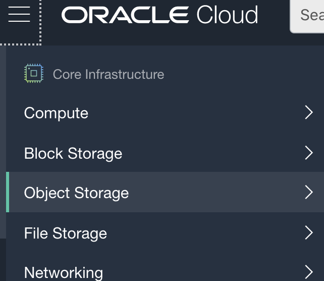

2.  在"对象存储"登录页中，确保区间设置为"logservicedemo"。
    

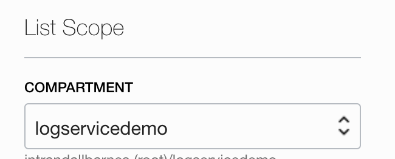
    
3. 单击"创建存储桶"可显示创建存储桶面板。
   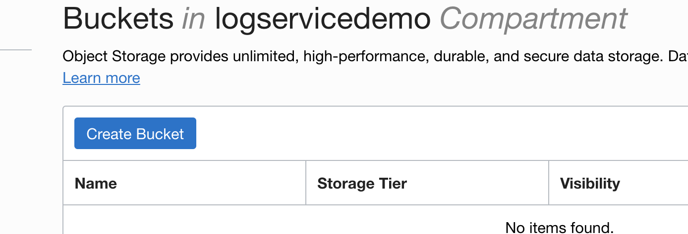

4. 在"创建存储桶"面板中，输入存储桶名称"logarchivedemo"、存储层"标准"、取消"发出对象事件"和"启用对象版本控制"，并确保加密配置为"使用 Oracle 管理的密钥进行加密"，如下图所示。
   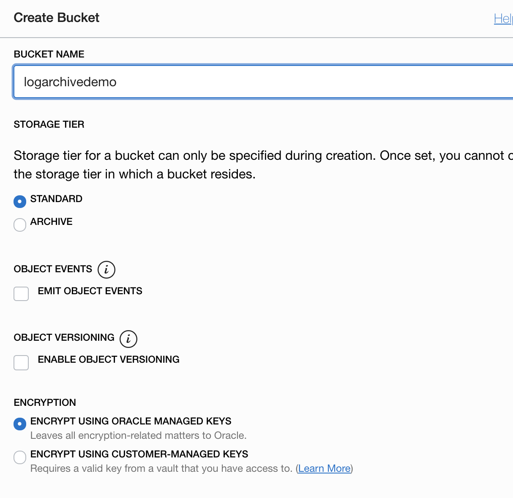

5. 单击"创建存储桶"以完成新的存储桶创建任务，即可继续执行下一步操作。

## 2. 配置自动导出

在此步骤中，您将创建一个服务连接器，将日志内容导出到第1步中创建的存储桶。

1. 在 OCI 管理控制台中，导航到日志记录=>服务连接器。

    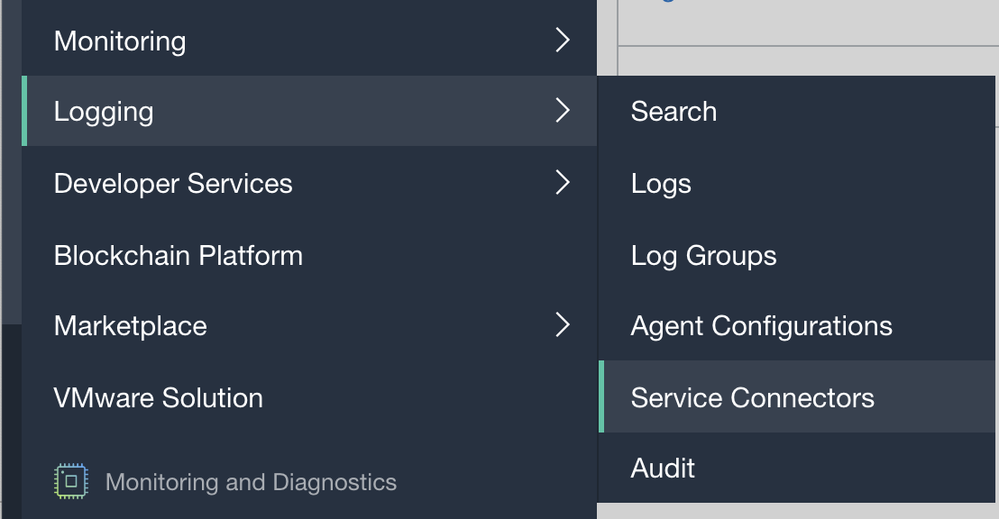

2. 确保在左列中选择了区间"logservicedemo"。如果这是您第一次访问此页面，服务连接器列表将为空。通过选择"创建连接器"打开"创建服务连接器"面板。
   
    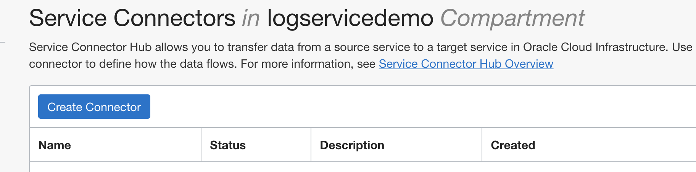

3. 在"创建服务连接器"面板中，输入连接器名称"logdemoconnect"，添加简要说明，并仔细检查区间为"logservicedemo"。
   
    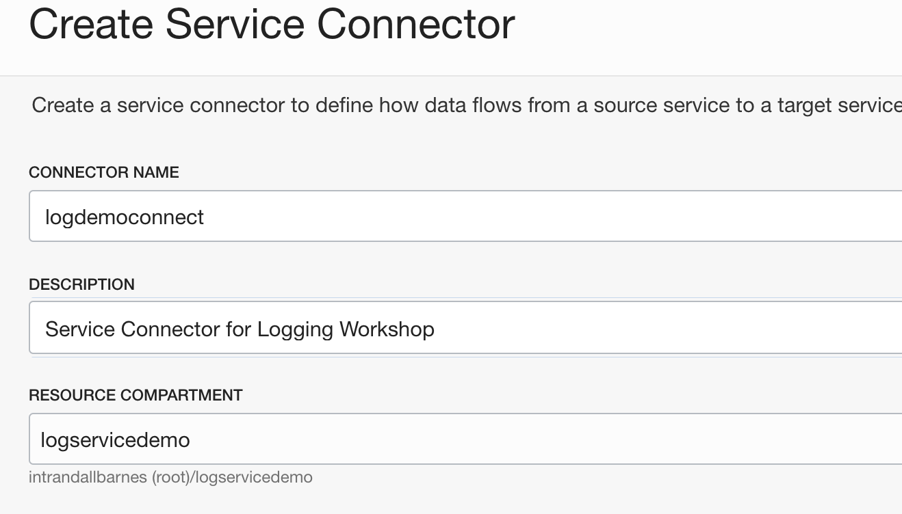

4. 在"配置服务连接器"部分中，为"源"选择"日志记录"，为"目标"选择"对象存储"。为日志组选择"Logservicelg"，为日志选择"customlog01"。 在此实验中，我们不会配置更高级的筛选和处理参数。
   
    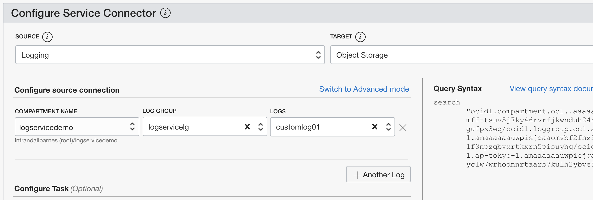

5. 在"配置目标连接"部分中，选择在第1步： logarchivedemo 中创建的存储桶。
   
    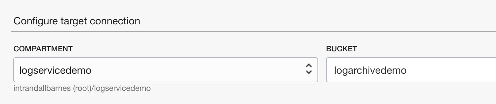

6. 连接器服务提供一个选项，用于自动创建此连接器作业导出数据所需的安全策略（权限）。单击"创建"框中，如下图所示。注意：根据您的帐户类型和以前的设置步骤，这些权限可能已经隐式创建。在这种情况下，不会显示此选项，并且继续执行下一个任务是安全的。
   
    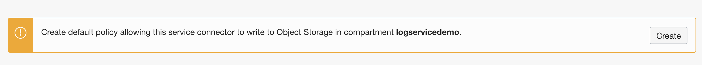

   The box confirms the policy creation and displays the policy name for future reference.
   
    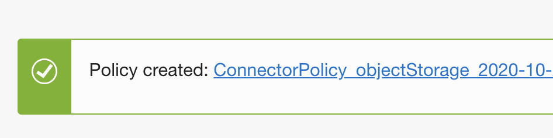

7. 单击"创建"完成连接器创建任务

    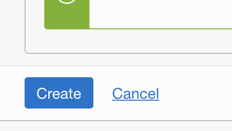

   面板将关闭，然后显示新的连接器属性页。在这里，您可以查看/编辑配置，并验证数据处理的状态。日志内容会定期分批处理。活动和指标可能需要几分钟才能在控制台中显示。

    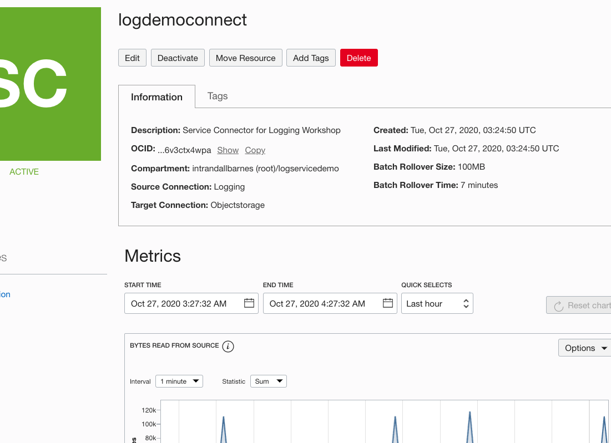

   

## 3. [可选] 查看日志存档内容

存档到对象存储的日志内容通过批处理（默认每 7 分钟一次）进行聚合，并保存为.gz格式。时间戳允许按时间范围轻松检索。在此步骤中，您将找到存档的内容，并可以选择下载/提取/查看以验证存储完整性。

1. 导航到对象存储，选择区间"logservicedemo"，以查找在第1步中创建的存储桶。

    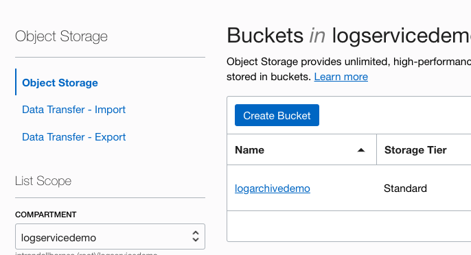

2. 单击存储桶名称"logarchivedemo"以打开属性页。展开存储桶内容以时间戳 gzip 格式查看存档内容。注意：创建初始内容的连接器后可能需要几分钟时间才能显示在存储桶中。

    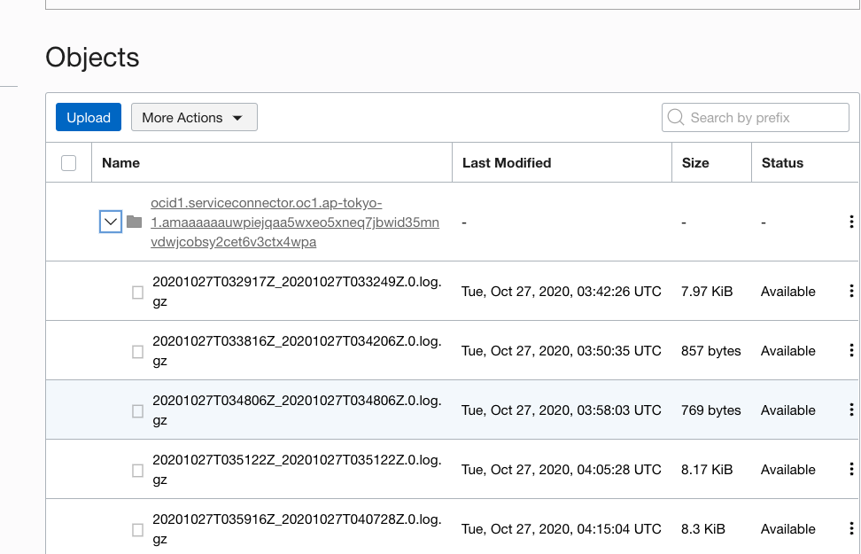

3. 选择用于下载、提取和查看的文件。下载选项可以通过单击最右侧列中的垂直点找到。

    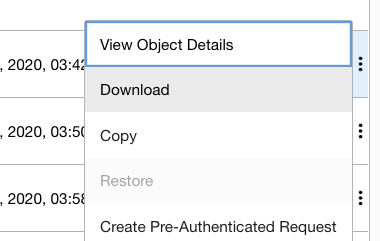

4. 使用首选日志或文本查看器来验证内容。

    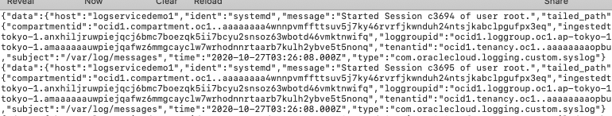

完结！
