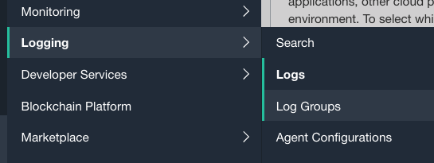
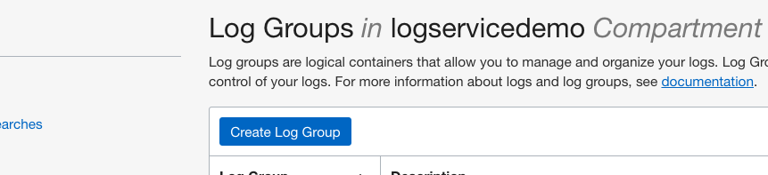
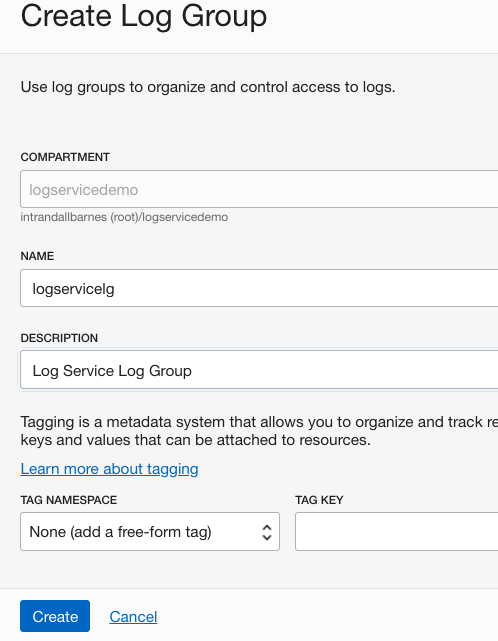
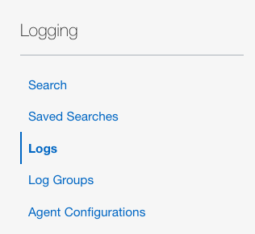
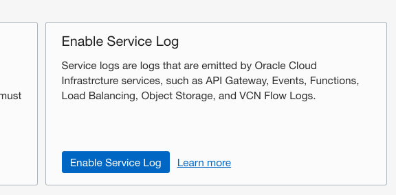
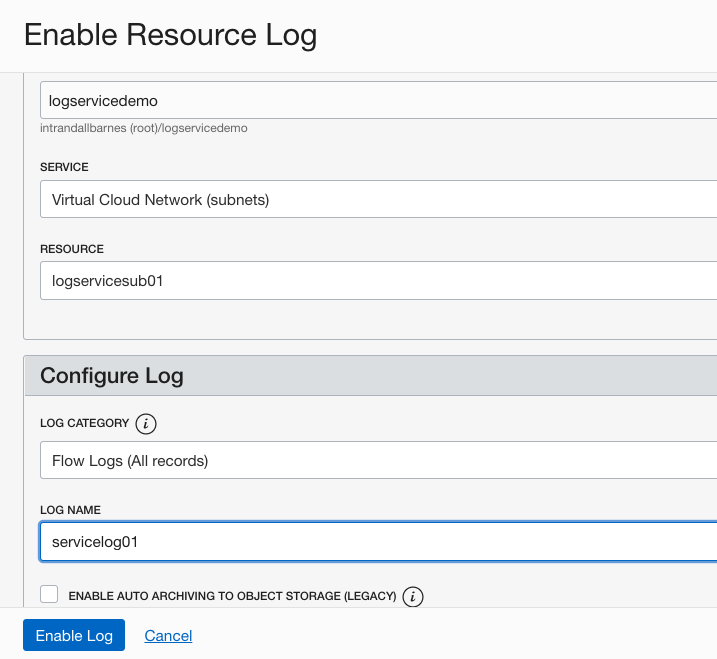
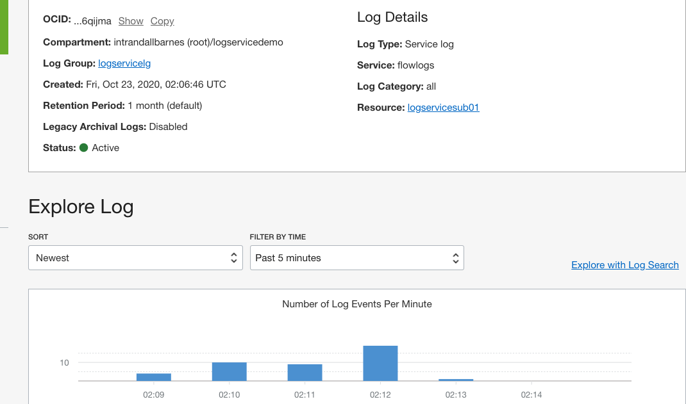
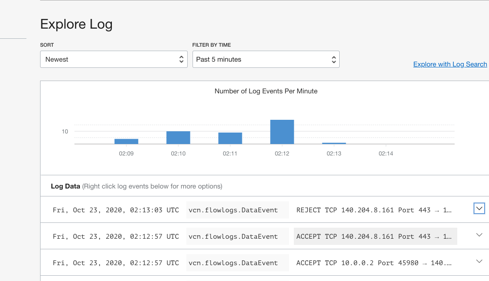

# 启用服务资源日志

## 概览

日志包含关键诊断信息，告诉您资源的性能和访问。您可以在核心云基础结构资源上启用内置日志记录。在此实验中，您将为在实验1中创建的虚拟云网络中的网络活动启用自动日志收集。
预计实验室时间：10 分钟

### 目标

在此实验中，您将：
* 创建日志组
* 启用网络流日志

### 前提条件

* Oracle 免费套餐、始终免费、付费或LiveLabs云帐户
* 访问云环境和完成实验1中资源的配置

### 目录

1. [创建日志组](#step1)
2. [启用网络流日志](#step2)

## 1. 创建日志组

日志组是用于组织和管理日志的逻辑容器。日志必须始终位于日志组中。您必须首先创建日志组才能启用或创建日志。幸运的是，这是一个快速和简单的活动。

1. 在 OCI 管理控制台中，确保您选择了与实验室1相同的区域。导航到日志记录=>日志组

      

2. 确保在左列中选择了区间"logservicedemo"。

    
   
3. 单击"创建 日志组"按钮。

    

4. 在"创建日志组"对话框页上，确保指定区间"logservicedemo "。命名日志组日志服务"logservicelg"，提供简要描述，然后单击"创建"按钮。

    

   现在，您已准备好继续下一步。

## 2. 启用网络流日志

许多核心云基础架构服务具有内置的日志记录功能。现在，您已经在第1步创建了日志组，让我们选择一个核心服务并启用日志记录。在此步骤中，您将启用在实验1中创建的虚拟云网络上登录。

1.  选择 OCI 管理控制台左列中的日志。这可以在日志记录服务中找到。

    

2.  选择"启用服务日志"以打开"启用资源日志"对话框页。

    

3.  在"启用资源日志"页上：
    - 确保列出区间"logservicedemo"
    - 从"服务"下拉**Virtual Cloud Network (subnets)** 
    - 选择资源"logservicesub01"
    - 在"配置日志"部分中命名日志，如图所示
    - 单击"启用日志"以完成任务

    

4. 查看日志详细信息页面。服务可能需要几分钟才能完成配置。

   

5. 您可以直接从日志属性页浏览日志内容。注意：稍后的实验部分将介绍完整的日志搜索活动。

   

您可以转到[下一个实验](../applog/applog.md)。
