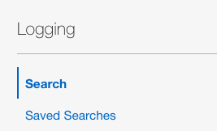
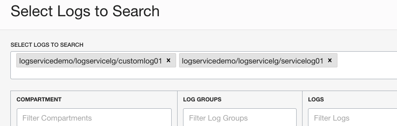
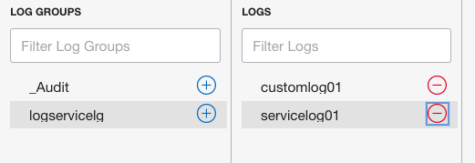
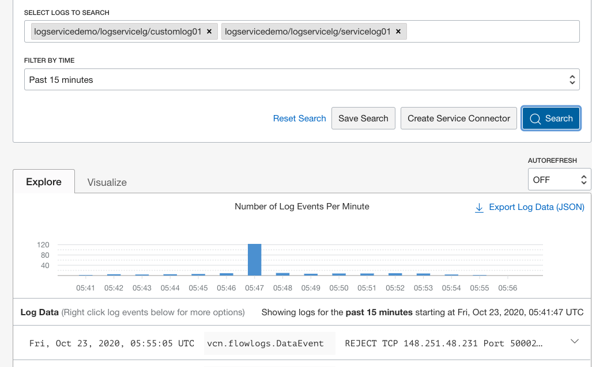

# 搜索日志内容

## 概览

在此实验中，您将浏览日志的内容，并熟悉日志记录服务提供的内置搜索功能。
OCI 日志记录服务提供用于搜索日志的任意组合或比例的工具，以识别可能难以通过旧方法观察的事件或模式。在由多个服务和平台组成的分布式横向扩展环境中工作时尤其如此。
预计实验室时间：5 分钟

### 目标

在此实验中，您将：

* 熟悉日志搜索控制台。
* 从前面的实验室中创建的日志中搜索内容。

### 前提条件

* Oracle 免费套餐、始终免费、付费或LiveLabs云帐户
* 访问云环境和完成实验1中资源的配置
* 在实验 2 中创建日志组和在实验 3 中创建定制日志

### 目录

1. [选择要包含在搜索中的日志](#step1)
2. [搜索内容和浏览日志](#step2)

## 1. 选择要包含在搜索中的日志

1. 在 OCI 管理控制台中，请确保您选择了与上一个实验相同的区域。导航到日志记录=>搜索。

    

2. 单击"选择要搜索的日志"以搜索框内弹出搜索面板。

3.  选择区间"logservicedemo"，日志组"logservicelg"，以及日志部分中列出的定制日志和服务日志。

   这可能需要一些时间和几次额外的点击来熟悉日志选择过程。最后，您的选择屏幕应类似于下图。只要**customlog01**和**servicelog01**显示在"选择要搜索的日志"框中，您就可以继续。

  

  

4.  单击"继续"关闭面板并返回到搜索着陆页。

## 2. 搜索内容和浏览日志

1.  在日志搜索页上，单击"搜索"按钮并查看下面的面板中的结果。

2.  在"定制筛选器"框中输入候选搜索关键字，如"错误"或"拒绝"。在结果面板中查看结果。

  

3.  单击"搜索"按钮查看筛选的结果。

4.  **可选**：更新搜索参数以筛选结果。

完成后，您可以转到[下一个实验](../export/export.md)。
