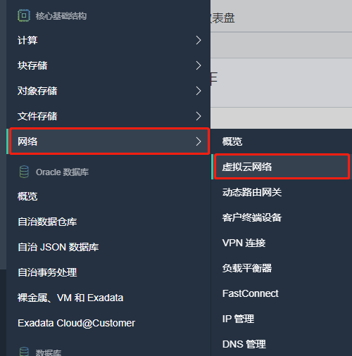

# 设置环境

## 概览
本实验将引导您完成配置云环境、定义安全和访问控制以及创建虚拟网络的步骤。

预计实验时间：15 分钟

### 目标

在此实验中，您将：
* 在租户中创建区间
* 创建和配置 IAM 组
* 创建和配置虚拟云网络

### 前提条件

* Oracle 免费套餐、始终免费、付费或 LiveLab 云帐户。
* 兼容的浏览器

### 目录

1. [创建 IAM 区间](#step1)
2. [创建和配置 IAM 动态组](#step2)
3. [创建虚拟云网络](#step3)
4. [启动虚拟机](#step4)

<a name="step1"></a>

## 1. 创建 IAM 区间

区间是云帐户中的虚拟容器，用于组织和分组相关资源，以便于管理。创建区间时，必须提供唯一的名称和说明。

1. 在 OCI 管理控制台中，找到并展开主菜单控件。这通常位于浏览器的左上角，但控制台布局可能因版本而异。

    

      展开服务列表，并向下导航到身份=> 区间。
    
    
  
2. 选择"创建区间"按钮。

    

    

3. 在"名称"字段中输入日志服务名称，并简要说明您的区间。单击"创建区间"按钮以完成创建。

    

    

4. 最有可能的是，您将返回到身份->区间页面。单击新的区间名称日志服务名称，打开"区间详细信息"页面。查找并记录此隔间的唯一标识符 （OCID）。此标识符在第2步中是必需的。

    

    

<a name="step2"></a>

## 2. 创建和配置 IAM 动态组

动态组允许您为虚拟机分配权限，并允许这些系统对 Oracle 云基础架构服务自动执行特定操作。这样，您就允许虚拟机上运行的应用程序和系统使用日志记录服务，例如，近乎实时地动态地将日志推送到集中式服务。创建动态组时，而不是将成员显式添加到组中，而是定义一组匹配规则来定义组成员。例如，规则可以指定特定区间中的所有实例都是动态组的成员。当实例在该区间中启动和终止时，成员可以动态更改。

1. 在 OCI 管理控制台中打开主菜单，导航到身份=>动态组。

      

      

2. 选择"创建动态组"按钮。

      

      

3. 在"名称"字段中输入日志服务，并在"名称"字段中输入简要描述动态组。

      

4. 接下来，我们将创建匹配规则，以选择应包含在此动态组中的虚拟机。在生产环境中，您可能非常有选择性地选择此组中可能包含的特定虚拟机，以严格限制它们继承的权限。在此研讨会中，我们将创建一个规则，在第1步中创建的日志服务模块中包括所有虚拟机。在匹配规则=>"规则1"框中添加以下语句。注意：更改 OCID 以匹配步骤 1 中记录的 OCID，保留此值周围的单引号。如果您没有记入此 OCID ，则可以通过导航到身份=>隔间=>logservicedemo属性页获取它。

    ```
    instance.compartment.id = 'ocid1.compartment.oc1..aaaaaaaaxxxxxxxxxxxxxxxxxxxxxxxxxxxxxxxxxxxxxxxxxxxxxxxxxxxxxxx'
    ```
    

5. 单击"创建"以完成该过程并关闭对话框屏幕。

      

6. 接下来，我们将为动态组创建策略，授予虚拟机将日志推送到日志记录服务的能力。

7. 导航到身份=>策略页，并确保在左列中选择区间"logservicedemo"。

      

8. 单击"创建策略"，将新策略名称为"logdemopolicy"，并输入简要说明。对于区间，请选择"logservicedemo"。

      

9. 在策略生成器部分中选择"定制（高级）"选项。

      

10. 在策略框中输入以下代码，如下图所示：

      ```
      Allow dynamic-group logservicedg to use log-content in compartment logservicedemo
      ```
      

11. 单击"创建"以完成该过程并关闭对话框。

       

<a name="step3"></a>

## 3. 创建虚拟云网络

虚拟云网络（VCN） 定义云环境中的专用网络，您可以在其中指定网络参数（如 CIDR 块和路由表）以及安全控制（例如访问控制列表、虚拟防火墙和允许连接到公共 Internet）。在此步骤中，我们将创建一个适合此实验的简单 VCN。注意：对于生产VCN环境，建议进一步限制网络访问控制，以满足您的安全要求。

1. 在 OCI 管理控制台中，选择要创建 VCN 的地区。

      

      

2. 打开主菜单，导航到网络=>虚拟云网络

      

3. 确保在左侧栏的下拉框中选择区间"logservicedemo"。

      

4. 选择"创建 VCN"按钮。

      

5. 在"创建虚拟云网络"对话框中，输入名称"logservicevcn"，为"在区间创建"选择"logservicevcn"，然后将 CIDR 块定义为"10.0.0.0/16"。 将其他设置保留为默认值，然后单击"创建 VCN"按钮以完成创建。

      

6. 在VCN 详细信息页面上，选择左侧列中的"Internet 网关"，然后单击"创建 Internet 网关"。
      

7. 在"创建 Internet 网关"对话框页面中，为名称指定"logserviceigw"，确保"在区间中创建"选择"logservicedemo"，然后单击"创建 Internet 网关"按钮。
      

8. 接下来，我们将快速更新 VCN 路由表，以利用上一步中创建的 Internet 网关。在 VCN 属性页中，选择左侧列中的路由表，然后单击"logservicevcn"的默认路由表。
      

9. 选择"添加路由规则"按钮。
      

10. 在"添加路由规则"对话框中，选择"目标类型"为"Internet网关"，目的地 CIDR 块为 0.0.0.0/0，最后在下拉框中选择"logserviceigw"。
      

11. 单击"添加路由规则"按钮以完成该过程。

12. 最后，我们将在 VCN中创建一个子网，以标识用于部署 VM 的 IP 空间。在 VCN 详细信息页面（您可能需要导航回虚拟云网络=> logservicevcn详细信息页），选择左侧列中的子网，然后单击"创建子网"按钮。
      

13. 在"创建子网"页中：

       - 名称："logservicesub01"

       - 在区离中创建："logservicedemo"
       - 子网类型：区域性（建议）
       - CIDR 块：10.0.0.0/24
       - 路由表区间：**Default Route Table**...
       - 子网访问：公共子网

      

14. 单击"创建子网"以完成任务并关闭对话框页面。

<a name="step4"></a>

## 4. 启动虚拟机

本实验的最后一步是在新创建的VCN中启动小型虚拟机。

1.  在 OCI 管理控制台中，确保您选择了与第3步中创建的 VCN 相同的区域。导航到计算=>实例。

      

2.  确保在左列中选择了"logservicedemo "。

      

3.  选择"创建实例"

      

4. 将打开"创建计算实例"对话框页。为 VM 提供简短的描述性名称，并确保选择"logservicedemo"。应预先选择"可用性域"，以匹配您在第3步中创建的子网。注意：您的区域和可用性域可能与下图不匹配。继续执行下面的其他配置字段。

      

5.  确保"映像"显示的是 Oracle Linux 7.8 或 7.9。特定的映像版本并不重要，您的选项可能与下图不匹配，但如果尚未设置 Oracle Linux  7.8 或 7.9，请选择"更改映像"。
    
    确保Shape指定单个内核 （1 核 OCPU） 虚拟机。请注意，您的选项和命名约定可能与下图不完全匹配。

6. "选择现有子网"中选择"logservicevcn"。应列出"logservicesub01"。如果没有，请仔细检查"区间"设置为"logservicedemo"。您可能需要切换到其他可用性域（见上文），以允许选择现有的子网。
   
      

7. 选择"生成 SSH 密钥对"，然后单击"保存私有密钥"，如下图所示。如果连接到虚拟机，则需要此密钥（可选）。
      

8. 最后单击"创建"按钮以完成此任务并关闭对话框页面。
      恭喜你！您已启动虚拟机并完成设置实验。

      
      


您可以转到[下一个实验](../infralog/infralog.md)。
