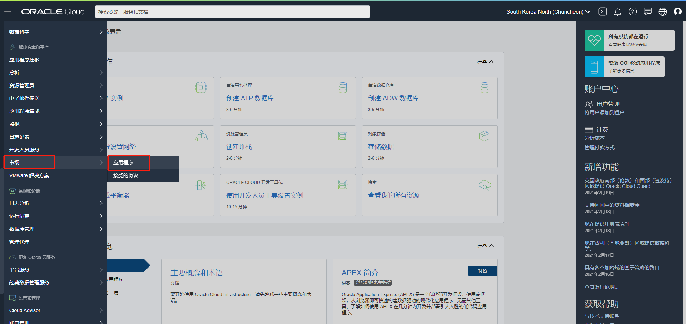
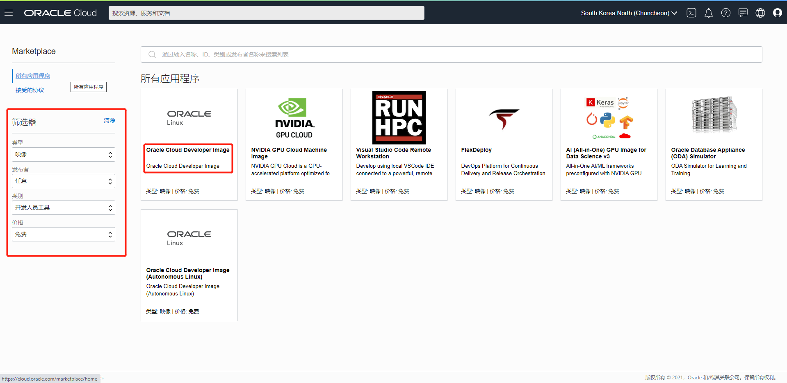
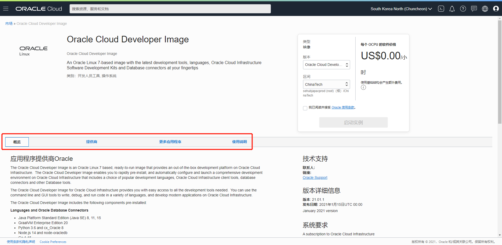
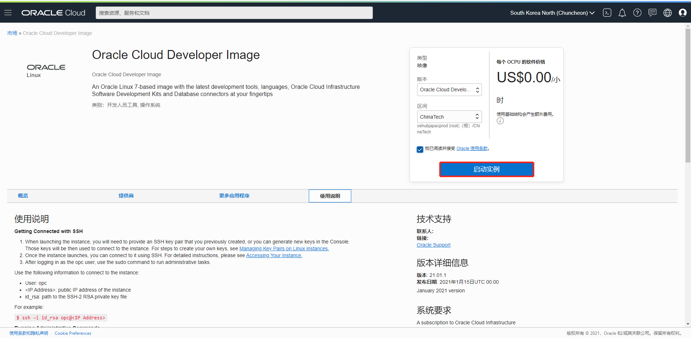
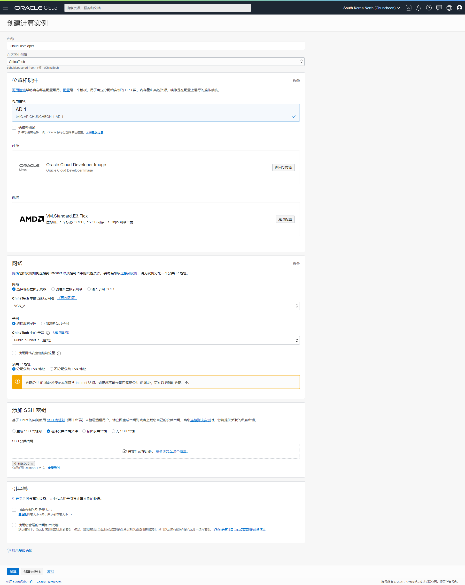
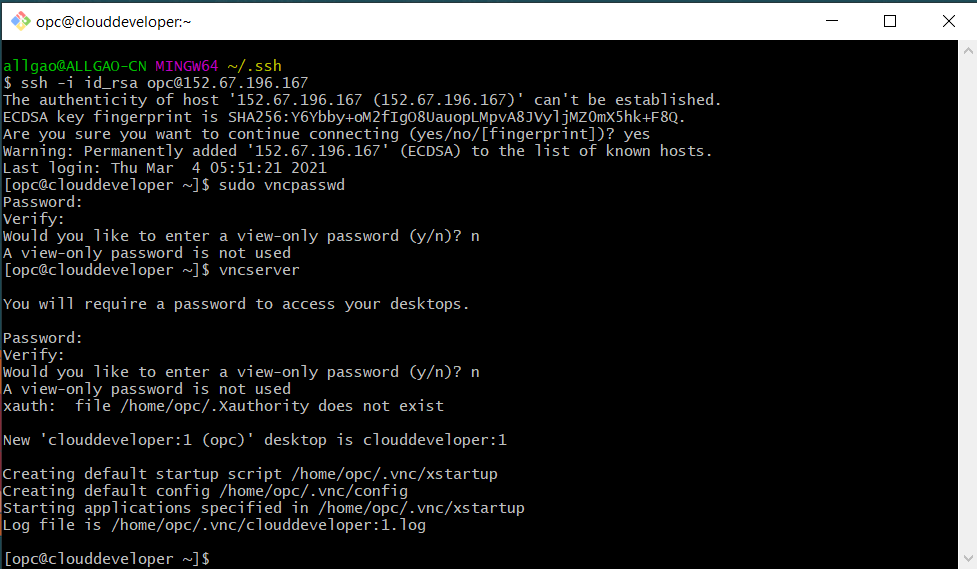
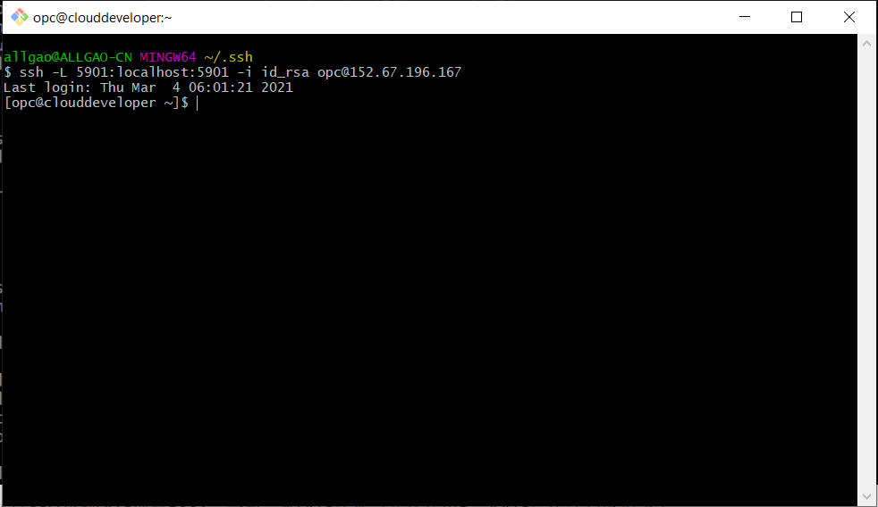
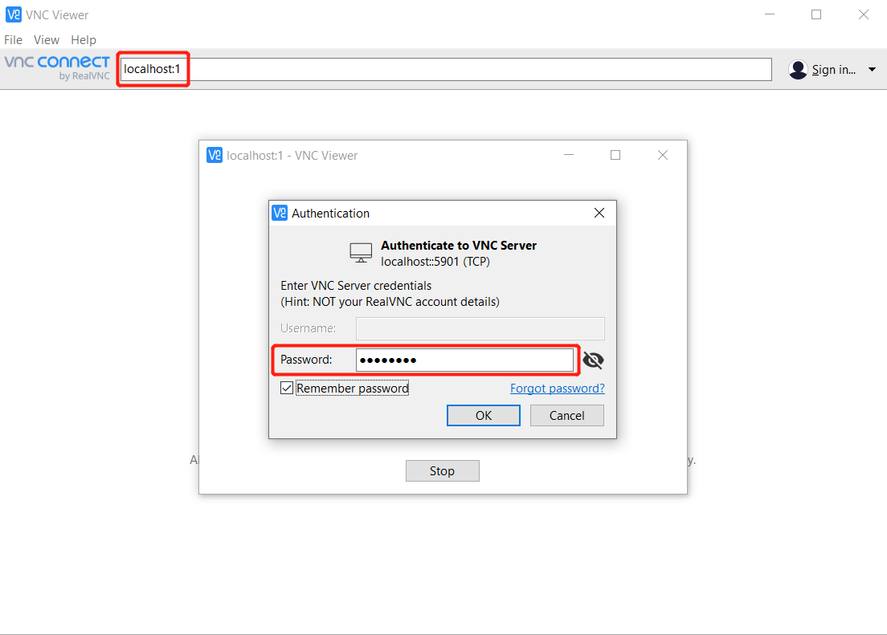
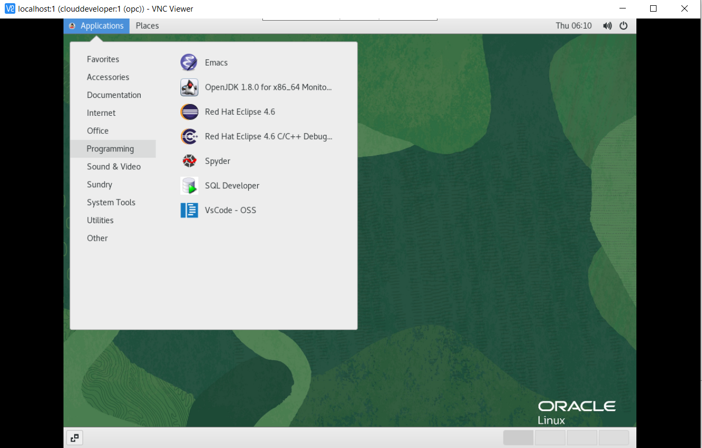

# 市场

## 概览

**甲骨文云基础设施 - 市场**是一个提供云上解决方案的线上商店。在商店的目录中，包含了映像和堆栈两种解决方案类型。每个类型列表都包含了不同的应用程序。客户通过市场可以快速获得相应的解决方案，这些方案有的是发布者免费提供的，有的则需要支付费用才能够使用。除了Oracle自身外，发布者还可以是Oracle认证的合作伙伴。市场中所有的解决方案在发布前都需经过Oracle的审核。

- 映像：包含运行实例所需的操作系统、软件等资源模板。映像可以用来部署OCI计算实例，从而获得映像中的解决方案。
- 堆栈：堆栈代表一组OCI资源的集合，这些资源共同构成发布者提供的解决方案。

## 先决条件

- 租户：有效的OCI租户和足够的剩余资源。
- IAM策略：需要租户管理员为用户设置相应的IAM策略，允许用户访问市场所需的所有OCI资源。

[参考]: https://docs.oracle.com/en-us/iaas/Content/Marketplace/Tasks/workingwithlistings.htm

- 收费模式
  - 免费：可以免费使用的应用
  - BYOL：用户自行购买软件许可
  - 付费：按照实际使用的OCPU或者是实例的小时数收费。

## 目录

[1. 使用OCI市场安装Oracle Cloud Developer映像](#practice-1-install-developer-image)

**注意**：*某些UI可能与说明中包含的名目截图有些许不同，但是您仍然可以使用本说明完成动手实验。*

<a name="practice-1-install-developer-image"></a>

## 1：使用OCI市场安装Oracle Cloud Developer映像

1. 登录甲骨文云基础设施控制台，打开菜单 **市场 - 应用程序**



2. 使用页面左侧的筛选器，选出需要使用的应用程序列表。点击卡片进入**映像详情**页面。



3. 映像详情页面提供了映像概览、供应商、相关应用、使用说明等信息。 在使用映像前，需仔细阅读以确认映像是否符合需求以及如何使用映像。



4. 如果确认使用这个映像，则需选择好版本、资源所在区间，勾选**Oracle使用条款**后，点击**启动实例**按钮，进入映像创建计算实例的页面。



5. 按照需求填写创建计算实例的相关参数,点击**创建**按钮开始创建计算实例。



6. 实例创建完成后，在实例详细信息页面获得访问用户名和IP地址，根据映像详情界面的使用方法中的步骤，使用ssh连接到实例。配置VNC密码，启动VNC服务。

```shell
ssh -i id_rsa opc@<public_ip>
sudo vncpasswd
vncserver
```



7. 退出当前连接。使用下面命令，通过SSH代理VNC端口5901。


```shell
ssh -L 5901:localhost:5901 -i id_rsa opc@<public_ip>
```



8. 下载一款VNC Server软件（此处使用RealVNC）连接到远程桌面



10. 通过远程桌面使用计算实例。

