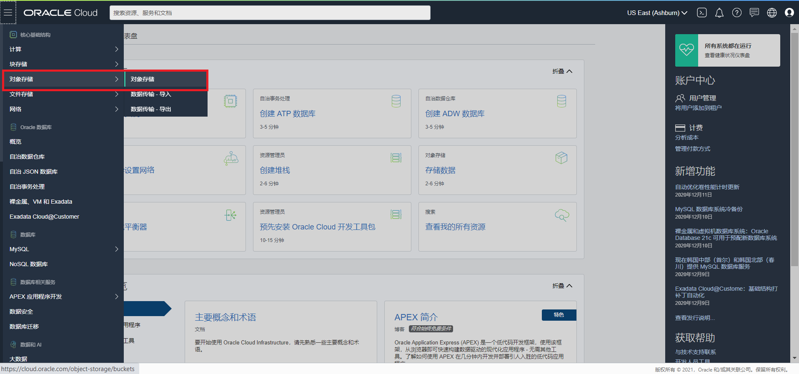

# 对象存储服务

## 概览

**甲骨文云基础设施 - 对象存储服务**是一个互联网规模的高性能存储平台，提供可靠且具有成本效益的数据持久性。**对象存储服务**可以存储无限大小的任意内容类型的非结构化数据，包括分析数据和富内容数据，例如图像和视频。

使用**对象存储**，您可以直接从Internet或从云平台，安全地存储或检索数据。对象存储提供了多个管理界面，使您可以轻松地管理大规模存储。平台的弹性使您可以在不影响性能和可靠性的情况下无缝扩展存储。

**对象存储**是区域级服务，不与任何特定的计算实例绑定。只要您具有Internet连接并且可以访问对象存储端点之一，就可以从**甲骨文云云基础设施**上下文内部或外部的任何位置访问数据。

**对象存储**还支持通过服务网关从甲骨文云基础设施的VCN中进行私有访问。服务网关允许从私有子网中的私有IP地址连接到对象存储公共端点。例如，您可以通过Oracle Cloud Infrastructure内部网络而不是通过Internet将数据库系统备份到对象存储桶。您可以选择使用IAM策略来控制哪些VCN或IP地址范围可以访问对象存储。

**甲骨文云基础设施-对象存储服务** 提供了两个不同的存储类层，可以满足对高性能，频繁访问的“热”存储和不太频繁访问的“冷”存储的需求。 存储层可帮助您在适当的情况下最大限度地提高性能，并在可能的情况下将成本降至最低。

- **标准存储**用于需要快速，立即和频繁访问的数据。 标准存储保证了数据的可访问性和访问性能，但因此价格也相对较高。
- **存档存储**用于存储很少访问但必须长时间保留的数据。 存档存储价格更低，同时访问数据所需较长交付时间。


## 先决条件

- Oracle Cloud Infrastructure帐户凭据（用户，密码和租户）

- 要登录控制台，您需要满足以下条件：

  - 租户，用户名和密码
- 控制台的URL：[https : //cloud.oracle.com/](https://cloud.oracle.com/)
  - Oracle Cloud Infrastructure支持最新版本的Google Chrome，Firefox和Internet Explorer 11

## 目录
[1：使用OCI控制台使用对象存储服务](#practice-1-objectstorage-cloud-console)

[2：使用预先验证请求上传对象](#practice-2-objectstorage-pre-authenticated)

[3：使用CLI Multipart方式上载大文件](#practice-1-objectstorage-cloud-console)

[4：生命周期策略](#practice-1-objectstorage-cloud-console)

[5：挂载对象存储到计算实例（S3 Compatible API）](#practice-1-objectstorage-cloud-console)

[6：对象复制](#practice-1-objectstorage-cloud-console)

**注意：** *某些UI可能与说明中包含的屏幕截图有些许不同，但是您仍然可以使用本说明来完成动手实验。*


<a name="practice-1-objectstorage-cloud-console"></a>

## 1：使用OCI控制台使用对象存储服务

1. 从浏览器打开甲骨文控制台界面，输入正确的租户名、用户名和密码登录OCI控制台。从左侧菜单中选择 **对象存储-对象存储**



2.  在左侧下拉菜单选择**Compartment**，点击 **创建存储桶** 按钮， 按照页面提示创建一个**存储桶**。


3. 在列表上点击存储桶名称，进入**存储桶详细信息**界面。点击 **上载** 按钮，根据页面提示，可以将文件上传到存储桶中。


4. 在对象列表中勾选要操作的对象，使用 **更多操作** 菜单， 可以**刷新**或**删除**存储桶中的对象。


<a name="practice-2-objectstorage-pre-authenticated"></a>
## 2：使用预先验证请求上传对象

1. 使用命令行终端，切换到要上传的对象文件目录


2. 在 **存储桶详细信息** 界面，从左侧 **资源** 栏点击 预先验证的请求， 点击 **创建预先验证的请求** 按钮，根据页面提示完成创建, 复制生成的URL


3. 打开命令行终端，使用如下格式上传对象到存储桶

   ```shell
   $ curl -X PUT --data-binary '@<local-filename>' <unique-PAR-URL>
   ```

   例如：

   ```shell
   $ curl -X PUT --data-binary '@f102.sql' https://objectstorage.us-ashburn-1.oraclecloud.com/p/i9PwmQ6UdgJIAkE5CI-pTrZhOx3RXMjcHu-3LGMO7LnX94VSm3bQ1kXMvVlYp8EG/n/sehubjapacprod/b/test/o/f102.sql
   ```

   


4. 打开 **资源** 栏下的 **对象** 列表，查看上传到对象存储桶中的对象


<a name="practice-3-objectstorage-multipart"></a>
## 3：使用CLI Multipart方式上载大文件

1. 登录甲骨文云基础设施控制台，并创建对象存储桶（参考实验一）


2. 下载并配置OCI CLI工具环境  [参考文档](https://docs.oracle.com/en-us/iaas/Content/API/SDKDocs/cliinstall.htm)

   切换到要上传的大文件目录，打开命令行工具。


3. 使用以下格式的命令，执行大文件Multipart上载

```shell
oci os object put --namespace <object_storage_namespace> --bucket-name <bucket_name> --file <file_location> --name <object_name> --part-size <upload_part_size_in_MB> --parallel-upload-count <maximum_number_parallel_uploads>
```

例如

```shell
oci os object put --namespace sehubjapacprod --bucket-name test111 --file ./bigfile.img --name bigfile.img --part-size 512 --parallel-upload-count 3
```


4. 在对象存储桶中查看上传的文件


<a name="practice-4-objectstorage-life-cycle"></a>
## 4：生命周期策略

1. 在对象**存储服务** - 存储桶详细信息页面左侧的**资源**栏点击 **生命周期策略规则** 按钮，点击 **创建规则** 按钮创建生命周期规则。


2. 根据向导提示，**生命周期规则**将符合筛选条件的对象，达到指定天数后，移动到归档，或从存储桶中删除。 配置好以后，点击**创建**按钮完成规则创建。


<a name="practice-5-objectstorage-s3-compatible"></a>
## 5：挂载对象存储到计算实例（S3 Compatible API）

1. 在计算实例上安装s3fs-fuse

```sh
sudo yum install s3fs-fuse
```


2. 从OCI控制台进入用户详细信息界面左侧资源栏，点击 客户密钥 ， 点击生成密钥按钮，在打开的窗口中输入密钥名称，生成一个客户密钥并复制到剪贴板。


2. 编辑 ${HOME}/.passwd-s3fs配置文件 

```shell
echo ACCESS_KEY_ID:SECRET_ACCESS_KEY > ${HOME}/.passwd-s3fs
```

```shell
chmod 600 ${HOME}/.passwd-s3fs
```

```shell
sudo chmod +x /usr/bin/fusermount
```


2. 创建文件夹，并使用下面的命令将对象存储桶挂载到计算实例上

```shell
mkdir test
```

```shell
s3fs [bucket] [destination directory] -o endpoint=[region] -o passwd_file=${HOME}/.passwd-s3fs -o url=https://[namespace].compat.objectstorage.[region].oraclecloud.com/ -onomultipart -o use_path_request_style 
```


3. 在OCI Console中查看对象存储桶中上传的文件


<a name="practice-6-objectstorage-copy"></a>

## 6：对象复制

1. 范围和限制

- 无法从归档存储桶中直接复制对象，但可以从标准存储将对象复制到归档存储桶。
- 源存储桶和目标存储桶都必须提前创建，复制操作不会自动创建存储桶
- 对象被复制到目标存储桶后，会自动分配新的ETag
- 如果复制操作过程中，源存储桶进行了重命名、覆盖或者删除对象操作，将导致复制失败。
- 复制操作目前近支持单个对象，不持支批量操作。

2. 从对象存储-**存储桶详细信息**页面对象列表中，选择想要复制的对象，打开右侧**操作**按钮（三个点）打开菜单，选择**复制**，打开复制对象配置页面


3. 根据向导，填写目标对象存储服务的 **命名空间**、**区域**、**目标存储桶名称**、**目标对象名称** 参数，并选择ETag匹配规则。点击**复制对象**按钮开始复制。


3. 打开目标存储桶，查看对象是否被成功复制


