### 概览

Container Engine for Kubernetes (OKE) 是一款Oracle托管的容器编排服务，可加快现代化云原生应用的构建速度并降低成本。与大多数供应商不同，Oracle云基础设施提供免费的Container Engine for Kubernetes服务，可在高性能、低成本的计算款型上运行。DevOps工程师可以使用未经修改的开源Kubernetes来支持应用负载迁移，并通过自动更新和修补来简化运营。

在本实验中，您可以使用默认设置来创建新集群。创建新集群时，将自动为集群创建新网络资源，以及节点池和三个私有网络Worker节点。然后，您将为集群设置Kubernetes配置文件（集群的"kubeconfig"文件）。kubeconfig文件使您能够使用kubectl和Kubernetes仪表板访问集群。

请注意，在本实验中，您设置了kubeconfig文件，以便从本地开发环境访问集群。但是，您也可以设置kubeconfig文件以从Cloud Shell环境访问集群。


### 前提条件

- Oracle云基础设施用户名和密码。

- 在您的租户中，必须有一个区间来包含必要的网络资源（VCN、子网、Internet 网关、NAT 网关、路由表、安全列表）。如果此类区间不存在，您必须在开始本实验之前创建它。

- 租户中必须至少有三个计算实例可用，才能完成本实验。请注意，如果只有一个计算实例可用，则可以使用单个节点池创建一个集群，该节点池具有单个子网和单个节点。但是，此类集群不会高度可用。

- 在本实验稍后部分设置kubeconfig文件之前，您必须已执行以下操作：

  - 生成API签名密钥对
  - 将API签名密钥对的公钥值添加到用户的"API 密钥"
  - 安装并配置了Oracle云基础设施CLI

- 您必须已安装并配置了Kubernetes命令行工具kubectl。如果您尚未这样做，请参阅[kubectl 文档](https://kubernetes.io/docs/tasks/tools/install-kubectl/)。


### 目录

1. [创建策略](#step1)
2. [创建集群](#step2)
3. [访问集群](#step3)
4. [部署Kubernetes仪表板](#step4)
5. [发布示例应用](#step5)
6. [清理集群（可选）](#step6)

------

<a name="step1"></a>

### 1. 创建策略

若要创建和/或管理集群，您必须属于以下之一，

- 租户的管理员组。
- 授予相应的Container Engine for Kubernetes策略的组。由于您将在本实验期间创建和配置集群和相关网络资源，因此策略还必须向组授予这些资源的适当权限。

如果您不属于租户的管理员组，请使用管理员组的用户创建相应的Container Engine for Kubernetes策略。

在OCI管理控制台界面，单击"身份"=>"策略"。

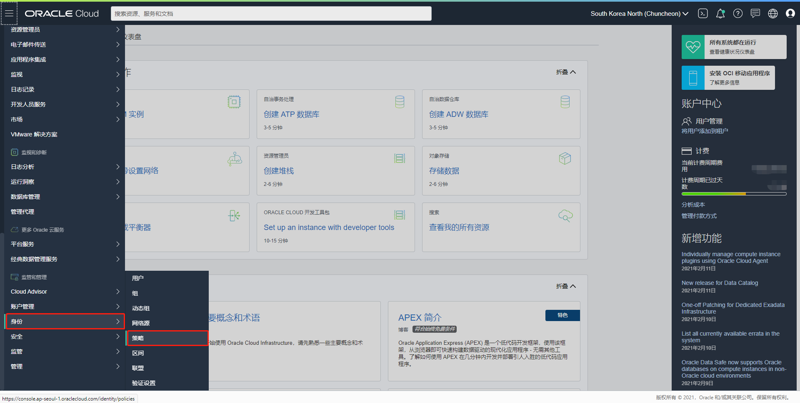

本实验使用"workshop"区间，选择"workshop"区间，单击"创建策略"。

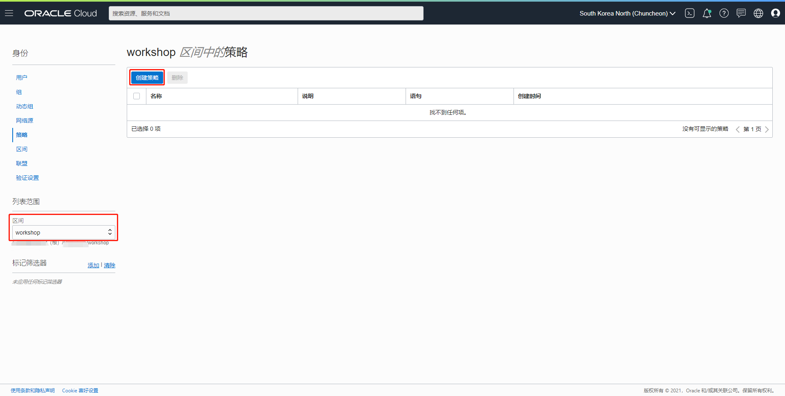

输入项目，策略构建器处单击"定制（高级）"，然后输入内容如下，然后单击"创建"。

```
Allow group <group-name> to manage cluster-family in <location>
```

例如，本实验的"group-name"是"workshop"，区间是"workshop"。

```
Allow group workshop to manage cluster-family in compartment workshop
```

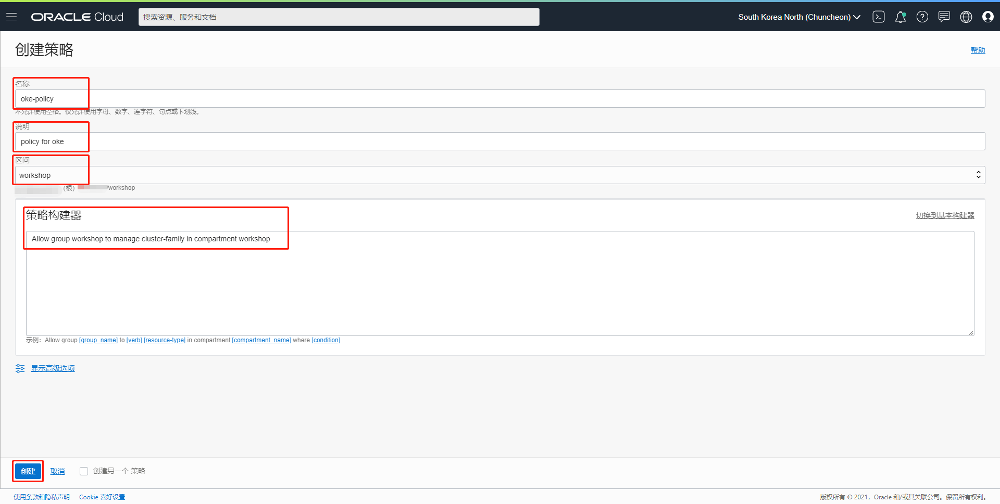

创建完成。

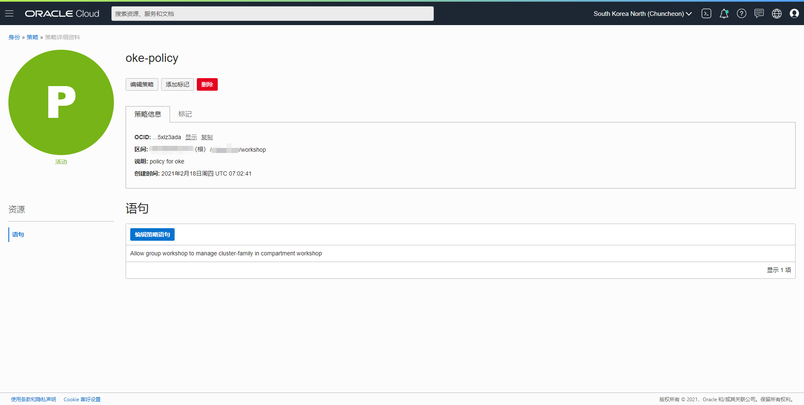

<a name="step2"></a>
### 2. 创建集群

在OCI管理控制台界面，单击"开发人员服务"=>"Kubernetes 集群"。

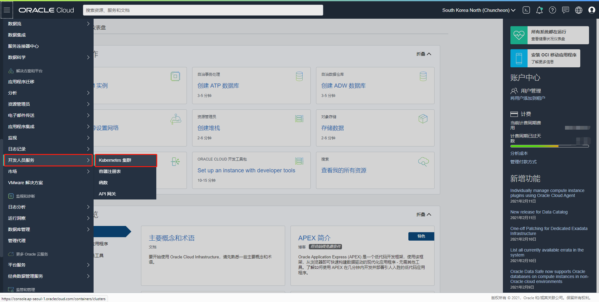

选择"workshop"区间，单击"创建集群"。

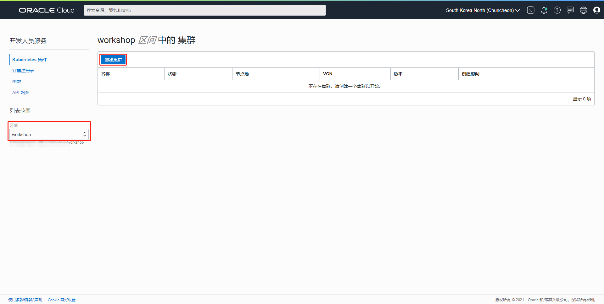

使用默认选择"快速创建"，单击"启动工作流"。

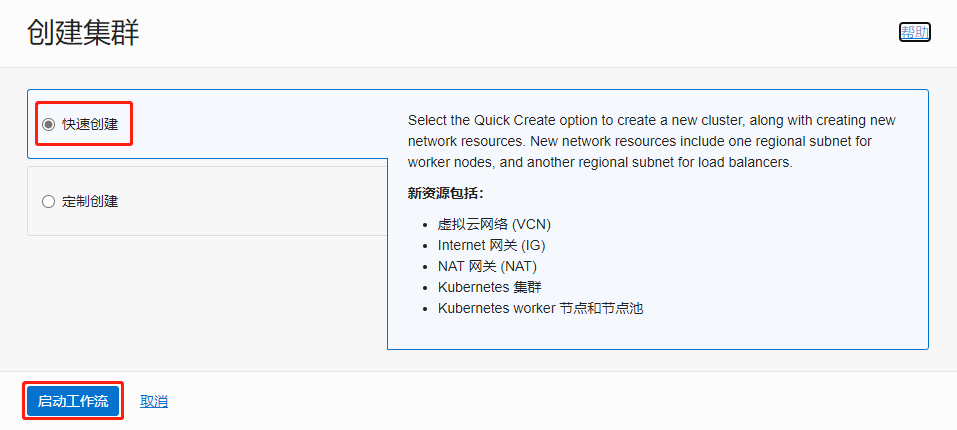

输入项目，单击"下一步"。

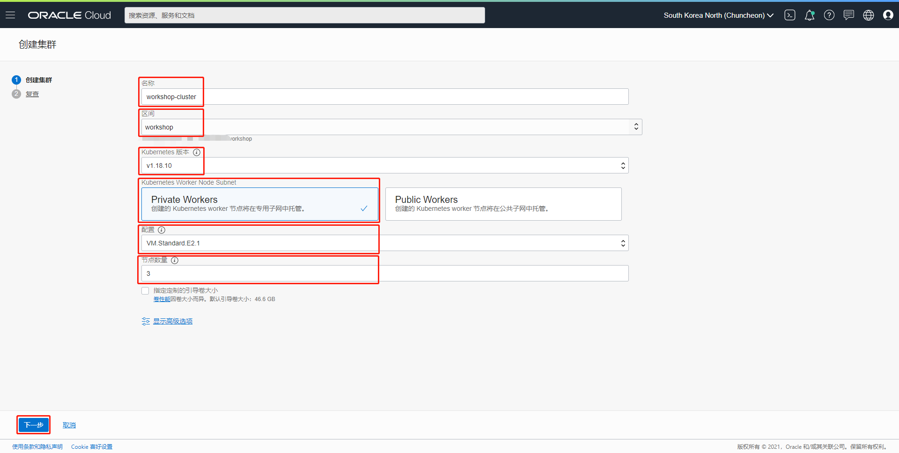

单击"创建集群"。

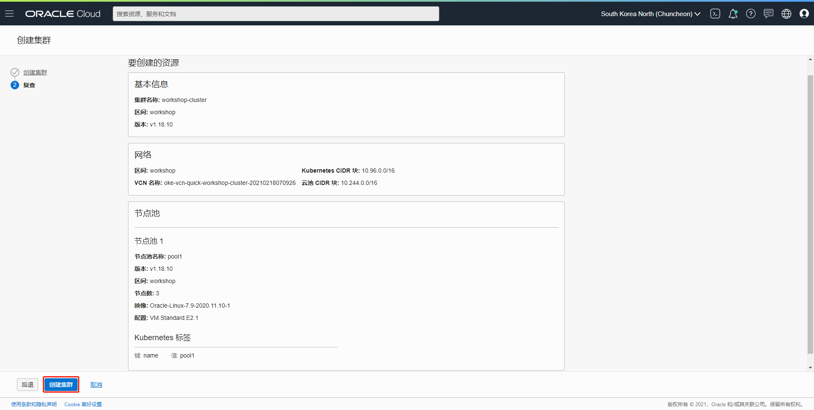

工作请求都创建完成后，单击"关闭"。

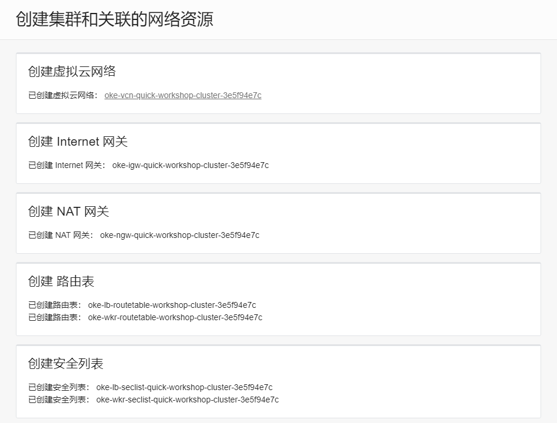

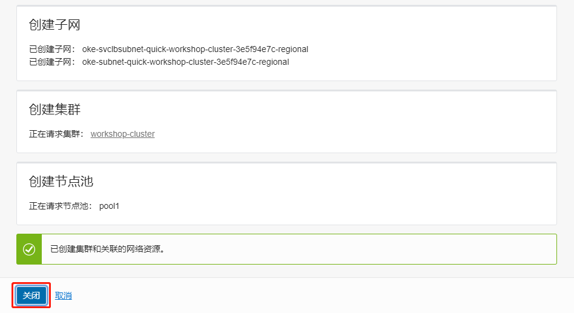

此时集群状态为"正在创建"。

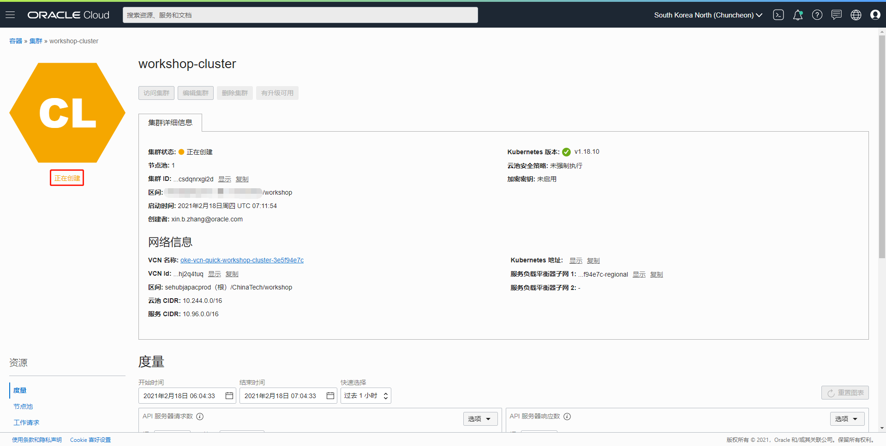

经过一些时间后，集群状态变为"活动"，创建完成。


单击"节点池"。

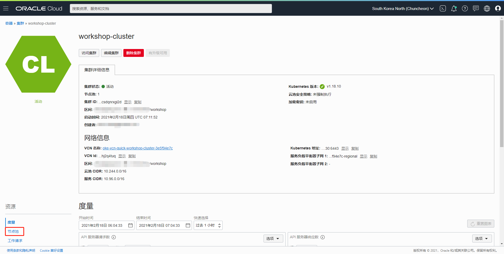

节点池状态为"活动"，Worker节点总数为"3"。

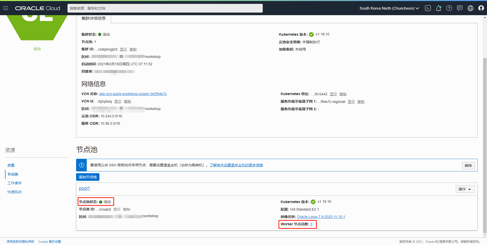

<a name="step3"></a>
### 3. 访问集群

单击"快速启动"。

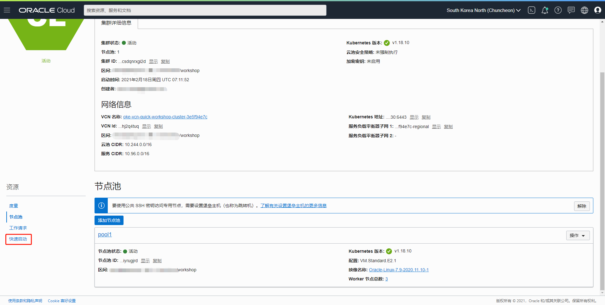

单击"访问集群"。

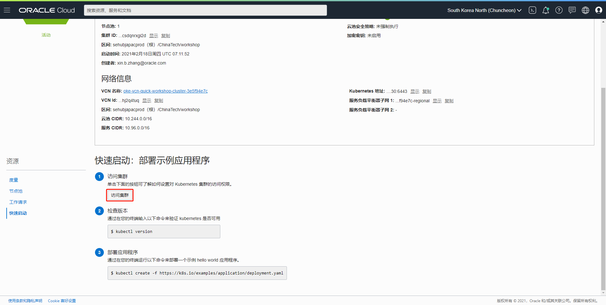

单击"本地访问权限"。

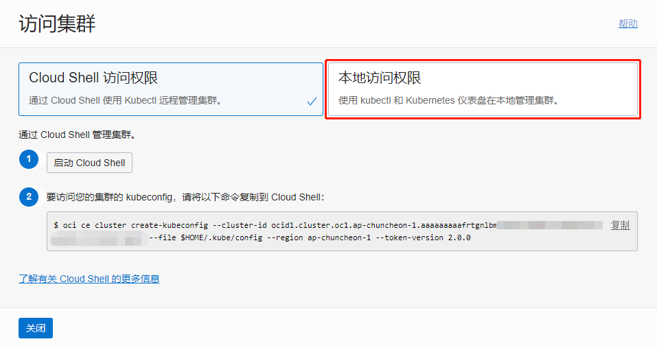

顺次单击"复制"并在OCI CLI里运行"本地访问权限"界面的命令。（请先下载OCI CLI链接如图）

第一次需要配置[OCI config](https://docs.oracle.com/en-us/iaas/Content/API/SDKDocs/cliconfigure.htm)

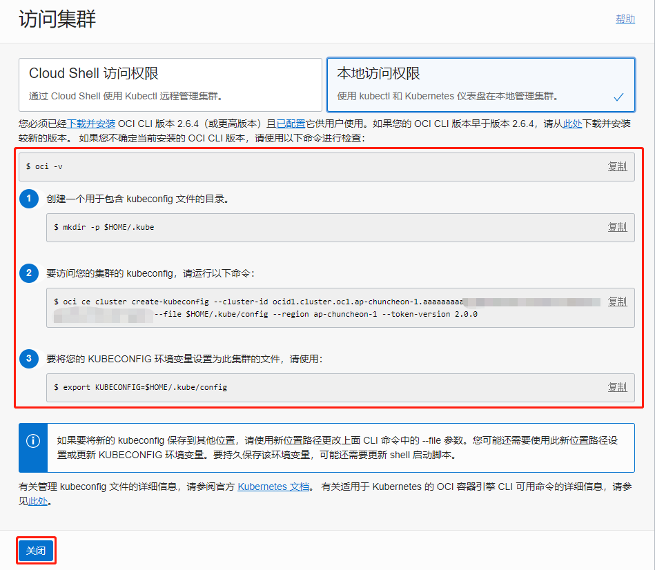

确认集群Worker节点。安装好kubectl的情况下

```
kubectl get nodes
```

输出结果。

   ```
   NAME        STATUS   ROLES   AGE   VERSION
   10.0.10.2   Ready    node    22m   v1.18.10
   10.0.10.3   Ready    node    22m   v1.18.10
   10.0.10.4   Ready    node    22m   v1.18.10
   ```

<a name="step4"></a>
### 4. 部署Kubernetes仪表板

在您创建的新集群上部署Kubernetes仪表板。在终端窗口中，输入以下命令。

```
kubectl apply -f https://raw.githubusercontent.com/kubernetes/dashboard/v2.1.0/aio/deploy/recommended.yaml
```

接下来，验证您是否可以使用Kubernetes仪表板连接到集群。

在文本编辑器中，创建一个名为`oke-admin-service-account.yaml`的文件，内容如下。该文件定义了一个管理员服务账户和一个集群rolebinding，都叫做"oke-admin"。

```
apiVersion: v1
   kind: ServiceAccount
   metadata:
     name: oke-admin
     namespace: kube-system
   ---
   apiVersion: rbac.authorization.k8s.io/v1beta1
   kind: ClusterRoleBinding
   metadata:
     name: oke-admin
   roleRef:
     apiGroup: rbac.authorization.k8s.io
     kind: ClusterRole
     name: cluster-admin
   subjects:
     - kind: ServiceAccount
       name: oke-admin
       namespace: kube-system
```

在群集中创建服务帐户和群集rolebinding，输入以下命令。

```
kubectl apply -f oke-admin-service-account.yaml
```

上述命令的输出确认了服务账户的创建和集群rolebinding。

```
serviceaccount/oke-admin created
clusterrolebinding.rbac.authorization.k8s.io/oke-admin created
```

您现在可以使用"oke-admin"服务帐户查看和控制集群，并连接到Kubernetes仪表板。

通过输入下面命令获取"oke-admin"服务帐户的身份验证令牌。

```
kubectl -n kube-system describe secret $(kubectl -n kube-system get secret | grep oke-admin | awk '{print $1}')
```

上述命令的输出包括身份验证令牌（一个长的字母数字字符串）作为"token"的值，如下所示。

```
Name:         oke-admin-token-429z6
Namespace:    kube-system
Labels:       <none>
Annotations:  kubernetes.io/service-account.name: oke-admin
              kubernetes.io/service-account.uid: 798e17e0-e37e-485c-a4a6-24de71f8865c

Type:  kubernetes.io/service-account-token

Data
====
ca.crt:     1289 bytes
namespace:  11 bytes
token:      eyJhb______0j4rQ
```

在上面的示例中，`eyJhb______0j4rQ`（缩写是为可读性）是身份验证令牌。

从输出中复制"token"的值，您将使用此令牌连接到仪表板。


在终端窗口中，输入以下命令：

```
kubectl proxy
```

打开一个新的浏览器窗口，然后转到[http://localhost:8001/api/v1/namespaces/kubernetes-dashboard/services/https:kubernetes-dashboard:/proxy/](http://localhost:8001/api/v1/namespaces/kubernetes-仪表板/services/https:kubernetes-dashboard:/proxy/)，显示Kubernetes仪表板。输入"token"信息，单击"Sign in"。

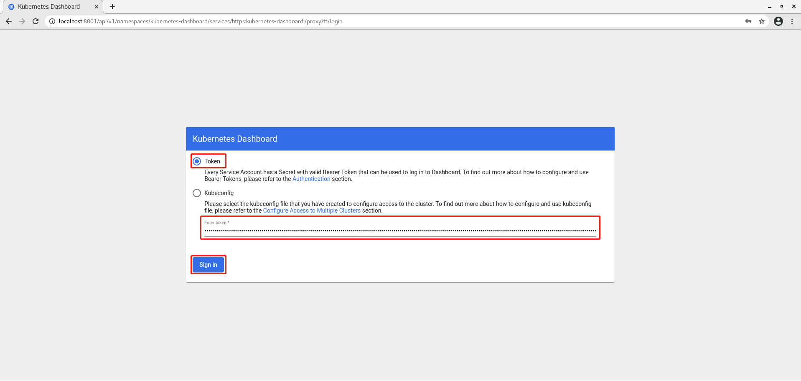

查看集群概况。

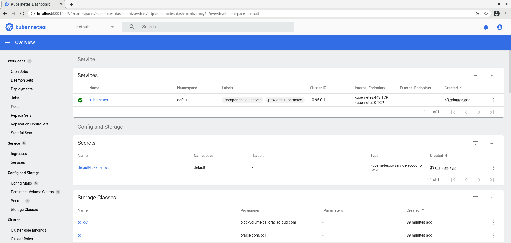

您已经成功创建新集群，并确认新集群已正常运行。

<a name="step5"></a>
### 5. 发布示例应用

在您的集群中运行一个Hello World应用程序。

```
kubectl apply -f https://k8s.io/examples/service/load-balancer-example.yaml
```

创建一个暴露Hello World应用程序的Service对象。

```
kubectl expose deployment hello-world --type=LoadBalancer --name=my-service
```

显示该Service的相关信息。

```
kubectl get services my-service
```

输出结果。

```
NAME         TYPE           CLUSTER-IP     EXTERNAL-IP     PORT(S)          AGE
my-service   LoadBalancer   10.96.186.64   xxx.xxx.xxx.xxx 8080:30900/TCP   3m14s
```

使用外部IP地址（LoadBalancer Ingress）访问Hello World应用程序。

```
curl http://<external-ip>:<port>
```

例如，

```
curl http://xxx.xxx.xxx.xxx:8080
```

请求成功后的响应是hello消息。

```
Hello Kubernetes!
```

<a name="step6"></a>
### 6. 清理集群（可选）

完成本实验后，如果要释放Oracle云基础设施资源，可以删除您创建的集群和VCN。

#### 6.1 删除OKE集群

在OKE详情界面，单击"删除集群"。

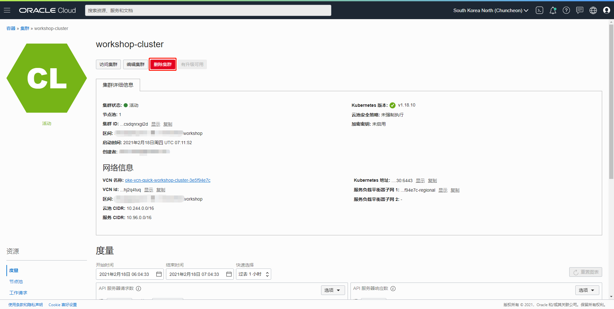

#### 6.2 删除实验中创建的VCN

在OCI管理控制台界面，单击"网络"=>"虚拟云网络"。

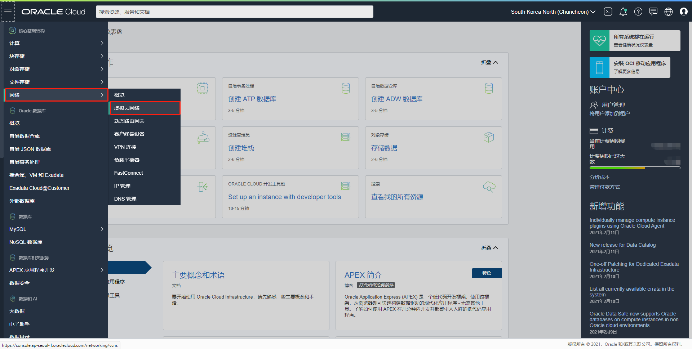

选择"workshop"区间，单击在本实验中创建的VCN。

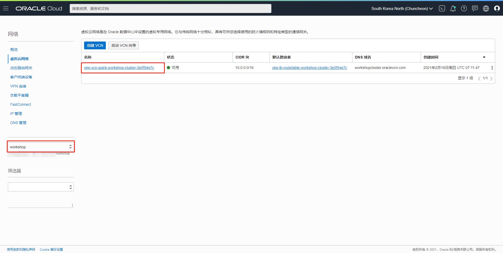

在VCN详情界面，单击"终止"。确认要终止VCN。

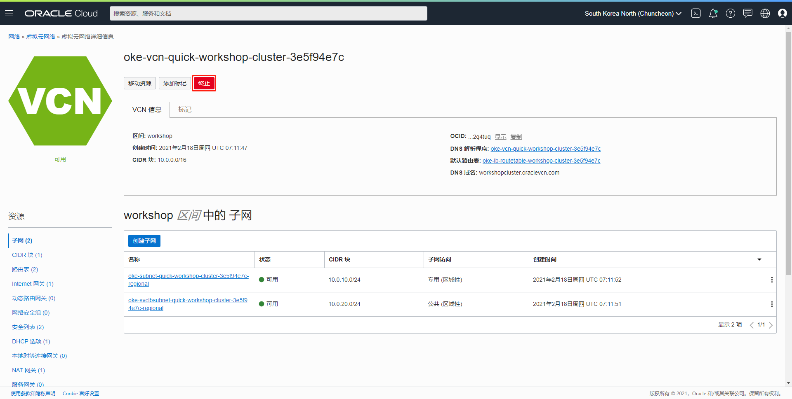

