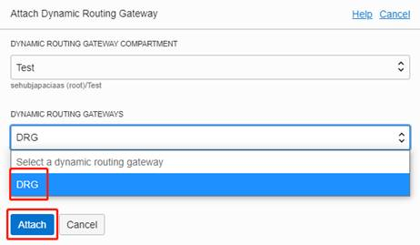

### 概览

在 Oracle Cloud Infrastructure 控制台上创建 VCN 有2种方式：

§  手动自定义创建，此种方式将需要手动创建所有网络基本元素，包括 VCN, Subnet, Security List, gateway, Route table 等等。

§  通过 Oracle Cloud Infrastructure 提供的 VCN Wizard 来快速创建包含标准组件及配置的 VCN 架构。

为使您能更清晰的理解 Oracle Cloud Infrastructure 的网络，本文将分别演示手动自定义创建及配置VCN以及通过VCN Wizard创建及配置VCN的过程。

本文将创建的VCN及其组件架构如下图所示：

### 前提条件 

- 已经通过IAM 授权，加入到了具有VCN 操作权限的用户组中。

### 目录

[1 手动创建并配置  VCN 及相关组件](#step1)

[1.1 创建VCN](#step1.1)

[1.2 创建Internet Gateway](#step1.2)

[1.3 创建DRG](#step1.3)

[1.4 创建Route Table](#step1.4)

[1.4.1 为 Public Subnet 创建 Route Table](#step1.4.1)

[1.4.2 为 Private Subnet 创建 Route Table](#step1.4.2)

[1.5 创建Security List](#step1.5)

[1.5.1 为 Public Subnet 创建 Security List](#step1.5.1)

[1.5.2 为 Private Subnet 创建 Security List](#step1.5.2)

[1.6 创建Subnet](#step1.6)

[1.6.1 创建 Public Subnet](#step1.6.1)

[1.6.2 创建 Private Subnet](#step1.6.2)

[2 使用 VCN  Wizard创建并配置 VCN 及相关组件](#step2)

[2.1 使用VCN Wizard创建VCN 及相关组件](#step2.1)

[2.2 创建DRG并配置相关路由](#step2.2)

[2.3 修改Security List以及Security Rule](#step2.3)

 

 

# 1 手动创建并配置 VCN 及相关组件

本节将演示如何手动 Oracle Cloud Infrastructure 控制台上创建并配置 VCN 以及相关的组件。

## 1.1 创建VCN 

登录 Oracle Cloud Infrastructure 控制台主页, 在选择好 Region之后，点击左上角的三条横线图标，选择 **Networking** > **Virtual Cloud Networks** 。

在新的页面中选择希望该VCN所属的Compartment（本LAB 中使用“Test” Compartment），点击 **Create VCN**

在弹出页面中为要创建的VCN 起一个名字，并选择**CIDR Block** 地址段（此处可点击“+ Another CIDR Block” 来填加多个CIDR段，但多个CIDR段不能有重叠，本 LAB中使用10.0.0.0/16），VCN 内部的DNS 选项使用默认即可，然后点击  **Create VCN 。**

## 1.2 创建Internet Gateway 

点击刚创建好的VCN_01，进入其主页面，选择 **Internet Gateways**, 点击 **Create Internet gateway** 。

在弹出页面中为要创建的Internet Gateway 起一个名字，然后点击  **Create** **Internet gateway**

 

## 1.3 创建DRG 

在 Oracle Cloud Infrastructure 控制台主页点击左上角的三条横线图标，选择 **Networking** > **Dynamic Routing Gateways** 。

在新的页面中选择希望该DRG所属的Compartment（本LAB 中使用“Test” Compartment），点击 **Create Dynamic Routing Gateway** 。

在弹出页面中为要创建的Dynamic Routing Gateway 起一个名字，然后点击  **Create Dynamic Routing Gateway** 。

回到之前创建的VCN_01主页面，选择 **Dynamic Routing Gateways**, 点击 **Attach Dynamic Routing Gateway**

在弹出页面中选择刚刚创建的DRG，然后点击 **Attach** 。

 

## 1.4 创建Route Table 

本节将为即将创建的两个Subnet分别创建两个Route Table ，设计如下：

### 1.4.1 为 Public Subnet 创建 Route Table

回到之前创建的VCN_01主页面，选择 **Route Tables**, 点击 **Create Route Table** 。

在弹出页面中为要创建的Route Table 起一个名字（本LAB中使用**Public_RT**），然后点击  **+ Another Route Rule** 。

按照之前的路由设计为 Public Subnet 的Route Table添加两条分别到 **IGW** 和 **RDG** 的路由。

### 1.4.2 为 Private Subnet 创建 Route Table

与之前为Public Subnet类似，VCN_01主页面，选择 **Route Tables**, 点击 **Create Route Table** 。

点击 **Create Route Table** 。

在弹出页面中为要创建的Route Table 起一个名字（本LAB中使用**Private_RT**），然后点击  **+ Another Route Rule** 。

回到之前创建的VCN_01主页面，选择 **Route Tables**, 查看刚刚创建的 Route Tables

 

## 1.5 创建Security List 

本节将为即将创建的两个Subnet分别创建两个Route Table ，设计如下：

 

### 1.5.1 为 Public Subnet 创建 Security List

回到之前创建的VCN_01主页面，选择 **Security Lists**, 点击 **Create Security Lists** 。

在弹出页面中为要创建的Security 起一个名字（本LAB中使用**Public_SL**），然后点击  **+ Another Ingress Rules**

按照之前的设计，为Public_SL 添加3条**Stateful Ingress Rules**, 然后点击 **Add Ingress Rules** 。

 
 

回到Public_SL 主页面，查看刚刚创建的 Security Rules。

 

### 1.5.2 为 Private Subnet 创建 Security List

同上，回到之前创建的VCN_01主页面，选择 **Security Lists**, 点击 **Security Lists** 。

在弹出页面中为要创建的Security 起一个名字，然后点击 **Create Security List** 。

点击刚刚创建的 **Private_SL**，选择 **Ingress Rules**再点击**Add Ingress Rules
** 按照之前的设计，为Private_SL 添加2条**Stateful Ingress Rules**, 然后点击 **Add Ingress Rules**

 

回到Private_SL 主页面，查看刚刚创建的Security Rules

 

## 1.6 创建Subnet 

本节将在创建好的VCN CIDR（10.0.0.0/16）中创建2个Subnet：**Public Subnet**（**10.0.0.0/24**）以及**Private Subnet**（**10.0.1.0/24**）

### 1.6.1 创建 Public Subnet 

在之前创建好的VCN_01主页面中，选择Subnets点击**Create** **Subnet** 。

在弹出页面中为要创建的Subnet 起一个名字（本LAB中使用**Public_Subnet**）
 **SUBNET TYPE** 选择 **Regional Subnet**选项；

 **CIDR Block** 段填入之前设计好的 **10.0.0.0/24** ；

 **ROUTE TABLE **选中之前创建的 **Public_RT** ；

 **DNS** 相关选项使用默认的 VCN DNS ；

 **SUBNET ACCESS**访问类型选中**Public Subnet** ；

 **SECURITY LIST** 选中之前创建的 **Public_SL **；

 然后点击  **Create Subnet**

 

  

 

### 1.6.2 创建 Private Subnet 

在之前创建好的VCN_01主页面中，选择Subnets点击 **Create** **Subnet**。

 在弹出页面中为要创建的Subnet 起一个名字（本LAB中使用**Private_Subnet**）。

 **SUBNET TYPE** 选择 **Regional Subnet** 选项 ;

 **CIDR Block **段填入之前设计好的 **10.0.1.0/24** ;

 **ROUTE TABLE **选中之前创建的 **Private_RT** ;

 **DNS** 相关选项使用默认的 VCN DNS ;

 **SUBNET ACCESS** 访问类型选中**Private Subnet ;**

** SECURITY LIST** 选中之前创建的 **Private_SL** ;

 然后点击  **Create Subnet** ;

  

 

 

# 2 使用 VCN Wizard创建并配置 VCN 及相关组件

本节将演示如何Oracle Cloud Infrastructure 提供的VCN Wizard在控制台上创建并配置 VCN 以及相关的组件。

 

## 2.1 使用VCN Wizard创建VCN 及相关组件

登录 Oracle Cloud Infrastructure 控制台主页, 在选择好 Region之后，点击左上角的三条横线图标，选择 **Networking** > **Virtual Cloud Networks**.

在新的页面中选择希望该VCN所属的Compartment（本LAB 中使用“Test” Compartment），点击 **Start VCN Wizard**

在弹出页面中选择 **VCN with Internet Connectivity** 。

在右侧的提示框中可以看到，通过此选项，VCN Wizard 将为您创建的架构中包括了 VCN, public subnet, private subnet, internet gateway (IG), NAT gateway (NAT), 以及service gateway (SG)。

点击 **Start VCN Wizard** 。

在弹出的页面中给VCN起一个名字（本LAB中使用**VCN_02**）。

 VCN Wiard 默认在VCN中创建一个Public Subnet 和一个 Private Subnet，这里我们输入设计好的VCN CIDR Block （**10.0.0.0/16**）以及两个Subnet的CIDR Block（**10.0.0.0/24**以及**10.0.1.0/24**）
 点击**Next**

下下一个页面中可以Review 所有即将创建的VCN组件的信息，可以看到 VCN Wizard 自动将所有需要的组件和配置都已经准备好了， 最后点击 **Create**

 

  

## 2.2 创建DRG并配置相关路由

由于 VCN Wizard 使用标准架构创建的组件中不包含DRG以及到DRG的路由，这里根据本LAB最初设计的架构需求，需要创建DRG并添加两个Subnet所对应Route Table中的Route Rules。

关于具体操作此处不赘述，请参考本文中1.3及1.4章节。

  

## 2.3 修改Security List以及Security Rule

由于 VCN Wizard 使用标准架构创建的 Security List 中的 Security Rule 是使用通用的 Sample 配置，所以需要修改两个 Subnet 所对应的 Security List 中的所有 Security Rules。

关于具体操作此处不赘述，请参考本文中1.5章节。

 